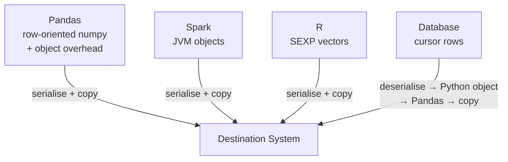
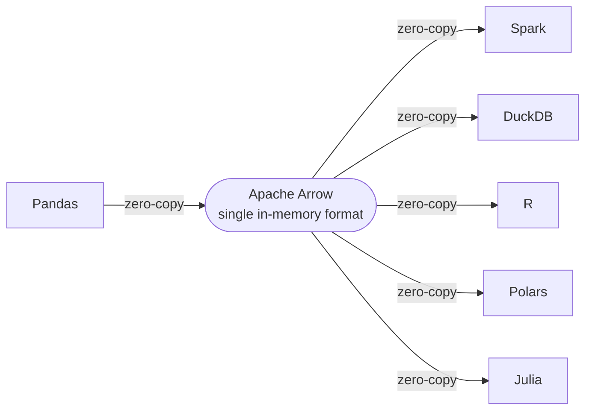
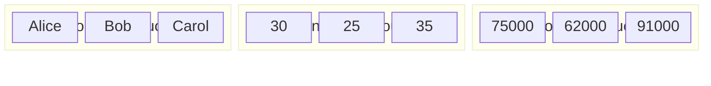
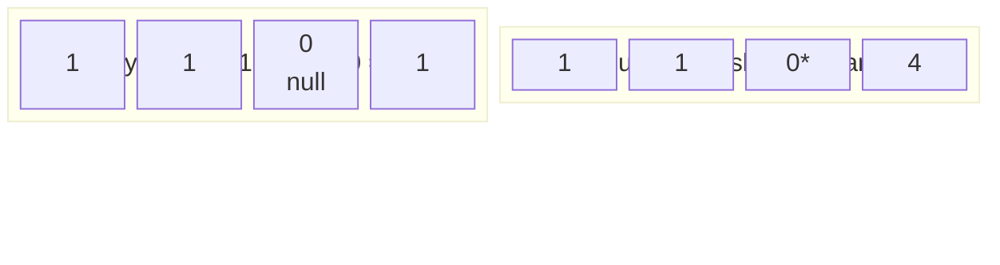
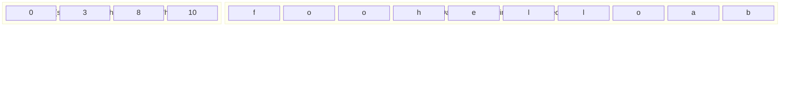
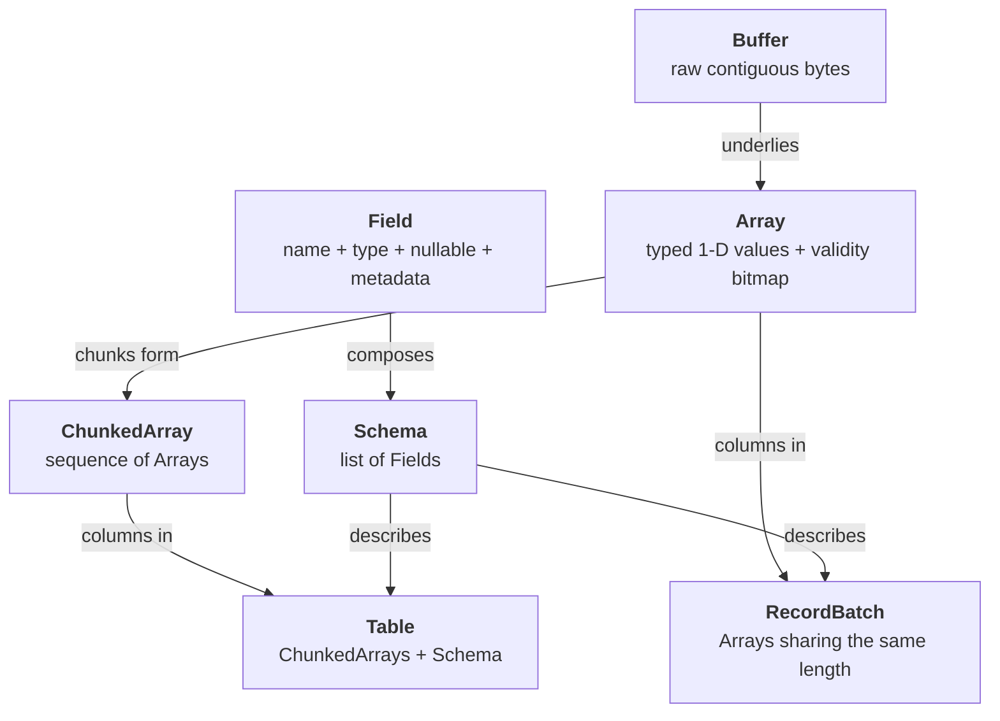
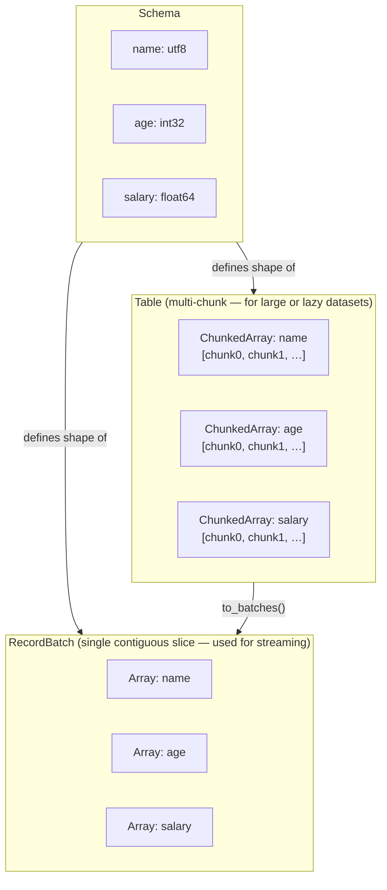
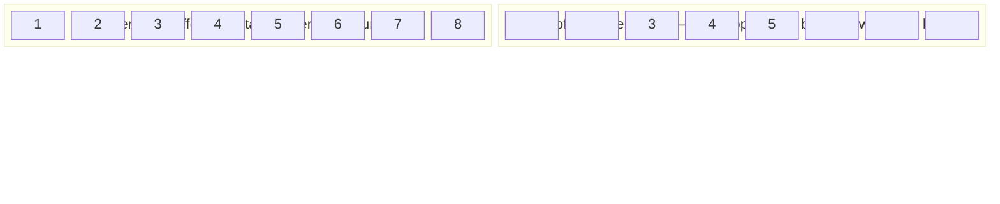
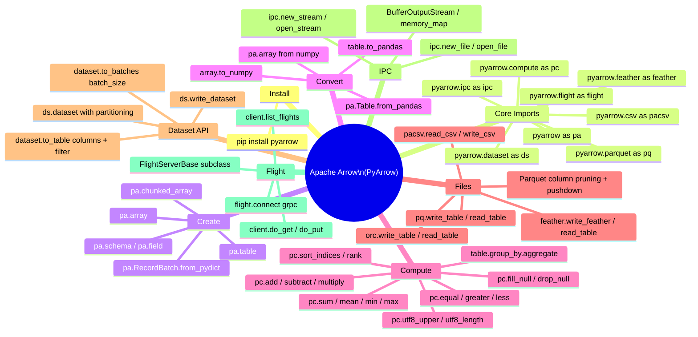

# Apache Arrow — Understanding Document

Apache Arrow is an in-memory columnar data format and a cross-language development platform for analytics. It defines a standardised layout for tabular data that allows **zero-copy sharing** across processes, languages and systems — without serialisation overhead.

---

## Table of Contents

1. [Why Arrow Exists](#1-why-arrow-exists)
2. [Core Design Principles](#2-core-design-principles)
3. [The Columnar Format](#3-the-columnar-format)
4. [Type System](#4-type-system)
5. [Core Data Structures](#5-core-data-structures)
6. [Memory Model](#6-memory-model)
7. [PyArrow API](#7-pyarrow-api)
   - 7.1 [Arrays and Types](#71-arrays-and-types)
   - 7.2 [Tables and RecordBatches](#72-tables-and-recordbatches)
   - 7.3 [Schemas](#73-schemas)
   - 7.4 [Compute API](#74-compute-api)
   - 7.5 [Reading and Writing Files](#75-reading-and-writing-files)
   - 7.6 [Dataset API](#76-dataset-api)
   - 7.7 [IPC — Inter-Process Communication](#77-ipc--inter-process-communication)
   - 7.8 [Arrow Flight](#78-arrow-flight)
8. [C++ API](#8-c-api)
9. [Integration with Other Systems](#9-integration-with-other-systems)
10. [Real-World Use Cases](#10-real-world-use-cases)
11. [What Arrow Cannot Do](#11-what-arrow-cannot-do)
12. [Quick Reference](#12-quick-reference)

---

## 1. Why Arrow Exists

Before Arrow, every analytics tool had its own in-memory data representation:



Each handoff between systems required **serialisation, deserialisation and copying** — even when both systems were on the same machine.

Arrow solves this by defining a **single in-memory format** that all tools agree on:



No conversion. No copy. The same bytes in memory, read by different runtimes.

---

## 2. Core Design Principles

| Principle | Detail |
|---|---|
| **Columnar layout** | Each column is a contiguous buffer. SIMD, cache-friendly, vectorisable |
| **Language-agnostic** | Identical format in C++, Python, Java, Go, Rust, C#, R, Julia |
| **Zero-copy reads** | Pass a pointer — not a copy — between systems and languages |
| **Random access** | O(1) access to any row in a column without scanning |
| **Self-describing** | Schema (column names + types) travels with the data |
| **Null handling** | First-class validity bitmap — every array tracks nulls efficiently |
| **Immutability** | Buffers are immutable once written; enables safe sharing |

---

## 3. The Columnar Format

### Row-oriented vs Columnar

**Row-oriented (traditional):**


Every field for one record is contiguous. Fast for inserting a full row. Slow for reading one column across all rows (cache misses per row).

**Columnar (Arrow):**



Reading `salary` for all rows = one sequential memory scan. SIMD instructions can process 8–16 values per clock cycle. Compression is more effective (similar values adjacent).

### Physical buffer layout

For a 32-bit integer array `[1, null, 3, 4]`:



For a variable-length string array `["foo", "hello", "ab"]`:



---

## 4. Type System

Arrow defines a rich, portable type system:

### Numeric types

| Arrow Type | Python alias | Bytes |
|---|---|---|
| `int8` | `pa.int8()` | 1 |
| `int16` | `pa.int16()` | 2 |
| `int32` | `pa.int32()` | 4 |
| `int64` | `pa.int64()` | 8 |
| `uint8` | `pa.uint8()` | 1 |
| `uint16` / `uint32` / `uint64` | — | 2/4/8 |
| `float16` | `pa.float16()` | 2 |
| `float32` | `pa.float32()` | 4 |
| `float64` | `pa.float64()` | 8 |

### Boolean and string

| Arrow Type | API |
|---|---|
| `bool` | `pa.bool_()` |
| `utf8` (variable-length string) | `pa.string()` |
| `large_utf8` | `pa.large_string()` |
| `binary` (variable-length bytes) | `pa.binary()` |
| `fixed_size_binary(n)` | `pa.binary(n)` |

### Temporal types

| Arrow Type | API | Example |
|---|---|---|
| `date32` | `pa.date32()` | days since epoch |
| `date64` | `pa.date64()` | milliseconds since epoch |
| `time32(unit)` | `pa.time32('ms')` | time of day in ms |
| `time64(unit)` | `pa.time64('us')` | time of day in µs |
| `timestamp(unit, tz)` | `pa.timestamp('us', tz='UTC')` | full datetime |
| `duration(unit)` | `pa.duration('s')` | elapsed time |

### Nested types

| Arrow Type | API | Description |
|---|---|---|
| `list` | `pa.list_(pa.int32())` | variable-length list of typed values |
| `large_list` | `pa.large_list(pa.string())` | same with 64-bit offsets |
| `fixed_size_list(n)` | `pa.list_(pa.float32(), n)` | fixed-length list |
| `struct` | `pa.struct([pa.field('x', pa.int32())])` | named fields |
| `map` | `pa.map_(pa.string(), pa.int32())` | key-value pairs |
| `union` | `pa.union(...)` | one of several types per slot |
| `dictionary` | `pa.dictionary(pa.int32(), pa.string())` | encoded categorical |

---

## 5. Core Data Structures



### Hierarchy



---

## 6. Memory Model

### Buffers

A `Buffer` is a reference-counted, immutable block of bytes. It tracks:
- Pointer to the memory
- Size in bytes
- A reference count (freed when the last holder releases it)

### Memory pools

Arrow allocates from a `MemoryPool`. The default pool uses `jemalloc` or `mimalloc` and ensures **64-byte alignment** (required for SIMD).

```python
import pyarrow as pa

pool = pa.default_memory_pool()
print(pool.bytes_allocated())   # current allocation
print(pool.max_memory())        # peak usage
```

### Zero-copy

When you slice an Arrow array, no data is copied — only the offset and length change. The underlying buffer is shared via reference counting.



---

## 7. PyArrow API

```bash
pip install pyarrow
```

### 7.1 Arrays and Types

```python
import pyarrow as pa
import numpy as np

# ── Create arrays ──────────────────────────────────────────────────────────────

# From Python lists (type inferred)
a1 = pa.array([1, 2, 3, 4, 5])
a2 = pa.array([1.1, 2.2, 3.3])
a3 = pa.array(["foo", "bar", "baz"])
a4 = pa.array([True, False, True])

# With explicit type
a5 = pa.array([1, 2, 3], type=pa.int8())
a6 = pa.array([1.0, 2.0], type=pa.float32())

# With nulls — Python None becomes Arrow null
a7 = pa.array([1, None, 3, None, 5])
print(a7.null_count)    # 2
print(a7.is_valid)      # [true, false, true, false, true]
print(a7.is_null())     # [false, true, false, true, false]

# From NumPy (zero-copy when possible)
np_arr = np.array([1.0, 2.0, 3.0], dtype=np.float64)
a8 = pa.array(np_arr)
print(a8.type)          # double

# From pandas Series
import pandas as pd
s = pd.Series([10, 20, 30])
a9 = pa.Array.from_pandas(s)

# ── Inspect arrays ─────────────────────────────────────────────────────────────

print(a1.type)          # int64
print(len(a1))          # 5
print(a1[2])            # <pyarrow.Int64Scalar: 3>
print(a1[2].as_py())    # 3  (Python int)
print(a1.to_pylist())   # [1, 2, 3, 4, 5]
print(a1.to_numpy())    # numpy array

# Slice (zero-copy)
sliced = a1.slice(1, 3)   # offset=1, length=3 → [2, 3, 4]

# Cast
a1_f = a1.cast(pa.float32())

# ── ChunkedArray ───────────────────────────────────────────────────────────────

# Multiple arrays of the same type combined
c = pa.chunked_array([[1, 2, 3], [4, 5], [6]])
print(c.num_chunks)         # 3
print(c.chunk(0).to_pylist()) # [1, 2, 3]
combined = c.combine_chunks()  # merge into a single Array

# ── Dictionary-encoded (categorical) ──────────────────────────────────────────

dict_arr = pa.DictionaryArray.from_arrays(
    indices=pa.array([0, 1, 2, 0, 1]),      # integer codes
    dictionary=pa.array(["cat", "dog", "fish"])  # lookup table
)
print(dict_arr.type)   # dictionary<values=string, indices=int64>
print(dict_arr.dictionary.to_pylist())  # ['cat', 'dog', 'fish']
print(dict_arr.to_pylist())             # ['cat', 'dog', 'fish', 'cat', 'dog']
```

---

### 7.2 Tables and RecordBatches

```python
import pyarrow as pa

# ── RecordBatch — a contiguous block of rows ───────────────────────────────────

batch = pa.RecordBatch.from_pydict({
    "name":   ["Alice", "Bob", "Carol"],
    "age":    [30, 25, 35],
    "salary": [75000.0, 62000.0, 91000.0],
})

print(batch.schema)             # name: string, age: int64, salary: double
print(batch.num_rows)           # 3
print(batch.num_columns)        # 3
print(batch.column("age"))      # [30, 25, 35]
print(batch.column(1))          # [30, 25, 35]  — by index

# Slice a RecordBatch (zero-copy)
sliced_batch = batch.slice(1, 2)   # rows 1–2

# Convert to/from Pandas
df = batch.to_pandas()
batch2 = pa.RecordBatch.from_pandas(df)

# ── Table — multi-chunk columnar dataset ───────────────────────────────────────

# From dict
table = pa.table({
    "name":   ["Alice", "Bob", "Carol", "Dave"],
    "age":    [30, 25, 35, 28],
    "salary": [75000.0, 62000.0, 91000.0, 55000.0],
    "city":   ["Mumbai", "Delhi", "Bangalore", "Mumbai"],
})

print(table.schema)
print(table.num_rows)       # 4
print(table.num_columns)    # 4
print(table.column_names)   # ['name', 'age', 'salary', 'city']

# Access columns
ages   = table.column("age")          # ChunkedArray
names  = table["name"]                # same, via indexing

# Convert to Pandas
df = table.to_pandas()

# Table from RecordBatches
batches = [batch, batch.slice(0, 2)]
table2  = pa.Table.from_batches(batches)

# Iterate over RecordBatches
for rb in table2.to_batches(max_chunksize=2):
    print(rb.num_rows)

# ── Table operations ───────────────────────────────────────────────────────────

# Add/replace a column
new_col = pa.array([100, 200, 300, 400])
table3  = table.append_column("bonus", new_col)
table4  = table.set_column(2, "salary_usd", new_col)

# Remove a column
table5  = table.remove_column(table.schema.get_field_index("city"))

# Rename columns
table6  = table.rename_columns(["n", "a", "s", "c"])

# Filter (returns a new Table)
mask    = pa.array([True, False, True, False])
filtered = table.filter(mask)

# Select columns
sub     = table.select(["name", "age"])

# Sort
sorted_table = table.sort_by("age")
sorted_desc  = table.sort_by([("salary", "descending")])

# Slice rows (zero-copy)
top2 = table.slice(0, 2)

# Combine tables
combined = pa.concat_tables([table, table2])
```

---

### 7.3 Schemas

```python
import pyarrow as pa

# ── Define a schema explicitly ─────────────────────────────────────────────────

schema = pa.schema([
    pa.field("id",         pa.int64(),   nullable=False),
    pa.field("name",       pa.string()),
    pa.field("score",      pa.float32()),
    pa.field("signup",     pa.timestamp("us", tz="UTC")),
    pa.field("tags",       pa.list_(pa.string())),
    pa.field("profile",    pa.struct([
        pa.field("city",  pa.string()),
        pa.field("age",   pa.int32()),
    ])),
])

# ── Inspect ────────────────────────────────────────────────────────────────────

print(schema.names)                     # list of column names
print(schema.types)                     # list of types
print(schema.field("score").type)       # float
print(schema.get_field_index("name"))   # 1

# ── Schema metadata ────────────────────────────────────────────────────────────

# Arrow schemas carry arbitrary key-value metadata (bytes)
schema_with_meta = schema.with_metadata({
    "source":   "CRM system",
    "version":  "2024-01",
})
print(schema_with_meta.metadata)

# ── Validate a table against a schema ─────────────────────────────────────────

table = pa.table({"id": [1, 2], "name": ["a", "b"]})
# Cast table to a target schema
target = pa.schema([
    pa.field("id",   pa.int32()),
    pa.field("name", pa.large_string()),
])
casted = table.cast(target)

# ── Evolution — add / remove / reorder ────────────────────────────────────────

schema2 = schema.append(pa.field("active", pa.bool_()))
schema3 = schema.remove(schema.get_field_index("tags"))
schema4 = schema.set(0, pa.field("id", pa.int32()))   # change type of field 0
```

---

### 7.4 Compute API

`pyarrow.compute` provides 200+ vectorised functions that operate on Arrow arrays without converting to Python or NumPy.

```python
import pyarrow as pa
import pyarrow.compute as pc

a = pa.array([3.0, 1.0, 4.0, 1.0, 5.0, 9.0, 2.0, 6.0])
b = pa.array([1.0, 2.0, 3.0, 4.0, 5.0, 6.0, 7.0, 8.0])
s = pa.array(["hello", "WORLD", "  Arrow  ", "foo"])

# ── Arithmetic ─────────────────────────────────────────────────────────────────

pc.add(a, b)              # element-wise addition
pc.subtract(a, b)
pc.multiply(a, b)
pc.divide(a, b)
pc.power(a, 2)
pc.abs(pc.subtract(a, b))
pc.negate(a)

# ── Rounding ───────────────────────────────────────────────────────────────────

pc.floor(a)
pc.ceil(a)
pc.round(a, ndigits=1)

# ── Comparison ────────────────────────────────────────────────────────────────

pc.equal(a, b)
pc.not_equal(a, b)
pc.greater(a, b)
pc.less(a, b)
pc.greater_equal(a, b)
pc.less_equal(a, b)

# ── Logical ───────────────────────────────────────────────────────────────────

mask1 = pc.greater(a, 3.0)
mask2 = pc.less(b, 6.0)
pc.and_(mask1, mask2)
pc.or_(mask1, mask2)
pc.invert(mask1)

# ── Reduction ─────────────────────────────────────────────────────────────────

pc.sum(a)                 # 31.0
pc.mean(a)                # 3.875
pc.min(a)                 # 1.0
pc.max(a)                 # 9.0
pc.stddev(a)
pc.variance(a)
pc.count(a)               # non-null count
pc.count(a, mode="all")   # total count including nulls

# ── Sorting and ranking ───────────────────────────────────────────────────────

indices  = pc.sort_indices(a)                # indices that would sort a
sorted_a = pc.take(a, indices)               # apply sort order
rank     = pc.rank(a, sort_keys=[("x", "ascending")])

# ── String operations ─────────────────────────────────────────────────────────

pc.utf8_upper(s)           # ["HELLO", "WORLD", "  ARROW  ", "FOO"]
pc.utf8_lower(s)
pc.utf8_length(s)
pc.utf8_trim_whitespace(s) # strip leading/trailing spaces
pc.utf8_replace_slice(s, start=0, stop=2, replacement="XX")
pc.utf8_split_whitespace(s)
pc.count_substring(s, pattern="o")
pc.match_substring(s, pattern="ello")         # boolean mask
pc.match_like(s, pattern="%ello%")
pc.ascii_is_upper(s)
pc.utf8_slice_codeunits(s, start=0, stop=3)  # first 3 chars

# ── Null handling ─────────────────────────────────────────────────────────────

arr_with_nulls = pa.array([1, None, 3, None])
pc.is_null(arr_with_nulls)         # [false, true, false, true]
pc.is_valid(arr_with_nulls)        # [true, false, true, false]
pc.fill_null(arr_with_nulls, 0)    # [1, 0, 3, 0]
pc.drop_null(arr_with_nulls)       # [1, 3]

# ── Type casting ──────────────────────────────────────────────────────────────

pc.cast(a, pa.int32())
pc.cast(s, pa.large_string())

# ── Set operations ────────────────────────────────────────────────────────────

x = pa.array([1, 2, 3, 3, 4])
pc.unique(x)                      # [1, 2, 3, 4]
pc.value_counts(x)                # [{value: 1, count: 1}, ...]
pc.is_in(x, value_set=pa.array([2, 4]))   # [false, true, false, false, true]
pc.index_in(x, value_set=pa.array([2, 4])) # index into value_set

# ── Date/time ─────────────────────────────────────────────────────────────────

ts = pa.array(["2024-01-15 09:30:00", "2024-06-20 14:00:00"],
              type=pa.timestamp("s"))

pc.year(ts)                 # [2024, 2024]
pc.month(ts)                # [1, 6]
pc.day(ts)                  # [15, 20]
pc.day_of_week(ts)          # 0=Monday
pc.quarter(ts)              # [1, 2]
pc.hour(ts)
pc.minute(ts)

# ── Conditional (if-else) ─────────────────────────────────────────────────────

condition = pc.greater(a, 4.0)
true_vals  = pa.array([99.0] * len(a))
result     = pc.if_else(condition, true_vals, a)  # replace values > 4 with 99

# ── Aggregate grouped (Table-level) ───────────────────────────────────────────

table = pa.table({"region": ["N","S","N","E","S"], "revenue": [10,20,30,40,50]})

# Group-by equivalent
grouped = table.group_by("region").aggregate([
    ("revenue", "sum"),
    ("revenue", "mean"),
    ("revenue", "count"),
])
print(grouped.to_pandas())
#   region  revenue_sum  revenue_mean  revenue_count
#   N       40           20.0          2
#   S       70           35.0          2
#   E       40           40.0          1
```

---

### 7.5 Reading and Writing Files

#### Parquet

```python
import pyarrow as pa
import pyarrow.parquet as pq

table = pa.table({
    "id":    [1, 2, 3, 4],
    "name":  ["a", "b", "c", "d"],
    "value": [1.1, 2.2, 3.3, 4.4],
})

# Write
pq.write_table(table, "data.parquet",
               compression="snappy",        # snappy / gzip / brotli / zstd / none
               row_group_size=1024)

# Read (full table)
loaded = pq.read_table("data.parquet")

# Read only specific columns (column pruning)
partial = pq.read_table("data.parquet", columns=["id", "value"])

# Read with row filter pushed down to Parquet level
filtered = pq.read_table("data.parquet",
                          filters=[("value", ">", 2.0)])

# Inspect metadata without reading data
meta = pq.read_metadata("data.parquet")
print(meta.num_row_groups)
print(meta.row_group(0).column(0).statistics)

schema = pq.read_schema("data.parquet")

# Partitioned Parquet dataset (Hive partitioning)
pq.write_to_dataset(table, root_path="dataset/",
                    partition_cols=["name"])
# Creates: dataset/name=a/part-0.parquet, etc.

dataset = pq.ParquetDataset("dataset/",
                             filters=[("name", "in", ["a", "b"])])
loaded2 = dataset.read()

# ParquetWriter for streaming large writes
writer = pq.ParquetWriter("output.parquet", table.schema, compression="zstd")
for batch in table.to_batches(max_chunksize=100):
    writer.write_batch(batch)
writer.close()
```

#### CSV

```python
import pyarrow.csv as pacsv

# Read CSV
table = pacsv.read_csv("data.csv")

# With options
table = pacsv.read_csv("data.csv",
    read_options=pacsv.ReadOptions(
        skip_rows=0,
        column_names=None,   # use header row
        encoding="utf-8",
    ),
    parse_options=pacsv.ParseOptions(
        delimiter=",",
        quote_char='"',
        newlines_in_values=False,
    ),
    convert_options=pacsv.ConvertOptions(
        column_types={"age": pa.int32(), "salary": pa.float64()},
        null_values=["NA", "N/A", ""],
        true_values=["yes", "Y"],
        false_values=["no", "N"],
    )
)

# Write CSV
import pyarrow.csv as pacsv
pacsv.write_csv(table, "output.csv")

# Streaming read (for large files)
with pacsv.open_csv("large.csv") as reader:
    for batch in reader:
        process(batch)   # each batch is a RecordBatch
```

#### JSON

```python
import pyarrow.json as pjson

# Read JSON Lines (newline-delimited JSON)
table = pjson.read_json("data.jsonl")

# With schema inference control
table = pjson.read_json("data.jsonl",
    read_options=pjson.ReadOptions(block_size=2**20),
    parse_options=pjson.ParseOptions(
        explicit_schema=pa.schema([
            pa.field("id",    pa.int64()),
            pa.field("value", pa.float64()),
        ])
    )
)
```

#### Feather / Arrow IPC File

```python
import pyarrow.feather as feather

# Write Feather v2 (Arrow IPC file format)
feather.write_feather(table, "data.feather", compression="lz4")

# Read
loaded = feather.read_table("data.feather")

# Memory-map for zero-copy read (no copy into RAM)
loaded_mmap = feather.read_table("data.feather", memory_map=True)
```

#### ORC

```python
import pyarrow.orc as orc

orc.write_table(table, "data.orc")
loaded = orc.read_table("data.orc")
```

---

### 7.6 Dataset API

The Dataset API provides a unified interface for reading large multi-file, multi-format, multi-partition datasets with lazy evaluation, column pruning and predicate pushdown.

```python
import pyarrow.dataset as ds

# ── Open a dataset ─────────────────────────────────────────────────────────────

# Single file
dataset = ds.dataset("data.parquet", format="parquet")

# Directory of files (auto-discovers all matching files)
dataset = ds.dataset("data/", format="parquet")

# Hive-partitioned directory
dataset = ds.dataset("data/", format="parquet",
                     partitioning="hive")
# data/year=2023/month=01/part-0.parquet → adds columns year, month

# Custom partitioning scheme
part = ds.partitioning(
    pa.schema([pa.field("year", pa.int32()), pa.field("month", pa.int32())]),
    flavor="hive"
)
dataset = ds.dataset("data/", partitioning=part)

# Multiple files explicitly
dataset = ds.dataset(["file1.parquet", "file2.parquet"])

# In-memory (from an existing Table)
dataset = ds.dataset(table)

# ── Inspect ────────────────────────────────────────────────────────────────────

print(dataset.schema)
print(dataset.count_rows())
print(len(dataset.files))   # list of discovered file paths

# ── Scan (lazy) ────────────────────────────────────────────────────────────────

# Filter expression — evaluated at the file/row-group level
filter_expr = (ds.field("year") == 2023) & (ds.field("revenue") > 1000)

# Read with column selection and filter
table = dataset.to_table(
    columns=["id", "revenue", "year"],
    filter=filter_expr,
)

# Streaming batches (memory-efficient for large datasets)
for batch in dataset.to_batches(
    columns=["id", "revenue"],
    filter=ds.field("revenue") > 500,
    batch_size=4096,
):
    process(batch)   # RecordBatch

# ── Write a dataset ────────────────────────────────────────────────────────────

ds.write_dataset(
    table,
    base_dir="output/",
    format="parquet",
    partitioning=ds.partitioning(
        pa.schema([pa.field("year", pa.int32())]),
        flavor="hive",
    ),
    existing_data_behavior="overwrite_or_ignore",
    file_options=ds.ParquetFileFormat().make_write_options(compression="zstd"),
)

# ── Scanner — fine-grained control ────────────────────────────────────────────

scanner = dataset.scanner(
    columns=["id", "revenue"],
    filter=filter_expr,
    batch_size=8192,
)
table = scanner.to_table()
```

---

### 7.7 IPC — Inter-Process Communication

Arrow IPC lets you send and receive Arrow data between processes, machines or languages with minimal overhead. There are two formats:

| Format | Use case |
|---|---|
| **IPC Stream** | Sequential streaming of RecordBatches over a socket, pipe or buffer |
| **IPC File** | Random-access file with a footer index — supports seeking to any batch |

```python
import pyarrow as pa
import pyarrow.ipc as ipc
import io

table = pa.table({"x": [1, 2, 3], "y": [4.0, 5.0, 6.0]})
batches = table.to_batches()

# ── Write IPC Stream to a buffer ───────────────────────────────────────────────

sink = pa.BufferOutputStream()
writer = ipc.new_stream(sink, table.schema)
for batch in batches:
    writer.write_batch(batch)
writer.close()

buffer = sink.getvalue()   # pa.Buffer (bytes)

# ── Read IPC Stream from a buffer ─────────────────────────────────────────────

reader = ipc.open_stream(buffer)
print(reader.schema)

received_batches = []
for batch in reader:
    received_batches.append(batch)

reconstructed = pa.Table.from_batches(received_batches)

# ── IPC File format (seekable, with footer) ────────────────────────────────────

with pa.OSFile("data.arrow", "wb") as f:
    writer = ipc.new_file(f, table.schema)
    for batch in batches:
        writer.write_batch(batch)
    writer.close()

with pa.memory_map("data.arrow", "r") as mmap:
    reader = ipc.open_file(mmap)
    print(f"Number of batches: {reader.num_record_batches}")
    batch_0 = reader.get_batch(0)
    full    = reader.read_all()

# ── Stream over a socket (server side) ────────────────────────────────────────

import socket

def serve_table(table, host="localhost", port=9999):
    s = socket.socket()
    s.bind((host, port))
    s.listen(1)
    conn, _ = s.accept()
    sink = conn.makefile("wb")
    writer = ipc.new_stream(sink, table.schema)
    for batch in table.to_batches():
        writer.write_batch(batch)
    writer.close()

# ── Client side ────────────────────────────────────────────────────────────────

def receive_table(host="localhost", port=9999):
    s = socket.socket()
    s.connect((host, port))
    source = s.makefile("rb")
    reader = ipc.open_stream(source)
    return reader.read_all()
```

---

### 7.8 Arrow Flight

Arrow Flight is a high-performance **RPC protocol** built on gRPC for transferring large Arrow datasets over a network — without serialisation to JSON or Protobuf.

```python
import pyarrow as pa
import pyarrow.flight as flight

# ── Flight Server ──────────────────────────────────────────────────────────────

class DataServer(flight.FlightServerBase):
    def __init__(self, location):
        super().__init__(location)
        # In-memory store
        self._tables = {
            b"sales":      pa.table({"region": ["N","S"], "revenue": [100, 200]}),
            b"customers":  pa.table({"id": [1, 2, 3], "name": ["a","b","c"]}),
        }

    def list_flights(self, context, criteria):
        for key in self._tables:
            descriptor = flight.FlightDescriptor.for_path(key)
            table      = self._tables[key]
            yield flight.FlightInfo(
                schema=table.schema,
                descriptor=descriptor,
                endpoints=[flight.FlightEndpoint(key, [self._location])],
                total_records=table.num_rows,
                total_bytes=table.nbytes,
            )

    def get_flight_info(self, context, descriptor):
        key   = descriptor.path[0]
        table = self._tables[key]
        return flight.FlightInfo(
            schema=table.schema,
            descriptor=descriptor,
            endpoints=[flight.FlightEndpoint(key, [self._location])],
            total_records=table.num_rows,
            total_bytes=table.nbytes,
        )

    def do_get(self, context, ticket):
        key   = ticket.ticket
        table = self._tables[key]
        return flight.RecordBatchStream(table)

    def do_put(self, context, descriptor, reader, writer):
        key = descriptor.path[0]
        self._tables[key] = reader.read_all()


# ── Flight Client ──────────────────────────────────────────────────────────────

client = flight.connect("grpc://localhost:8815")

# List available datasets
for info in client.list_flights():
    print(info.descriptor.path, info.total_records)

# Fetch a dataset
descriptor = flight.FlightDescriptor.for_path(b"sales")
info       = client.get_flight_info(descriptor)
reader     = client.do_get(info.endpoints[0].ticket)
table      = reader.read_all()

# Upload a dataset
writer, _  = client.do_put(
    flight.FlightDescriptor.for_path(b"new_data"),
    table.schema,
)
writer.write_table(table)
writer.close()
```

---

## 8. C++ API

```cpp
#include <arrow/api.h>
#include <arrow/io/api.h>
#include <arrow/ipc/api.h>
#include <parquet/arrow/reader.h>
#include <parquet/arrow/writer.h>

// ── Build arrays ──────────────────────────────────────────────────────────────

// Int64 array
arrow::Int64Builder int_builder;
int_builder.Append(1);
int_builder.Append(2);
int_builder.AppendNull();
int_builder.Append(4);
std::shared_ptr<arrow::Array> int_array;
int_builder.Finish(&int_array);

// String array from a vector
std::vector<std::string> names = {"Alice", "Bob", "Carol"};
arrow::StringBuilder str_builder;
str_builder.AppendValues(names);
std::shared_ptr<arrow::Array> str_array;
str_builder.Finish(&str_array);

// Float array using AppendValues
arrow::FloatBuilder f_builder;
std::vector<float> vals = {1.1f, 2.2f, 3.3f};
f_builder.AppendValues(vals);
std::shared_ptr<arrow::Array> f_array;
f_builder.Finish(&f_array);

// ── Build a RecordBatch ───────────────────────────────────────────────────────

auto schema = arrow::schema({
    arrow::field("id",    arrow::int64()),
    arrow::field("name",  arrow::utf8()),
    arrow::field("score", arrow::float32()),
});

auto batch = arrow::RecordBatch::Make(
    schema, /*num_rows=*/3,
    {int_array, str_array, f_array}
);

// ── Build a Table ─────────────────────────────────────────────────────────────

std::vector<std::shared_ptr<arrow::RecordBatch>> batches = {batch};
auto table = arrow::Table::FromRecordBatches(schema, batches).ValueOrDie();

std::cout << table->num_rows()    << "\n";  // 3
std::cout << table->num_columns() << "\n";  // 3

// ── Write Parquet ──────────────────────────────────────────────────────────────

auto outfile = arrow::io::FileOutputStream::Open("data.parquet").ValueOrDie();

parquet::WriterProperties::Builder prop_builder;
prop_builder.compression(parquet::Compression::SNAPPY);
auto props = prop_builder.build();

parquet::arrow::WriteTable(*table, arrow::default_memory_pool(),
                           outfile, /*chunk_size=*/1024, props);

// ── Read Parquet ───────────────────────────────────────────────────────────────

std::shared_ptr<arrow::io::ReadableFile> infile =
    arrow::io::ReadableFile::Open("data.parquet").ValueOrDie();

std::unique_ptr<parquet::arrow::FileReader> reader;
parquet::arrow::OpenFile(infile, arrow::default_memory_pool(), &reader);

std::shared_ptr<arrow::Table> loaded_table;
reader->ReadTable(&loaded_table);

// Read specific columns only
reader->ReadTable({0, 2}, &loaded_table);  // columns 0 and 2

// ── IPC Stream ────────────────────────────────────────────────────────────────

// Write
auto buf_stream = arrow::io::BufferOutputStream::Create().ValueOrDie();
auto ipc_writer = arrow::ipc::MakeStreamWriter(buf_stream, schema).ValueOrDie();
ipc_writer->WriteRecordBatch(*batch);
ipc_writer->Close();
std::shared_ptr<arrow::Buffer> ipc_buf = buf_stream->Finish().ValueOrDie();

// Read
auto buf_reader  = std::make_shared<arrow::io::BufferReader>(ipc_buf);
auto ipc_reader  = arrow::ipc::RecordBatchStreamReader::Open(buf_reader).ValueOrDie();
std::shared_ptr<arrow::RecordBatch> received;
ipc_reader->ReadNext(&received);

// ── Compute functions ─────────────────────────────────────────────────────────

#include <arrow/compute/api.h>

auto sum_result  = arrow::compute::Sum(int_array);
auto sort_result = arrow::compute::SortIndices(*table,
    arrow::compute::SortOptions({arrow::compute::SortKey("score",
        arrow::compute::SortOrder::Descending)}));
```

---

## 9. Integration with Other Systems

### Pandas (zero-copy where possible)

```python
import pandas as pd
import pyarrow as pa

# Pandas → Arrow (copy only for non-contiguous or unsupported types)
df = pd.DataFrame({"a": [1,2,3], "b": [4.0, 5.0, 6.0]})
table = pa.Table.from_pandas(df)

# Arrow → Pandas
df2 = table.to_pandas()

# Zero-copy column extraction
arr = table.column("a")
np_arr = arr.to_numpy(zero_copy_only=True)   # raises if copy needed

# Preserve Pandas index
table = pa.Table.from_pandas(df, preserve_index=True)
```

### NumPy (zero-copy for compatible types)

```python
import numpy as np
import pyarrow as pa

# NumPy → Arrow (zero-copy for contiguous C-order arrays)
np_arr = np.array([1.0, 2.0, 3.0], dtype=np.float64)
arrow_arr = pa.array(np_arr)

# Arrow → NumPy
np_back = arrow_arr.to_numpy()                 # may copy
np_zero = arrow_arr.to_numpy(zero_copy_only=True)  # raises if copy needed

# Structured NumPy arrays → RecordBatch
struct_arr = np.array([(1, 2.0), (3, 4.0)], dtype=[("x", "i4"), ("y", "f8")])
batch = pa.RecordBatch.from_struct_array(pa.array(struct_arr))
```

### DuckDB (in-process SQL on Arrow)

```python
import duckdb
import pyarrow as pa

table = pa.table({"a": [1,2,3,4], "b": [10,20,30,40]})

# Query Arrow table directly — zero-copy
conn = duckdb.connect()
result = conn.execute("SELECT a, b*2 AS b2 FROM table WHERE a > 1").fetch_arrow_table()

# Write result back as Arrow
result_df = conn.execute("SELECT sum(b) FROM table").fetchdf()
```

### Apache Spark (via Arrow-optimised PySpark)

```python
# Enable Arrow-based pandas UDFs in PySpark
spark.conf.set("spark.sql.execution.arrow.pyspark.enabled", "true")

# Arrow-accelerated toPandas/createDataFrame
df_spark   = spark.createDataFrame(pandas_df)   # Arrow path
pandas_back = df_spark.toPandas()               # Arrow path
```

### Polars (uses Arrow internally)

```python
import polars as pl
import pyarrow as pa

table = pa.table({"a": [1,2,3], "b": [4.0,5.0,6.0]})

# Arrow → Polars (zero-copy)
df_polars = pl.from_arrow(table)

# Polars → Arrow (zero-copy)
table_back = df_polars.to_arrow()
```

---

## 10. Real-World Use Cases

| Use Case | How Arrow Helps |
|---|---|
| **ML feature pipeline** | Parquet → Dataset API → batched scan → model training without loading all data into RAM |
| **Cross-language data sharing** | C++ preprocessing → IPC stream → Python model → IPC stream → Java serving |
| **Analytical query engine** | DuckDB or DataFusion reads Arrow partitioned datasets, executes SQL, returns Arrow tables |
| **Data lake access** | Partition-pruned Parquet reads with predicate pushdown — read only the rows/columns needed |
| **Microservice data API** | Arrow Flight replaces REST+JSON for 10–100× throughput when transferring large datasets |
| **Real-time streaming** | IPC stream format over a socket or Kafka for efficient serialisation between pipeline stages |
| **GPU analytics** | RAPIDS (cuDF) uses Arrow on CPU as the interchange format to/from GPU memory |
| **Zero-copy visualisation** | Pass an Arrow table directly to Vega-Altair or Plotly without converting to lists |

---

## 11. What Arrow Cannot Do

| Limitation | Alternative |
|---|---|
| **Persistent storage format** | Arrow IPC is an in-memory and streaming format — use Parquet or ORC for storage |
| **OLTP / row-level mutations** | Arrow arrays are immutable — use a database for updates/deletes |
| **Distributed execution** | Arrow moves data efficiently but has no execution engine — use Spark, DataFusion, or DuckDB |
| **Streaming aggregation** | Arrow has no stateful streaming — use Flink or Kafka Streams |
| **Index structures** | No B-tree or hash index — predicates are applied by linear scan |
| **Ordered maps / sorted indexes** | Not part of the Arrow format spec |

---

## 12. Quick Reference


