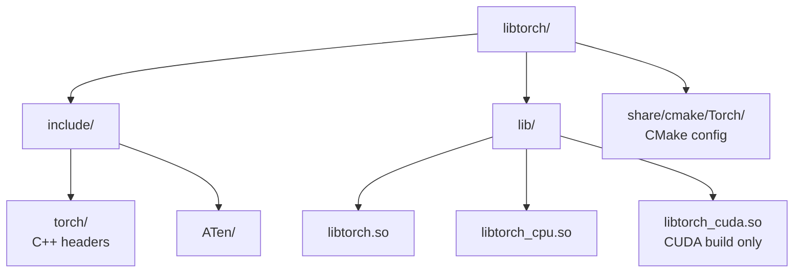
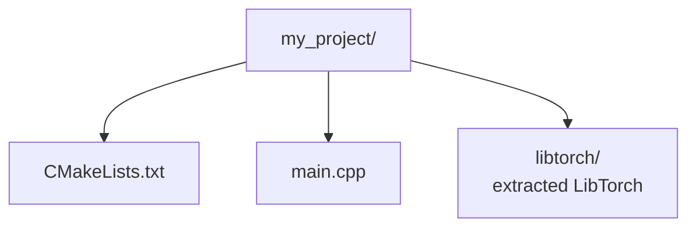
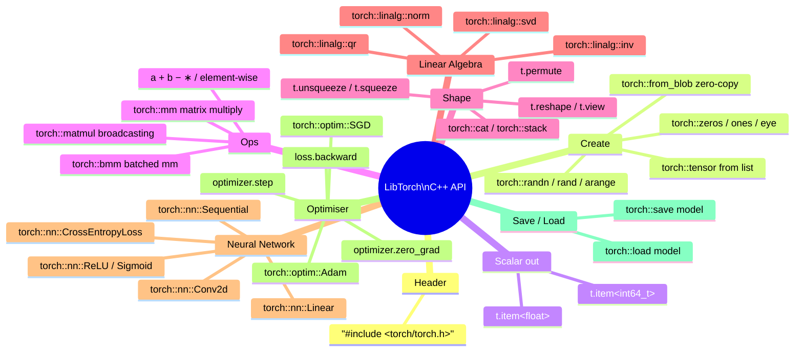

# LibTorch — Pure C++ Guide

LibTorch is the standalone C++ distribution of PyTorch. Everything — tensors, autograd, neural network modules, optimisers, model serialisation — is available as a native C++ library with no runtime dependency on Python.

---

## Table of Contents

1. [Setup and Installation](#1-setup-and-installation)
2. [CMake Build Configuration](#2-cmake-build-configuration)
3. [Scalars, Vectors and Matrices](#3-scalars-vectors-and-matrices)
4. [Data Types and Devices](#4-data-types-and-devices)
5. [Tensor Operations](#5-tensor-operations)
6. [Indexing and Slicing](#6-indexing-and-slicing)
7. [Shape Manipulation](#7-shape-manipulation)
8. [Linear Algebra](#8-linear-algebra)
9. [Reduction Operations](#9-reduction-operations)
10. [Autograd — Automatic Differentiation](#10-autograd--automatic-differentiation)
11. [Building Neural Networks with torch::nn](#11-building-neural-networks-with-torchnn)
12. [Training a Model in C++](#12-training-a-model-in-c)
13. [Saving and Loading Models](#13-saving-and-loading-models)
14. [GPU Support (CUDA)](#14-gpu-support-cuda)
15. [Full End-to-End Example](#15-full-end-to-end-example)

---

## 1. Setup and Installation

### Download pre-built binaries

```bash
# CPU-only (Linux, cxx11 ABI — recommended for most systems)
wget https://download.pytorch.org/libtorch/cpu/libtorch-cxx11-abi-shared-with-deps-2.3.0%2Bcpu.zip
unzip libtorch-*.zip

# CUDA 12.1
wget https://download.pytorch.org/libtorch/cu121/libtorch-cxx11-abi-shared-with-deps-2.3.0%2Bcu121.zip
unzip libtorch-*.zip
```

Extracted layout:



### Set the runtime library path

```bash
export LD_LIBRARY_PATH=/path/to/libtorch/lib:$LD_LIBRARY_PATH
```

---

## 2. CMake Build Configuration

### Project layout



### CMakeLists.txt

```cmake
cmake_minimum_required(VERSION 3.18)
project(LibTorchApp CXX)

set(CMAKE_CXX_STANDARD 17)

# Tell CMake where LibTorch lives
set(CMAKE_PREFIX_PATH "${CMAKE_SOURCE_DIR}/libtorch")
find_package(Torch REQUIRED)

add_executable(app main.cpp)
target_link_libraries(app "${TORCH_LIBRARIES}")
target_include_directories(app PRIVATE "${TORCH_INCLUDE_DIRS}")

# Windows: copy DLLs next to the executable
if(MSVC)
    file(GLOB TORCH_DLLS "${TORCH_INSTALL_PREFIX}/lib/*.dll")
    add_custom_command(TARGET app POST_BUILD
        COMMAND ${CMAKE_COMMAND} -E copy_if_different
            ${TORCH_DLLS} $<TARGET_FILE_DIR:app>)
endif()
```

### Build

```bash
mkdir build && cd build
cmake .. -DCMAKE_BUILD_TYPE=Release
cmake --build . --config Release -j$(nproc)
./app
```

---

## 3. Scalars, Vectors and Matrices

The header you always need:

```cpp
#include <torch/torch.h>
```

---

### 3.1 Scalar (0-D tensor)

```cpp
// From a C++ literal
torch::Tensor s1 = torch::tensor(3.14f);
torch::Tensor s2 = torch::tensor(42);
torch::Tensor s3 = torch::tensor(true);

// Read the value back as a C++ type
float   v1 = s1.item<float>();
int64_t v2 = s2.item<int64_t>();
bool    v3 = s3.item<bool>();

std::cout << "Scalar: " << v1 << "\n";      // 3.14
std::cout << "Shape:  " << s1.sizes() << "\n"; // []  (0-D)
std::cout << "Dims:   " << s1.dim()   << "\n"; // 0
```

---

### 3.2 Vector (1-D tensor)

```cpp
// From an initializer list
torch::Tensor v = torch::tensor({1.0f, 2.0f, 3.0f, 4.0f, 5.0f});

// From a std::vector
std::vector<float> data = {10.f, 20.f, 30.f};
torch::Tensor v2 = torch::tensor(data);

// From a raw C array (zero-copy view — caller owns the memory)
float arr[] = {1.f, 2.f, 3.f};
torch::Tensor v3 = torch::from_blob(arr, {3}, torch::kFloat32);
// ↑ Call .clone() if you need LibTorch to own the data

std::cout << v  << "\n";           // [1, 2, 3, 4, 5]
std::cout << v.sizes() << "\n";    // [5]
std::cout << "Length: " << v.size(0) << "\n";  // 5

// Factory functions
torch::Tensor zeros_v = torch::zeros({6});      // [0, 0, 0, 0, 0, 0]
torch::Tensor ones_v  = torch::ones({6});       // [1, 1, 1, 1, 1, 1]
torch::Tensor range_v = torch::arange(0, 10, 2); // [0, 2, 4, 6, 8]
torch::Tensor lin_v   = torch::linspace(0.f, 1.f, 5); // [0, 0.25, 0.5, 0.75, 1]
torch::Tensor rand_v  = torch::randn({8});      // standard normal
```

---

### 3.3 Matrix (2-D tensor)

```cpp
// From a nested initializer list
torch::Tensor m = torch::tensor({
    {1.f, 2.f, 3.f},
    {4.f, 5.f, 6.f},
    {7.f, 8.f, 9.f}
});

std::cout << m          << "\n";   // 3×3 values
std::cout << m.sizes()  << "\n";   // [3, 3]
std::cout << "Rows: "   << m.size(0) << ", Cols: " << m.size(1) << "\n";

// Factory functions for matrices
torch::Tensor Z  = torch::zeros({4, 5});         // 4×5 all-zeros
torch::Tensor I  = torch::eye(3);               // 3×3 identity
torch::Tensor R  = torch::randn({3, 3});         // 3×3 normal
torch::Tensor U  = torch::rand({3, 3});          // 3×3 uniform [0,1)
torch::Tensor F  = torch::full({2, 4}, 7.f);    // 2×4 filled with 7

// From a raw flat array — row-major layout
float raw[6] = {1, 2, 3, 4, 5, 6};
torch::Tensor m2 = torch::from_blob(raw, {2, 3}, torch::kFloat32).clone();

std::cout << m2 << "\n";
// 1  2  3
// 4  5  6
```

---

### 3.4 Higher-Dimensional Tensors (N-D)

```cpp
// 3-D: batch × height × width  (e.g. greyscale images)
torch::Tensor t3 = torch::randn({8, 28, 28});

// 4-D: batch × channels × height × width  (e.g. RGB images)
torch::Tensor t4 = torch::randn({16, 3, 224, 224});

std::cout << t3.dim()    << "\n";   // 3
std::cout << t4.numel()  << "\n";   // 16*3*224*224 = 2,408,448
```

---

## 4. Data Types and Devices

### Scalar types

| C++ constant | C++ type | Bits |
|---|---|---|
| `torch::kFloat32` | `float` | 32 |
| `torch::kFloat64` | `double` | 64 |
| `torch::kFloat16` | half float | 16 |
| `torch::kInt32` | `int32_t` | 32 |
| `torch::kInt64` | `int64_t` | 64 |
| `torch::kInt8` | `int8_t` | 8 |
| `torch::kUInt8` | `uint8_t` | 8 |
| `torch::kBool` | `bool` | 8 |

```cpp
// Specify dtype at creation
torch::Tensor fi = torch::ones({3, 3}, torch::kFloat64);
torch::Tensor ii = torch::zeros({4}, torch::kInt64);
torch::Tensor bi = torch::ones({2, 2}, torch::kBool);

// Cast an existing tensor
torch::Tensor a   = torch::randn({3, 3});          // float32
torch::Tensor a64 = a.to(torch::kFloat64);          // cast to float64
torch::Tensor ai  = a.to(torch::kInt32);            // cast to int32

// Inspect
std::cout << a.dtype()  << "\n";   // torch.float32
std::cout << a.is_floating_point() << "\n";  // 1 (true)
```

### Devices

```cpp
// CPU (default)
torch::Device cpu(torch::kCPU);

// GPU — index 0
torch::Device gpu(torch::kCUDA, 0);

// Check availability
if (torch::cuda::is_available()) {
    int n = torch::cuda::device_count();
    std::cout << n << " CUDA device(s) available\n";
}

// Move a tensor between devices
torch::Tensor t = torch::randn({3, 3});
torch::Tensor t_gpu = t.to(gpu);
torch::Tensor t_cpu = t_gpu.to(cpu);

// Specify device at creation
torch::TensorOptions opts = torch::TensorOptions()
    .dtype(torch::kFloat32)
    .device(torch::kCUDA, 0);
torch::Tensor on_gpu = torch::randn({4, 4}, opts);
```

---

## 5. Tensor Operations

### 5.1 Element-wise arithmetic

```cpp
torch::Tensor a = torch::tensor({1.f, 2.f, 3.f, 4.f});
torch::Tensor b = torch::tensor({10.f, 20.f, 30.f, 40.f});

// Binary ops — return new tensors
torch::Tensor add  = a + b;           // [11, 22, 33, 44]
torch::Tensor sub  = b - a;           // [9, 18, 27, 36]
torch::Tensor mul  = a * b;           // [10, 40, 90, 160]
torch::Tensor div_ = b / a;           // [10, 10, 10, 10]
torch::Tensor pw   = a.pow(2);        // [1, 4, 9, 16]

// Scalar ops
torch::Tensor scaled = a * 3.f;       // [3, 6, 9, 12]
torch::Tensor offset = a + 100.f;     // [101, 102, 103, 104]

// In-place ops (trailing underscore — modifies tensor in memory)
a.add_(1.f);    // a → [2, 3, 4, 5]
a.mul_(2.f);    // a → [4, 6, 8, 10]
a.fill_(0.f);   // a → [0, 0, 0, 0]

// Operator overloads also work
torch::Tensor c = torch::ones({4}) * 5.f + torch::arange(4.f);
std::cout << c << "\n";  // [5, 6, 7, 8]
```

---

### 5.2 Comparison operations

```cpp
torch::Tensor x = torch::tensor({1.f, 5.f, 3.f, 7.f, 2.f});

torch::Tensor gt   = x > 3.f;         // [false, true, false, true, false]
torch::Tensor eq   = x == 5.f;        // [false, true, false, false, false]
torch::Tensor mask = (x >= 2.f) & (x <= 5.f);  // boolean AND

// Use a mask to select elements
torch::Tensor selected = x.masked_select(mask);
std::cout << selected << "\n";  // [5, 3, 2]

// where: element-wise conditional
torch::Tensor result = torch::where(x > 3.f, x, torch::zeros_like(x));
std::cout << result << "\n";    // [0, 5, 0, 7, 0]
```

---

### 5.3 Mathematical functions

```cpp
torch::Tensor t = torch::tensor({-2.f, -1.f, 0.f, 1.f, 2.f});

torch::Tensor abs_t  = torch::abs(t);       // [2, 1, 0, 1, 2]
torch::Tensor relu_t = torch::relu(t);      // [0, 0, 0, 1, 2]
torch::Tensor exp_t  = torch::exp(t);
torch::Tensor log_t  = torch::log(torch::abs(t) + 1e-6f);
torch::Tensor sqrt_t = torch::sqrt(torch::abs(t));
torch::Tensor sin_t  = torch::sin(t);

// Sigmoid and tanh (activations)
torch::Tensor sig_t  = torch::sigmoid(t);
torch::Tensor tanh_t = torch::tanh(t);

// Clamp values to a range
torch::Tensor clamped = t.clamp(-1.f, 1.f);  // [-1, -1, 0, 1, 1]
```

---

## 6. Indexing and Slicing

```cpp
torch::Tensor m = torch::arange(1, 13).reshape({3, 4}).to(torch::kFloat32);
// m:
//  1  2  3  4
//  5  6  7  8
//  9 10 11 12

using namespace torch::indexing;

// Single element
torch::Tensor elem    = m[1][2];               // 7
float         val     = m[1][2].item<float>(); // 7.0f

// Whole row / column
torch::Tensor row1    = m[1];                  // [5, 6, 7, 8]
torch::Tensor col2    = m.index({Slice(), 2}); // [3, 7, 11]

// Slices: Slice(start, stop, step)
torch::Tensor rows01  = m.index({Slice(0, 2)});         // rows 0–1
torch::Tensor cols13  = m.index({Slice(), Slice(1, 3)}); // cols 1–2
torch::Tensor step    = m.index({Slice(), Slice(None, None, 2)}); // every 2nd col

// Negative indexing (last row, last column)
torch::Tensor last_row = m[-1];                // [9, 10, 11, 12]
torch::Tensor last_col = m.index({Slice(), -1}); // [4, 8, 12]

// Boolean mask
torch::Tensor flat    = m.view({-1});
torch::Tensor big     = flat.masked_select(flat > 6.f);  // [7,8,9,10,11,12]

// Fancy indexing with a LongTensor
torch::Tensor idx  = torch::tensor({0L, 2L});
torch::Tensor rows = m.index_select(0, idx);   // rows 0 and 2

// Set values via index
m[0][0] = 99.f;
m.index({Slice(1, 3), Slice(1, 3)}) = torch::zeros({2, 2});
```

---

## 7. Shape Manipulation

```cpp
torch::Tensor t = torch::arange(24.f);   // [24]

// Reshape (total elements must match)
torch::Tensor a = t.reshape({2, 3, 4});  // [2, 3, 4]
torch::Tensor b = t.view({6, 4});        // [6, 4]  — alias, must be contiguous
torch::Tensor c = t.reshape({-1, 6});    // [-1 inferred] → [4, 6]

// Flatten
torch::Tensor flat = a.flatten();                  // [24]
torch::Tensor flat2 = a.flatten(/*start=*/1);      // [2, 12]  (keep dim 0)

// Add/remove dimensions
torch::Tensor m  = torch::randn({3, 4});
torch::Tensor u0 = m.unsqueeze(0);    // [1, 3, 4]
torch::Tensor u1 = m.unsqueeze(1);    // [3, 1, 4]
torch::Tensor u2 = m.unsqueeze(-1);   // [3, 4, 1]
torch::Tensor sq = u0.squeeze(0);     // [3, 4]  — removes size-1 dim
torch::Tensor sq2 = u0.squeeze();     // removes all size-1 dims

// Transpose and permute
torch::Tensor t2  = m.t();                       // [4, 3]
torch::Tensor p   = a.permute({2, 0, 1});        // [4, 2, 3]

// Expand and repeat (without copying data)
torch::Tensor row = torch::ones({1, 4});
torch::Tensor expanded = row.expand({3, 4});     // [3, 4]  view only
torch::Tensor repeated = row.repeat({3, 2});     // [3, 8]  copies data

// Concatenate and stack
torch::Tensor x = torch::ones({2, 3});
torch::Tensor y = torch::zeros({2, 3});
torch::Tensor cat_r = torch::cat({x, y}, /*dim=*/0);  // [4, 3]  along rows
torch::Tensor cat_c = torch::cat({x, y}, /*dim=*/1);  // [2, 6]  along cols
torch::Tensor stk   = torch::stack({x, y}, /*dim=*/0); // [2, 2, 3]  new dim

// Split
auto parts = torch::split(cat_r, /*split_size=*/2, /*dim=*/0); // two [2,3]
```

---

## 8. Linear Algebra

```cpp
torch::Tensor A = torch::randn({3, 4});
torch::Tensor B = torch::randn({4, 5});

// Matrix multiply
torch::Tensor C  = torch::mm(A, B);          // [3, 5]  2-D only
torch::Tensor C2 = torch::matmul(A, B);       // [3, 5]  supports broadcasting

// Batched matrix multiply
torch::Tensor Ab = torch::randn({8, 3, 4});
torch::Tensor Bb = torch::randn({8, 4, 5});
torch::Tensor Cb = torch::bmm(Ab, Bb);        // [8, 3, 5]

// Dot product (1-D vectors)
torch::Tensor u = torch::tensor({1.f, 2.f, 3.f});
torch::Tensor v2 = torch::tensor({4.f, 5.f, 6.f});
torch::Tensor dot = torch::dot(u, v2);         // scalar: 1*4+2*5+3*6 = 32

// Cross product (3-D vectors)
torch::Tensor cross = torch::cross(u, v2, /*dim=*/0);

// Outer product
torch::Tensor outer = torch::outer(u, v2);    // [3, 3]

// Transpose
torch::Tensor At = A.t();                      // [4, 3]
torch::Tensor Atp = A.transpose(0, 1);        // same as .t() for 2-D

// Decompositions
auto [Q, R]        = torch::linalg::qr(A);       // QR decomposition
auto [U, S, Vh]    = torch::linalg::svd(A, /*full_matrices=*/false); // SVD
auto [L, info]     = torch::linalg::cholesky_ex(A.t().mm(A)); // Cholesky
torch::Tensor Ainv = torch::linalg::inv(A.t().mm(A));          // Inverse

// Solve linear system  Ax = b
torch::Tensor b_vec = torch::randn({3});
torch::Tensor sq_A  = A.t().mm(A);             // 4×4 positive definite
// x = torch::linalg::solve(sq_A, b_extended);

// Norms
torch::Tensor frobenius = torch::linalg::norm(A);            // Frobenius
torch::Tensor col_norms = torch::linalg::norm(A, 2, /*dim=*/0); // per-column L2
torch::Tensor l1        = torch::linalg::norm(A, 1);
torch::Tensor det       = torch::linalg::det(A.t().mm(A));
torch::Tensor trace_v   = torch::trace(A.t().mm(A));
```

---

## 9. Reduction Operations

```cpp
torch::Tensor m = torch::tensor({
    {1.f, 2.f, 3.f},
    {4.f, 5.f, 6.f}
});

// Global reductions — returns a scalar tensor
torch::Tensor total  = m.sum();      // 21
torch::Tensor mean_v = m.mean();     // 3.5
torch::Tensor max_v  = m.max();      // 6
torch::Tensor min_v  = m.min();      // 1
torch::Tensor prod   = m.prod();
torch::Tensor std_v  = m.std();
torch::Tensor var_v  = m.var();

// Along a dimension
torch::Tensor col_sum  = m.sum(/*dim=*/0);        // [5, 7, 9]   sum each col
torch::Tensor row_sum  = m.sum(/*dim=*/1);        // [6, 15]     sum each row
torch::Tensor col_mean = m.mean(/*dim=*/0);       // [2.5, 3.5, 4.5]
torch::Tensor row_mean = m.mean(/*dim=*/1, /*keepdim=*/true); // [[2],[5]]

// Max and argmax
auto [max_vals, max_idx] = m.max(/*dim=*/1);  // max of each row + index
torch::Tensor argmax_col = m.argmax(/*dim=*/0); // index of max in each col
torch::Tensor argmax_all = m.argmax();           // flat index of global max

// Min and argmin
auto [min_vals, min_idx] = m.min(/*dim=*/0);

// Cumulative operations
torch::Tensor flat   = m.view({-1});
torch::Tensor cumsum = flat.cumsum(/*dim=*/0);   // [1,3,6,10,15,21]
torch::Tensor cumprod = flat.cumprod(/*dim=*/0);

// Sort
auto [sorted, sort_idx] = m.sort(/*dim=*/1);       // sort each row
auto [sorted_d, idx_d]  = m.sort(/*dim=*/1, /*descending=*/true);

// Unique values
auto [unique_vals, counts_u] = torch::_unique2(
    torch::tensor({1, 2, 2, 3, 3, 3}),
    /*sorted=*/true, /*return_inverse=*/false, /*return_counts=*/true
);
std::cout << unique_vals << "\n"; // [1, 2, 3]
std::cout << counts_u    << "\n"; // [1, 2, 3]
```

---

## 10. Autograd — Automatic Differentiation

```cpp
// Tensors that need gradients
torch::Tensor x = torch::tensor({2.f}, torch::requires_grad(true));
torch::Tensor w = torch::tensor({3.f}, torch::requires_grad(true));
torch::Tensor b = torch::tensor({1.f}, torch::requires_grad(true));

// Forward: y = w*x + b
torch::Tensor y = w * x + b;   // 3*2+1 = 7

// Backward: compute dy/dw, dy/dx, dy/db
y.backward();

std::cout << "dy/dw: " << w.grad() << "\n";   // 2  (= x)
std::cout << "dy/dx: " << x.grad() << "\n";   // 3  (= w)
std::cout << "dy/db: " << b.grad() << "\n";   // 1

// Vector function — need to provide gradient vector
torch::Tensor a = torch::randn({3}, torch::requires_grad(true));
torch::Tensor out = (a * a).sum();   // scalar output
out.backward();
std::cout << a.grad() << "\n";  // 2*a (element-wise)

// Disable gradient tracking for inference
{
    torch::NoGradGuard no_grad;
    torch::Tensor result = w * x + b;  // no computation graph built
}

// Or use a local scope
torch::Tensor r2 = [&]() {
    torch::AutoGradMode guard(false);
    return w * x + b;
}();

// Detach a tensor from the graph
torch::Tensor w_val = w.detach();   // plain tensor, no grad
```

---

## 11. Building Neural Networks with torch::nn

### 11.1 Defining a module

```cpp
#include <torch/torch.h>

// Inherit from torch::nn::Module
struct LinearNet : torch::nn::Module {
    torch::nn::Linear fc1{nullptr};
    torch::nn::Linear fc2{nullptr};
    torch::nn::Linear fc3{nullptr};
    torch::nn::Dropout drop{nullptr};

    LinearNet(int64_t in, int64_t hidden, int64_t out)
    {
        // register_module makes parameters visible to optimisers
        fc1  = register_module("fc1",  torch::nn::Linear(in,     hidden));
        fc2  = register_module("fc2",  torch::nn::Linear(hidden, hidden));
        fc3  = register_module("fc3",  torch::nn::Linear(hidden, out));
        drop = register_module("drop", torch::nn::Dropout(0.3));
    }

    torch::Tensor forward(torch::Tensor x) {
        x = torch::relu(fc1->forward(x));
        x = drop->forward(x);
        x = torch::relu(fc2->forward(x));
        x = fc3->forward(x);
        return x;
    }
};
```

### 11.2 Using Sequential

```cpp
torch::nn::Sequential net(
    torch::nn::Linear(128, 64),
    torch::nn::ReLU(),
    torch::nn::Dropout(0.2),
    torch::nn::Linear(64, 32),
    torch::nn::ReLU(),
    torch::nn::Linear(32, 10)
);

torch::Tensor input = torch::randn({4, 128});
torch::Tensor out   = net->forward(input);
std::cout << out.sizes() << "\n";   // [4, 10]
```

### 11.3 Available built-in modules

| Category | Modules |
|---|---|
| **Linear** | `Linear`, `Bilinear` |
| **Convolution** | `Conv1d`, `Conv2d`, `Conv3d`, `ConvTranspose2d` |
| **Normalisation** | `BatchNorm1d`, `BatchNorm2d`, `LayerNorm`, `GroupNorm` |
| **Recurrent** | `RNN`, `LSTM`, `GRU` |
| **Activation** | `ReLU`, `Sigmoid`, `Tanh`, `GELU`, `Softmax`, `LogSoftmax` |
| **Pooling** | `MaxPool2d`, `AvgPool2d`, `AdaptiveAvgPool2d` |
| **Regularisation** | `Dropout`, `Dropout2d` |
| **Embedding** | `Embedding`, `EmbeddingBag` |
| **Attention** | `MultiheadAttention` |
| **Loss** | `MSELoss`, `CrossEntropyLoss`, `BCELoss`, `NLLLoss`, `L1Loss` |

### 11.4 Inspecting parameters

```cpp
LinearNet model(128, 64, 10);

// Iterate over named parameters
for (const auto& p : model.named_parameters()) {
    std::cout << p.key() << " | " << p.value().sizes() << "\n";
}
// fc1.weight | [64, 128]
// fc1.bias   | [64]
// fc2.weight | [64, 64]
// ...

// Total parameter count
int64_t total = 0;
for (const auto& p : model.parameters()) {
    total += p.numel();
}
std::cout << "Total parameters: " << total << "\n";
```

---

## 12. Training a Model in C++

```cpp
#include <torch/torch.h>

// --- Model ---
struct Net : torch::nn::Module {
    torch::nn::Linear fc1{nullptr}, fc2{nullptr};

    Net() {
        fc1 = register_module("fc1", torch::nn::Linear(4, 16));
        fc2 = register_module("fc2", torch::nn::Linear(16, 1));
    }

    torch::Tensor forward(torch::Tensor x) {
        return fc2->forward(torch::relu(fc1->forward(x)));
    }
};

int main() {
    // Instantiate model and optimiser
    auto model = std::make_shared<Net>();
    torch::optim::Adam optimizer(model->parameters(),
                                 torch::optim::AdamOptions(1e-3));

    torch::nn::MSELoss criterion;

    const int EPOCHS = 100;
    const int BATCH  = 32;

    for (int epoch = 1; epoch <= EPOCHS; ++epoch) {
        model->train();   // enable dropout / batchnorm training mode

        // Synthetic batch: y = sum(x)
        torch::Tensor x      = torch::randn({BATCH, 4});
        torch::Tensor y_true = x.sum(1, /*keepdim=*/true);

        // --- Forward ---
        torch::Tensor y_pred = model->forward(x);
        torch::Tensor loss   = criterion(y_pred, y_true);

        // --- Backward ---
        optimizer.zero_grad();
        loss.backward();
        optimizer.step();

        if (epoch % 10 == 0) {
            std::cout << "Epoch " << epoch
                      << "  Loss: " << loss.item<float>() << "\n";
        }
    }

    // --- Inference ---
    model->eval();
    torch::NoGradGuard no_grad;
    torch::Tensor test_x = torch::randn({4, 4});
    torch::Tensor pred   = model->forward(test_x);
    std::cout << "Predictions:\n" << pred << "\n";

    return 0;
}
```

### Available optimisers

```cpp
// SGD with momentum
torch::optim::SGD  opt1(model->parameters(),
    torch::optim::SGDOptions(0.01).momentum(0.9));

// Adam
torch::optim::Adam opt2(model->parameters(),
    torch::optim::AdamOptions(1e-3).weight_decay(1e-4));

// RMSprop
torch::optim::RMSprop opt3(model->parameters(),
    torch::optim::RMSpropOptions(1e-3).alpha(0.9));

// Learning rate scheduler (manual step)
for (auto& group : optimizer.param_groups()) {
    group.options().set_lr(group.options().get_lr() * 0.5);
}
```

---

## 13. Saving and Loading Models

```cpp
// Save model weights to a file
torch::save(model, "model.pt");

// Load weights into a fresh model of the same architecture
auto loaded_model = std::make_shared<Net>();
torch::load(loaded_model, "model.pt");
loaded_model->eval();

// Save just the state dict (more portable)
torch::serialize::OutputArchive archive;
model->save(archive);
archive.save_to("state_dict.pt");

// Load from archive
torch::serialize::InputArchive in_archive;
in_archive.load_from("state_dict.pt");
loaded_model->load(in_archive);

// Save a raw tensor
torch::Tensor weights = torch::randn({128, 64});
torch::save(weights, "weights.pt");

// Load a raw tensor
torch::Tensor w_loaded;
torch::load(w_loaded, "weights.pt");
std::cout << w_loaded.sizes() << "\n";  // [128, 64]
```

---

## 14. GPU Support (CUDA)

```cpp
torch::Device device = torch::cuda::is_available()
                     ? torch::Device(torch::kCUDA, 0)
                     : torch::Device(torch::kCPU);

std::cout << "Device: " << device << "\n";

// Move model to device
model->to(device);

// Create tensors directly on device
torch::Tensor x = torch::randn({32, 4}, device);

// Or move existing tensors
torch::Tensor y = torch::randn({32, 4}).to(device);

// Ensure model output comes back to CPU for logging
torch::Tensor pred = model->forward(x).cpu();

// Synchronise before timing CUDA operations
if (torch::cuda::is_available()) {
    torch::cuda::synchronize();
}
```

**Rule:** model parameters and all input tensors must be on the **same device**. Mixing CPU and CUDA raises a runtime error.

---

## 15. Full End-to-End Example

A complete classifier that creates data, builds a model, trains it, evaluates it, and saves it — all in C++.

```cpp
// classifier.cpp
#include <torch/torch.h>
#include <iostream>
#include <iomanip>

// ── Model ─────────────────────────────────────────────────────────────────────

struct Classifier : torch::nn::Module {
    torch::nn::Linear   fc1{nullptr}, fc2{nullptr}, fc3{nullptr};
    torch::nn::BatchNorm1d bn1{nullptr}, bn2{nullptr};
    torch::nn::Dropout  drop{nullptr};

    Classifier(int64_t features, int64_t classes) {
        fc1  = register_module("fc1",  torch::nn::Linear(features, 128));
        bn1  = register_module("bn1",  torch::nn::BatchNorm1d(128));
        fc2  = register_module("fc2",  torch::nn::Linear(128, 64));
        bn2  = register_module("bn2",  torch::nn::BatchNorm1d(64));
        fc3  = register_module("fc3",  torch::nn::Linear(64, classes));
        drop = register_module("drop", torch::nn::Dropout(0.3));
    }

    torch::Tensor forward(torch::Tensor x) {
        x = torch::relu(bn1->forward(fc1->forward(x)));
        x = drop->forward(x);
        x = torch::relu(bn2->forward(fc2->forward(x)));
        x = fc3->forward(x);
        return x;
    }
};

// ── Synthetic dataset ─────────────────────────────────────────────────────────

std::pair<torch::Tensor, torch::Tensor>
make_dataset(int64_t n, int64_t features, int64_t classes) {
    // X: random features;  y: class label derived from feature sum
    torch::Tensor X = torch::randn({n, features});
    torch::Tensor y = (X.sum(1) > 0).to(torch::kInt64) % classes;
    return {X, y};
}

// ── Accuracy helper ───────────────────────────────────────────────────────────

float accuracy(const torch::Tensor& logits, const torch::Tensor& targets) {
    torch::Tensor preds   = logits.argmax(1);
    torch::Tensor correct = preds.eq(targets).sum();
    return correct.item<float>() / static_cast<float>(targets.size(0));
}

// ── Main ──────────────────────────────────────────────────────────────────────

int main() {
    torch::manual_seed(42);

    const int64_t FEATURES  = 16;
    const int64_t CLASSES   = 3;
    const int64_t BATCH      = 64;
    const int64_t EPOCHS     = 50;
    const float   LR         = 1e-3f;

    // Device
    torch::Device device = torch::cuda::is_available()
                         ? torch::Device(torch::kCUDA, 0)
                         : torch::Device(torch::kCPU);
    std::cout << "Running on: " << device << "\n\n";

    // Data
    auto [X_train, y_train] = make_dataset(800,  FEATURES, CLASSES);
    auto [X_test,  y_test]  = make_dataset(200,  FEATURES, CLASSES);
    X_train = X_train.to(device); y_train = y_train.to(device);
    X_test  = X_test.to(device);  y_test  = y_test.to(device);

    // Model + optimiser + loss
    auto model = std::make_shared<Classifier>(FEATURES, CLASSES);
    model->to(device);

    torch::optim::Adam optimizer(model->parameters(),
                                 torch::optim::AdamOptions(LR));
    torch::nn::CrossEntropyLoss criterion;

    // Training loop
    std::cout << std::fixed << std::setprecision(4);

    for (int epoch = 1; epoch <= EPOCHS; ++epoch) {
        model->train();

        // Mini-batch loop
        float epoch_loss = 0.f;
        int   steps      = 0;

        for (int64_t start = 0; start < X_train.size(0); start += BATCH) {
            int64_t end    = std::min(start + BATCH, X_train.size(0));
            auto x_batch   = X_train.slice(0, start, end);
            auto y_batch   = y_train.slice(0, start, end);

            torch::Tensor logits = model->forward(x_batch);
            torch::Tensor loss   = criterion(logits, y_batch);

            optimizer.zero_grad();
            loss.backward();
            optimizer.step();

            epoch_loss += loss.item<float>();
            ++steps;
        }

        if (epoch % 10 == 0) {
            model->eval();
            torch::NoGradGuard no_grad;

            torch::Tensor val_logits = model->forward(X_test);
            torch::Tensor val_loss   = criterion(val_logits, y_test);
            float         val_acc    = accuracy(val_logits, y_test);

            std::cout << "Epoch " << std::setw(3) << epoch
                      << "  train_loss=" << epoch_loss / steps
                      << "  val_loss="   << val_loss.item<float>()
                      << "  val_acc="    << val_acc * 100.f << "%\n";
        }
    }

    // Final evaluation
    model->eval();
    torch::NoGradGuard no_grad;
    torch::Tensor final_logits = model->forward(X_test);
    float final_acc = accuracy(final_logits, y_test);
    std::cout << "\nFinal test accuracy: " << final_acc * 100.f << "%\n";

    // Save
    torch::save(model, "classifier.pt");
    std::cout << "Model saved to classifier.pt\n";

    // Reload and verify
    auto reloaded = std::make_shared<Classifier>(FEATURES, CLASSES);
    torch::load(reloaded, "classifier.pt");
    reloaded->to(device);
    reloaded->eval();

    torch::Tensor check = reloaded->forward(X_test);
    std::cout << "Reloaded accuracy: " << accuracy(check, y_test) * 100.f << "%\n";

    return 0;
}
```

Build and run:

```bash
mkdir build && cd build
cmake .. -DCMAKE_BUILD_TYPE=Release
cmake --build . -j$(nproc)
./app
```

Expected output:

```
Running on: cpu

Epoch  10  train_loss=1.0721  val_loss=1.0334  val_acc=42.50%
Epoch  20  train_loss=0.9841  val_loss=0.9782  val_acc=55.00%
Epoch  30  train_loss=0.9102  val_loss=0.9103  val_acc=63.50%
Epoch  40  train_loss=0.8513  val_loss=0.8674  val_acc=68.00%
Epoch  50  train_loss=0.8041  val_loss=0.8332  val_acc=71.50%

Final test accuracy: 71.50%
Model saved to classifier.pt
Reloaded accuracy: 71.50%
```

---

## Quick Reference


