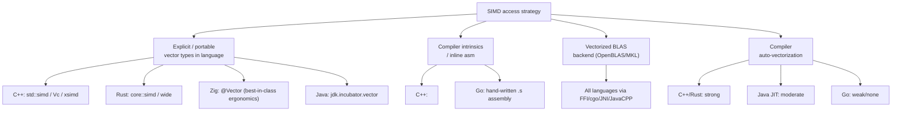
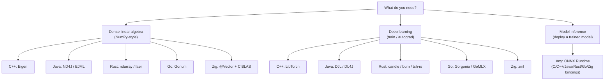

# Numerical & ML Libraries Across Languages

A cross-language reference of the popular numerical-computing, linear-algebra, and machine-learning libraries that play roles similar to Python's **NumPy**, **PyTorch**, and **TensorFlow**. Each entry notes whether the library is **SIMD-capable** (uses vectorized CPU instructions — SSE/AVX/AVX-512 on x86, NEON/SVE on ARM — either directly, via an autovectorizing compiler, or through a BLAS backend such as OpenBLAS/MKL that is itself hand-vectorized).

> **SIMD legend**
> - ✅ **Yes** — explicit/intrinsic SIMD or ships a vectorized kernel/BLAS backend.
> - ⚙️ **Via backend** — relies on an external BLAS/LAPACK (OpenBLAS, MKL, BLIS, Accelerate) which is SIMD-optimized.
> - 🔁 **Autovec** — no hand-written SIMD, but the compiler can auto-vectorize tight loops.
> - ❌ **No / minimal** — scalar code, SIMD not a design goal.

---

## Table of Contents

1. [Quick Comparison Matrix](#1-quick-comparison-matrix)
2. [C++](#2-c)
3. [Java / JVM](#3-java--jvm)
4. [Rust](#4-rust)
5. [Go (Golang)](#5-go-golang)
6. [Zig](#6-zig)
7. [SIMD Notes by Language](#7-simd-notes-by-language)
8. [Choosing a Library](#8-choosing-a-library)

---

## 1. Quick Comparison Matrix

| Language | NumPy-like (arrays) | PyTorch-like (autograd/DL) | TensorFlow-like (graph/deploy) | BLAS/LAPACK backend |
|---|---|---|---|---|
| **C++** | Eigen, xtensor, Armadillo, NumCpp | LibTorch, Flashlight, mlpack | TensorFlow C++ API, ONNX Runtime | ✅ MKL / OpenBLAS / Blaze |
| **Java** | ND4J, ojAlgo, EJML, Apache Commons Math | DJL, Deeplearning4j, ND4J-autograd | TensorFlow Java, DJL, ONNX Runtime | ✅ via JavaCPP → MKL/OpenBLAS |
| **Rust** | ndarray, nalgebra, faer | Candle, tch-rs, burn, dfdx | Candle, tract, ONNX Runtime (ort) | ✅ via openblas-src / MKL / pure-Rust faer |
| **Go** | Gonum, gorgonia/tensor | Gorgonia, GoMLX | TensorFlow Go bindings, ONNX Runtime Go | ⚙️ Gonum has asm kernels; cgo BLAS |
| **Zig** | zml tensor, zig-nd, std SIMD vectors | zml, custom | zml (XLA/IREE), ONNX via C | 🔁/✅ `@Vector` builtins + C BLAS |

---

## 2. C++

C++ has the richest ecosystem — most other languages bind to these libraries under the hood.

| Library | Role | SIMD | Notes |
|---|---|---|---|
| **Eigen** | NumPy-like / linear algebra | ✅ Yes | Header-only; explicit SSE/AVX/AVX-512/NEON vectorization built in. The de-facto C++ linalg library. |
| **xtensor** | NumPy-like (lazy, broadcasting) | ✅ Yes | NumPy-style API; SIMD via `xsimd`. Has `xtensor-python` bridge. |
| **Armadillo** | NumPy/MATLAB-like | ⚙️ Via backend | High-level syntax; delegates to LAPACK/BLAS (OpenBLAS/MKL). |
| **Blaze** | High-performance linalg | ✅ Yes | Smart expression templates + explicit SIMD + BLAS. |
| **NumCpp** | NumPy clone | 🔁 Autovec | Header-only, API mirrors NumPy; relies on compiler autovec + optional Boost. |
| **Fastor / Vc / std::simd** | Explicit SIMD primitives | ✅ Yes | `std::simd` (C++26/`<experimental/simd>`) gives portable vector types. |
| **LibTorch** | PyTorch backend (C++) | ✅ Yes | Full PyTorch in C++; ATen kernels are vectorized + MKL/oneDNN. |
| **Flashlight** | DL research (ArrayFire) | ✅ Yes | From Meta; ArrayFire backend (CPU SIMD + CUDA). |
| **mlpack** | Classical ML | ✅ Yes | Built on Armadillo/ensmallen. |
| **TensorFlow C++ API** | TF graph/inference | ✅ Yes | Eigen + oneDNN + XLA. |
| **ONNX Runtime** | Cross-framework inference | ✅ Yes | Highly optimized; AVX-512/VNNI, ARM NEON. |

See also the dedicated guides in this folder: [numcpp_guide.md](numcpp_guide.md), [libtorch_guide.md](libtorch_guide.md).

---

## 3. Java / JVM

The JVM historically lagged on SIMD, but the **Vector API** (incubating since JDK 16, `jdk.incubator.vector`) now exposes portable SIMD, and most heavy libraries bind to native BLAS via JavaCPP.

| Library | Role | SIMD | Notes |
|---|---|---|---|
| **ND4J** (DL4J) | NumPy-like n-d arrays | ✅ Yes | "NumPy for Java"; native backend with AVX + oneDNN via JavaCPP. |
| **Deeplearning4j** | PyTorch/TF-like DL | ✅ Yes | Built on ND4J; CPU (AVX) and CUDA. |
| **DJL** (Deep Java Library) | PyTorch/TF/ONNX frontend | ✅ Yes | High-level API over LibTorch/TF/ONNX engines. |
| **ojAlgo** | Linear algebra / optimization | 🔁 Autovec | Pure Java; benefits from JIT autovec, some Vector API use. |
| **EJML** | Efficient Java Matrix Library | 🔁 Autovec | Pure Java; dense/sparse; no native BLAS. |
| **Apache Commons Math** | General math/stats | ❌ No | Pure Java, scalar; broad but not perf-focused. |
| **TensorFlow Java** | TF graphs | ✅ Yes | Official bindings to the TF C library. |
| **JBLAS** | BLAS wrapper | ⚙️ Via backend | Thin JNI wrapper over native BLAS/LAPACK. |
| **Vector API** (`jdk.incubator.vector`) | Explicit SIMD primitives | ✅ Yes | Portable AVX/NEON vector ops in pure Java. |

---

## 4. Rust

Rust has a fast-growing, increasingly production-ready numerical/ML ecosystem with strong SIMD support.

| Library | Role | SIMD | Notes |
|---|---|---|---|
| **ndarray** | NumPy-like n-d arrays | ⚙️/🔁 | NumPy-style; optional `blas` feature → OpenBLAS/MKL; autovec otherwise. |
| **nalgebra** | Linear algebra (graphics/robotics) | 🔁/✅ | Generic; optional SIMD via `simba`/`wide`; LAPACK feature. |
| **faer** | High-performance dense linalg | ✅ Yes | Pure-Rust, hand-vectorized; rivals OpenBLAS without C deps. |
| **candle** | PyTorch-like DL (HF) | ✅ Yes | From Hugging Face; CPU SIMD, CUDA, Metal. |
| **tch-rs** | LibTorch bindings | ✅ Yes | Full PyTorch via LibTorch. |
| **burn** | PyTorch-like DL framework | ✅ Yes | Pluggable backends (ndarray, wgpu, candle, LibTorch). |
| **dfdx** | Autograd, compile-time shapes | ✅ Yes | Type-checked tensor shapes; SIMD/CUDA. |
| **tract** | TF/ONNX inference engine | ✅ Yes | Sonos; pure-Rust ONNX/TF inference, NEON/AVX. |
| **ort** | ONNX Runtime bindings | ✅ Yes | Wraps Microsoft ONNX Runtime. |
| **std::simd** (`core::simd`) | Portable SIMD primitives | ✅ Yes | Nightly portable SIMD; `wide`/`packed_simd` on stable. |
| **polars** | DataFrame (Arrow) | ✅ Yes | Not ML, but SIMD-heavy columnar compute. |

See the dedicated guide: [libtorch_guide.md](libtorch_guide.md) (concepts carry over to tch-rs).

---

## 5. Go (Golang)

Go favors simplicity; heavy numerics typically use Gonum (with hand-written assembly kernels) or cgo bindings to C libraries. The compiler does **not** auto-vectorize, so SIMD comes from hand-written assembly.

| Library | Role | SIMD | Notes |
|---|---|---|---|
| **Gonum** | NumPy-like (mat, stat, blas) | ✅ Yes | Hand-written SIMD (SSE/AVX) assembly kernels in `gonum/internal/asm`. |
| **gonum/blas (native)** | BLAS in Go | ✅ Yes | Assembly-optimized; can also bind to C BLAS via `cgo`. |
| **gorgonia** | PyTorch/TF-like (graphs, autograd) | ⚙️ Partial | Computation graphs + autodiff; uses Gonum/CUDA. |
| **gorgonia/tensor** | NumPy-like n-d arrays | ⚙️ Partial | Backing tensor library for Gorgonia. |
| **GoMLX** | JAX/TF-like ML | ✅ Yes | Uses XLA (PJRT) backend for SIMD/GPU/TPU. |
| **TensorFlow Go** | TF inference | ✅ Yes | Bindings to the TF C library. |
| **onnxruntime_go** | ONNX inference | ✅ Yes | cgo wrapper over ONNX Runtime. |
| **go-dsp / chewxy/math32** | DSP / float32 math | 🔁/❌ | Utility math; limited SIMD. |

> Go has no stable standard SIMD intrinsics API; projects use `//go:noescape` assembly or the experimental `simd` proposals. Auto-vectorization by the Go compiler is essentially absent.

---

## 6. Zig

Zig is young but has **first-class portable SIMD** built into the language via the `@Vector` builtin, plus trivial C interop (so any C BLAS/ONNX library is directly usable).

| Library / Facility | Role | SIMD | Notes |
|---|---|---|---|
| **`@Vector(N, T)`** (language builtin) | Explicit SIMD primitives | ✅ Yes | Portable vector types; arithmetic, `@reduce`, shuffles compile to SSE/AVX/NEON. |
| **`std.simd`** | SIMD helpers | ✅ Yes | Standard-library helpers (e.g. `std.simd.suggestVectorLength`). |
| **zml** | TF/JAX-like ML | ✅ Yes | Production inference; compiles via MLIR/XLA/IREE to CPU SIMD/GPU/TPU. |
| **zig-nd / zalgebra / zlm** | NumPy/linalg-like | ✅/🔁 | Smaller libraries; `zalgebra`/`zlm` target graphics math; use `@Vector`. |
| **C interop (Eigen, BLAS, LibTorch, ONNX)** | Anything from C/C++ | ✅ Yes | `@cImport` makes the entire C/C++ numerical ecosystem available natively. |

> Zig's ecosystem of native numerical libraries is still small, but because Zig links against C effortlessly, the practical answer for heavy linear algebra is usually "call OpenBLAS/Eigen/LibTorch directly," while `@Vector` covers custom hot loops with portable SIMD.

---

## 7. SIMD Notes by Language

| Language | Native portable SIMD | Intrinsics | Autovectorization | Typical fast path |
|---|---|---|---|---|
| **C++** | `std::simd` (C++26), Vc, xsimd | ✅ `<immintrin.h>` | ✅ Strong (GCC/Clang) | Eigen / MKL / explicit intrinsics |
| **Java** | ✅ Vector API (incubating) | ❌ (JIT only) | ⚙️ Moderate (HotSpot) | Vector API or native BLAS via JavaCPP |
| **Rust** | ✅ `core::simd` (nightly), `wide` | ✅ `core::arch` | ✅ Strong (LLVM) | faer / candle / SIMD crates |
| **Go** | ❌ (none stable) | ⚙️ Inline assembly only | ❌ Essentially none | Gonum asm kernels or cgo→BLAS |
| **Zig** | ✅ `@Vector` (excellent) | ✅ `@cImport` intrinsics | ✅ Good (LLVM) | `@Vector` loops or C BLAS via `@cImport` |

---

## 8. Choosing a Library

**General guidance:**

- **Maximum performance & ecosystem maturity:** C++ (Eigen + LibTorch/ONNX Runtime). Almost every other language ultimately binds to these.
- **JVM shops:** ND4J/DJL give NumPy + PyTorch-style ergonomics with native acceleration.
- **Memory safety + modern tooling:** Rust (`faer`/`candle`/`burn`) is the strongest non-C++ native option today.
- **Simplicity / services:** Go (Gonum) for moderate numerics; use ONNX Runtime or GoMLX for serious ML.
- **Cutting-edge / systems control:** Zig's `@Vector` plus effortless C interop lets you mix portable SIMD with the full C numerical stack.
- **Cross-framework deployment in any language:** **ONNX Runtime** is the common denominator — train anywhere, export to ONNX, run with SIMD-optimized kernels everywhere.

---

### References

- Eigen: <https://eigen.tuxfamily.org/>
- xtensor: <https://xtensor.readthedocs.io/>
- LibTorch / PyTorch C++: <https://pytorch.org/cppdocs/>
- ND4J / Deeplearning4j: <https://deeplearning4j.konduit.ai/>
- DJL: <https://djl.ai/>
- Java Vector API (JEP 338+): <https://openjdk.org/jeps/448>
- Rust ndarray: <https://docs.rs/ndarray/>
- faer: <https://faer-rs.github.io/>
- candle: <https://github.com/huggingface/candle>
- burn: <https://burn.dev/>
- Gonum: <https://www.gonum.org/>
- Gorgonia: <https://gorgonia.org/>
- GoMLX: <https://github.com/gomlx/gomlx>
- Zig `@Vector` / SIMD: <https://ziglang.org/documentation/master/#Vectors>
- zml: <https://github.com/zml/zml>
- ONNX Runtime: <https://onnxruntime.ai/>
