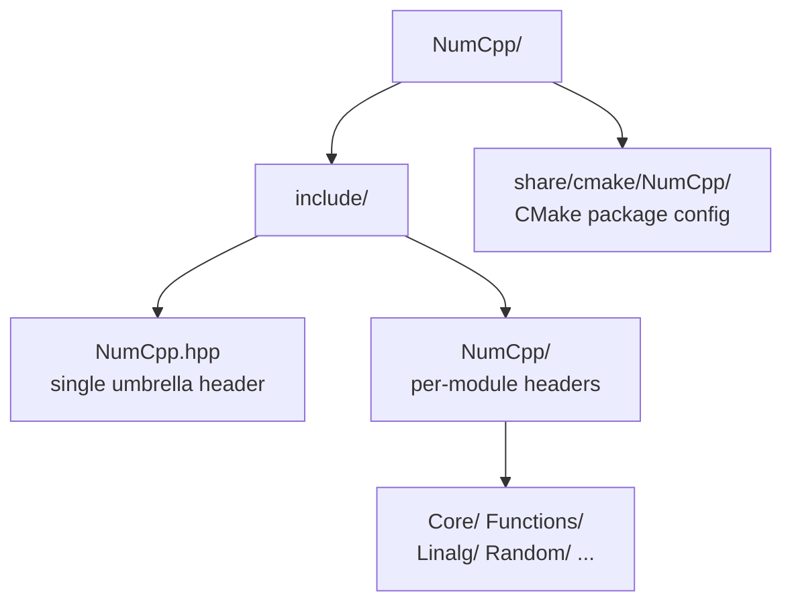
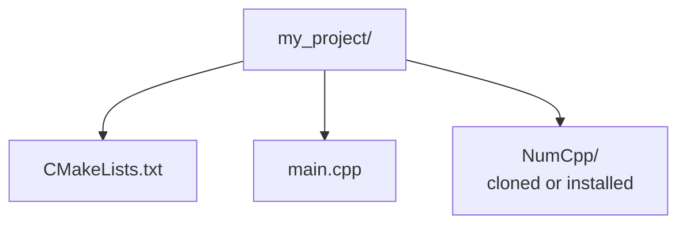

# NumCpp — NumPy for C++ Guide

[NumCpp](https://github.com/dpilger26/NumCpp) is a templatized, header-only C++ implementation of the Python NumPy library. It provides the `nc::NdArray<dtype>` class — a strongly-typed, N-dimensional array — together with a large collection of free functions (`nc::add`, `nc::dot`, `nc::linalg::inv`, …) whose names and semantics mirror NumPy as closely as C++ allows. Because it is header-only there is nothing to compile or link: just add the include path and go.

---

## Table of Contents

1. [Setup and Installation](#1-setup-and-installation)
2. [CMake Build Configuration](#2-cmake-build-configuration)
3. [Scalars, Vectors and Matrices](#3-scalars-vectors-and-matrices)
4. [Data Types](#4-data-types)
5. [Array Operations](#5-array-operations)
6. [Indexing and Slicing](#6-indexing-and-slicing)
7. [Shape Manipulation](#7-shape-manipulation)
8. [Linear Algebra](#8-linear-algebra)
9. [Reduction Operations](#9-reduction-operations)
10. [Random Number Generation](#10-random-number-generation)
11. [Broadcasting and Element-wise Math](#11-broadcasting-and-element-wise-math)
12. [File I/O and Serialisation](#12-file-io-and-serialisation)
13. [Interfacing with std and Raw Pointers](#13-interfacing-with-std-and-raw-pointers)
14. [Polynomials, FFT and Image-style Filters](#14-polynomials-fft-and-image-style-filters)
15. [Full End-to-End Example](#15-full-end-to-end-example)

---

## 1. Setup and Installation

NumCpp is **header-only**. You only need the headers on your include path. The only hard dependency is a C++17 compiler; some advanced features (SVD, eigenvalues, FFT) optionally use [Boost](https://www.boost.org/).

### Option A — clone the repository

```bash
git clone https://github.com/dpilger26/NumCpp.git
# Headers live in NumCpp/include/NumCpp.hpp and NumCpp/include/NumCpp/...
```

### Option B — install with CMake

```bash
git clone https://github.com/dpilger26/NumCpp.git
cd NumCpp
mkdir build && cd build
cmake .. -DCMAKE_INSTALL_PREFIX=/usr/local
cmake --build . --target install
```

### Option C — package managers

```bash
# vcpkg
vcpkg install nlohmann-json   # transitive dep for some features
vcpkg install numcpp

# Conan
conan install --requires=numcpp/2.12.1
```

Extracted layout:



### The one include you always need

```cpp
#include "NumCpp.hpp"   // pulls in the whole library
```

By convention the namespace `nc` is used throughout (analogous to `np` in Python).

---

## 2. CMake Build Configuration

### Project layout



### CMakeLists.txt

```cmake
cmake_minimum_required(VERSION 3.14)
project(NumCppApp CXX)

set(CMAKE_CXX_STANDARD 17)
set(CMAKE_CXX_STANDARD_REQUIRED ON)

# If NumCpp was installed system-wide:
find_package(NumCpp REQUIRED)

add_executable(app main.cpp)
target_link_libraries(app NumCpp::NumCpp)

# --- OR, if you just cloned the repo next to your source: ---
# add_executable(app main.cpp)
# target_include_directories(app PRIVATE "${CMAKE_SOURCE_DIR}/NumCpp/include")
# target_compile_features(app PRIVATE cxx_std_17)
```

### Build

```bash
mkdir build && cd build
cmake .. -DCMAKE_BUILD_TYPE=Release
cmake --build . --config Release -j$(nproc)
./app
```

### Quick one-off compile (no CMake)

```bash
g++ -std=c++17 -O2 -I/path/to/NumCpp/include main.cpp -o app && ./app
```

---

## 3. Scalars, Vectors and Matrices

The array type is `nc::NdArray<dtype>`. It is always at heart a 2-D (rows × cols) container; a "vector" is simply a 1×N or N×1 array, and a scalar is a 1×1 array.

```cpp
#include "NumCpp.hpp"
#include <iostream>
```

### 3.1 Scalar (1×1 array)

```cpp
nc::NdArray<double> s = {3.14};         // shape (1, 1)
double v = s.item();                    // read the single value back -> 3.14

std::cout << "Value: " << v        << "\n";
std::cout << "Shape: " << s.shape() << "\n";   // (1, 1)
std::cout << "Size:  " << s.size()  << "\n";   // 1
```

### 3.2 Vector (1-D)

```cpp
// From an initializer list
nc::NdArray<double> v = {1.0, 2.0, 3.0, 4.0, 5.0};   // shape (1, 5)

// From a std::vector
std::vector<double> data = {10.0, 20.0, 30.0};
nc::NdArray<double> v2(data);                         // shape (1, 3)

std::cout << v             << "\n";   // [[1, 2, 3, 4, 5]]
std::cout << v.shape()     << "\n";   // (1, 5)
std::cout << v.size()      << "\n";   // 5

// Factory functions
auto zeros_v = nc::zeros<double>(1, 6);        // [[0, 0, 0, 0, 0, 0]]
auto ones_v  = nc::ones<double>(1, 6);         // [[1, 1, 1, 1, 1, 1]]
auto range_v = nc::arange<int>(0, 10, 2);      // [[0, 2, 4, 6, 8]]
auto lin_v   = nc::linspace<double>(0.0, 1.0, 5); // [[0, 0.25, 0.5, 0.75, 1]]
auto full_v  = nc::full<double>(1, 4, 7.0);    // [[7, 7, 7, 7]]
```

### 3.3 Matrix (2-D)

```cpp
// From a nested initializer list
nc::NdArray<double> m = {
    {1.0, 2.0, 3.0},
    {4.0, 5.0, 6.0},
    {7.0, 8.0, 9.0}
};

std::cout << m          << "\n";
std::cout << m.shape()  << "\n";          // (3, 3)
std::cout << "Rows: " << m.numRows()
          << ", Cols: " << m.numCols() << "\n";

// Factory functions for matrices
auto Z = nc::zeros<double>(4, 5);          // 4×5 all-zeros
auto I = nc::eye<double>(3);               // 3×3 identity
auto U = nc::ones<double>(3, 3);           // 3×3 all-ones
auto F = nc::full<double>(2, 4, 7.0);      // 2×4 filled with 7
auto D = nc::diag(nc::NdArray<double>{1.0, 2.0, 3.0}); // diagonal matrix
```

### 3.4 Reshaping flat data into N-D

```cpp
// NumCpp arrays are logically 2-D, but you can model higher-rank tensors
// by reshaping flat data and tracking dimensions yourself.
auto flat = nc::arange<double>(0.0, 24.0);     // shape (1, 24)
auto img  = flat.reshape(4, 6);                // shape (4, 6)

std::cout << img.shape() << "\n";              // (4, 6)
std::cout << img.size()  << "\n";              // 24
```

---

## 4. Data Types

`NdArray<dtype>` is a template, so the element type is part of the type. There is no runtime dtype object as in NumPy.

| Python NumPy dtype | NumCpp template argument | C++ type |
|---|---|---|
| `np.float64` | `nc::NdArray<double>` | `double` |
| `np.float32` | `nc::NdArray<float>` | `float` |
| `np.int32` | `nc::NdArray<int32_t>` | `int32_t` |
| `np.int64` | `nc::NdArray<int64_t>` | `int64_t` |
| `np.uint8` | `nc::NdArray<uint8_t>` | `uint8_t` |
| `np.bool_` | `nc::NdArray<bool>` | `bool` |
| `np.complex128` | `nc::NdArray<std::complex<double>>` | `std::complex<double>` |

```cpp
// Specify dtype at creation via the template parameter
auto fi = nc::ones<double>(3, 3);
auto ii = nc::zeros<int32_t>(1, 4);
nc::NdArray<bool> bi = {true, false, true};

// Cast (convert) an existing array to another element type
auto a   = nc::random::randN<double>({3, 3});  // double
auto af  = a.astype<float>();                  // -> float
auto ai  = a.astype<int>();                    // -> int (truncates)

// Inspect
std::cout << a.dtype()  << "\n";   // a short type tag, e.g. "f8"
std::cout << sizeof(double) << " bytes per element\n";
```

---

## 5. Array Operations

### 5.1 Element-wise arithmetic

```cpp
nc::NdArray<double> a = {1.0, 2.0, 3.0, 4.0};
nc::NdArray<double> b = {10.0, 20.0, 30.0, 40.0};

// Operator overloads — return new arrays
auto add  = a + b;            // [[11, 22, 33, 44]]
auto sub  = b - a;            // [[9, 18, 27, 36]]
auto mul  = a * b;            // [[10, 40, 90, 160]]  (element-wise!)
auto div_ = b / a;            // [[10, 10, 10, 10]]
auto pw   = nc::power(a, 2);  // [[1, 4, 9, 16]]

// Scalar ops broadcast automatically
auto scaled = a * 3.0;        // [[3, 6, 9, 12]]
auto offset = a + 100.0;      // [[101, 102, 103, 104]]

// Compound-assignment operators modify in place
a += 1.0;    // a -> [[2, 3, 4, 5]]
a *= 2.0;    // a -> [[4, 6, 8, 10]]

// Named function equivalents (mirror NumPy)
auto add2 = nc::add(a, b);
auto mul2 = nc::multiply(a, b);
```

### 5.2 Comparison operations

```cpp
nc::NdArray<double> x = {1.0, 5.0, 3.0, 7.0, 2.0};

auto gt   = x > 3.0;          // [[0, 1, 0, 1, 0]]  (NdArray<bool>)
auto eq   = nc::equal(x, 5.0);
auto mask = (x >= 2.0) && (x <= 5.0);   // boolean AND, element-wise

// Use a boolean mask to select elements -> 1-D result
auto selected = x[mask];
std::cout << selected << "\n";   // [[5, 3, 2]]

// where: element-wise conditional
auto result = nc::where(x > 3.0, x, nc::zeros_like(x));
std::cout << result << "\n";     // [[0, 5, 0, 7, 0]]

// Any / all
std::cout << nc::any(gt) << "\n";  // [[1]]
std::cout << nc::all(gt) << "\n";  // [[0]]
```

### 5.3 Mathematical functions

```cpp
nc::NdArray<double> t = {-2.0, -1.0, 0.0, 1.0, 2.0};

auto abs_t  = nc::abs(t);         // [[2, 1, 0, 1, 2]]
auto exp_t  = nc::exp(t);
auto log_t  = nc::log(nc::abs(t) + 1e-6);
auto sqrt_t = nc::sqrt(nc::abs(t));
auto sin_t  = nc::sin(t);
auto cos_t  = nc::cos(t);

// Sigmoid-style activations are composed from primitives
auto sig_t  = 1.0 / (1.0 + nc::exp(-t));
auto tanh_t = nc::tanh(t);

// Clip values to a range
auto clipped = nc::clip(t, -1.0, 1.0);  // [[-1, -1, 0, 1, 1]]

// Rounding
auto rounded = nc::round(nc::NdArray<double>{1.4, 1.6, -1.5});
auto floored = nc::floor(t);
auto ceiled  = nc::ceil(t);
```

---

## 6. Indexing and Slicing

```cpp
auto m = nc::arange<double>(1.0, 13.0).reshape(3, 4);
// m:
//  1  2  3  4
//  5  6  7  8
//  9 10 11 12

// Single element — linear index or (row, col)
double e1 = m[6];          // linear (row-major) -> 7
double e2 = m(1, 2);       // (row, col)         -> 7

// Whole row / column using nc::Slice
using nc::Slice;
auto row1 = m(1, m.cSlice());          // [[5, 6, 7, 8]]
auto col2 = m(m.rSlice(), 2);          // [[3], [7], [11]]

// Slices: Slice(start, stop, step)
auto rows01 = m(Slice(0, 2), m.cSlice());        // rows 0–1
auto cols13 = m(m.rSlice(), Slice(1, 3));        // cols 1–2
auto step   = m(m.rSlice(), Slice(0, 4, 2));     // every 2nd column

// Negative indexing (last row / last column)
auto last_row = m(-1, m.cSlice());     // [[9, 10, 11, 12]]
auto last_col = m(m.rSlice(), -1);     // [[4], [8], [12]]

// Boolean mask -> flat result
auto big = m[m > 6.0];                 // [[7, 8, 9, 10, 11, 12]]

// Fancy indexing with an integer index array
nc::NdArray<uint32_t> idx = {0, 2};
auto picked = m(idx, m.cSlice());      // rows 0 and 2

// Assign through an index / slice
m(0, 0) = 99.0;
m.put(m > 50.0, 0.0);                  // set every element > 50 to 0
m(Slice(1, 3), Slice(1, 3)) = nc::zeros<double>(2, 2);
```

---

## 7. Shape Manipulation

```cpp
auto t = nc::arange<double>(0.0, 24.0);   // shape (1, 24)

// Reshape (total elements must match; -1 infers a dimension)
auto a = t.reshape(2, 12);                // (2, 12)
auto b = t.reshape(4, 6);                 // (4, 6)
auto c = t.reshape(-1, 6);               // (-1 inferred) -> (4, 6)

// Flatten
auto flat = a.flatten();                  // (1, 24)

// Transpose
auto m  = nc::random::randN<double>({3, 4});
auto mt = m.transpose();                  // (4, 3)
auto mt2 = nc::transpose(m);              // free-function form

// Concatenate (stacking)
auto x = nc::ones<double>(2, 3);
auto y = nc::zeros<double>(2, 3);
auto vstacked = nc::vstack({x, y});       // (4, 3)  stack rows
auto hstacked = nc::hstack({x, y});       // (2, 6)  stack columns
auto appended = nc::append(x, y, nc::Axis::ROW);   // (4, 3)

// Repeat / tile
auto row     = nc::NdArray<double>{1.0, 2.0, 3.0};
auto tiled   = nc::tile(row, 3, 1);       // (3, 3) — repeat the row 3×
auto repeated = nc::repeat(row, 1, 2);    // repeat each element twice

// Split
auto parts = nc::vsplit(vstacked, 2);     // two (2, 3) arrays

// Swap / flip
auto flippedLR = nc::fliplr(m);
auto flippedUD = nc::flipud(m);
```

---

## 8. Linear Algebra

```cpp
auto A = nc::random::randN<double>({3, 4});
auto B = nc::random::randN<double>({4, 5});

// Matrix multiply (NumPy's @ / np.dot)
auto C = nc::dot(A, B);              // (3, 5)

// Dot product of two 1-D vectors -> 1×1 array
nc::NdArray<double> u = {1.0, 2.0, 3.0};
nc::NdArray<double> v = {4.0, 5.0, 6.0};
auto dot = nc::dot(u, v);           // [[32]]  (1*4 + 2*5 + 3*6)

// Cross product (3-element vectors)
auto cross = nc::cross(u, v);

// Outer product
auto outer = nc::dot(u.transpose(), v);   // (3, 3)

// Transpose
auto At = A.transpose();            // (4, 3)

// Build a square, positive-definite matrix to demonstrate decompositions
auto S = nc::dot(A.transpose(), A); // (4, 4)

// Determinant, trace, inverse
auto det   = nc::linalg::determinant(S);
auto trace = nc::trace(S);
auto inv   = nc::linalg::inv(S);

// Solve a linear system  A x = b
nc::NdArray<double> b_vec = nc::random::randN<double>({4, 1});
auto sol = nc::linalg::solve(S, b_vec);   // x such that S x = b

// Decompositions (some require Boost)
auto [U, Sigma, Vt] = nc::linalg::svd(A);      // SVD
auto chol           = nc::linalg::cholesky(S); // Cholesky factor
auto [Q, R]         = nc::linalg::qr(A);       // QR (if available)

// Matrix power and norms
auto Apow = nc::linalg::matrix_power(S, 2);
auto fro  = nc::linalg::norm(A);               // Frobenius norm
```

---

## 9. Reduction Operations

NumCpp reductions take an `nc::Axis` argument: `NONE` (flatten everything), `ROW` (collapse rows → per-column result) or `COL` (collapse columns → per-row result).

```cpp
nc::NdArray<double> m = {
    {1.0, 2.0, 3.0},
    {4.0, 5.0, 6.0}
};

// Global reductions (Axis::NONE is the default) -> 1×1 array
auto total = nc::sum(m);        // [[21]]
auto mean  = nc::mean(m);       // [[3.5]]
auto maxV  = nc::max(m);        // [[6]]
auto minV  = nc::min(m);        // [[1]]
auto prod  = nc::prod(m);
auto stdev = nc::stdev(m);
auto var   = nc::var(m);

// Along an axis
auto colSum  = nc::sum(m,  nc::Axis::ROW);   // [[5, 7, 9]]   collapse rows
auto rowSum  = nc::sum(m,  nc::Axis::COL);   // [[6, 15]]     collapse cols
auto colMean = nc::mean(m, nc::Axis::ROW);   // [[2.5, 3.5, 4.5]]

// argmax / argmin -> indices
auto argmaxRow = nc::argmax(m, nc::Axis::ROW);   // index of max per column
auto argmaxAll = nc::argmax(m);                  // flat index of global max
auto argminCol = nc::argmin(m, nc::Axis::COL);

// Cumulative operations
auto flat    = m.flatten();
auto cumsum  = nc::cumsum(flat);   // [[1, 3, 6, 10, 15, 21]]
auto cumprod = nc::cumprod(flat);

// Sort and unique
auto sorted = nc::sort(m, nc::Axis::COL);      // sort each row
auto uniq   = nc::unique(nc::NdArray<int>{1, 2, 2, 3, 3, 3}); // [[1, 2, 3]]

// Percentile / median
auto med = nc::median(m);
auto p90 = nc::percentile(m, 90.0);
```

---

## 10. Random Number Generation

All generators live under `nc::random`. Seed once for reproducibility.

```cpp
nc::random::seed(42);

// Uniform [0, 1)
auto u = nc::random::rand<double>({3, 3});

// Standard normal  N(0, 1)
auto n = nc::random::randN<double>({3, 3});

// Normal with given mean / std
auto g = nc::random::normal<double>({1000, 1}, 5.0 /*mean*/, 2.0 /*std*/);

// Uniform integers in [low, high)
auto i = nc::random::randInt<int>({1, 10}, 0, 100);

// Random choice / permutation / shuffle
auto deck = nc::arange<int>(0, 52);
auto perm = nc::random::permutation(deck);
nc::random::shuffle(deck);
auto pick = nc::random::choice(deck, 5);   // 5 random elements

// Other distributions
auto poisson  = nc::random::poisson<int>({1, 5}, 3.0);
auto binomial = nc::random::binomial<int>({1, 5}, 10, 0.5);
auto bernoul  = nc::random::bernoulli({1, 5}, 0.5);
```

---

## 11. Broadcasting and Element-wise Math

NumCpp does **not** broadcast mismatched shapes as freely as NumPy. Array–array binary operators require identical shapes; scalar–array operations broadcast the scalar. To "broadcast" a row or column, replicate it explicitly with `nc::tile` first.

```cpp
auto M   = nc::arange<double>(0.0, 6.0).reshape(2, 3);
auto row = nc::NdArray<double>{10.0, 20.0, 30.0};   // (1, 3)

// Manual broadcast: tile the row to match M's rows, then add
auto rowB = nc::tile(row, M.numRows(), 1);          // (2, 3)
auto added = M + rowB;

// Column broadcast
auto col  = nc::NdArray<double>{{100.0}, {200.0}};   // (2, 1)
auto colB = nc::tile(col, 1, M.numCols());           // (2, 3)
auto added2 = M + colB;

// Scalar broadcasting works directly
auto scaled = M * 0.5 + 1.0;

// Trig / exp / log are all element-wise and shape-preserving
auto activated = nc::tanh(nc::dot(M, nc::random::randN<double>({3, 4})));
```

---

## 12. File I/O and Serialisation

```cpp
auto data = nc::random::randN<double>({100, 5});

// Binary dump / load (NumCpp's native .bin format)
data.tofile("data.bin");
auto loaded = nc::fromfile<double>("data.bin");      // 1-D; reshape as needed
loaded = loaded.reshape(100, 5);

// Plain-text CSV-style I/O
data.tofile("data.csv", ',');
auto fromCsv = nc::fromfile<double>("data.csv", ',');

// NumPy .npy interoperability (requires the optional CNpy backend)
// nc::dump(data, "data.npy");
// auto npy = nc::load<double>("data.npy");

// Pretty-print to a stream
std::cout << data(nc::Slice(0, 3), data.cSlice()) << "\n";  // first 3 rows
```

---

## 13. Interfacing with std and Raw Pointers

```cpp
// From a std::vector (1-D)
std::vector<double> sv = {1.0, 2.0, 3.0, 4.0};
nc::NdArray<double> a(sv);                  // (1, 4)

// From a raw pointer (copies the data)
double raw[6] = {1, 2, 3, 4, 5, 6};
nc::NdArray<double> b(raw, 2, 3);           // (2, 3), row-major

// Zero-copy view over external memory (caller keeps ownership)
nc::NdArray<double> view(raw, 2, 3, false /*takeOwnership*/);

// Back to std::vector
std::vector<double> out = a.toStlVector();

// Iterate like an STL container
for (double& x : a) { x *= 2.0; }

// Access the contiguous backing buffer
double* ptr = a.data();
std::cout << "First element: " << ptr[0] << "\n";
```

---

## 14. Polynomials, FFT and Image-style Filters

```cpp
// --- Polynomials ---
// Coefficients highest-degree first: 2x^2 + 3x + 1
nc::polynomial::Poly1d<double> p({2.0, 3.0, 1.0});
std::cout << "p(2) = " << p(2.0) << "\n";        // 2*4 + 3*2 + 1 = 15
auto deriv = p.deriv();
auto integ = p.integ();
auto roots = p.roots();

// Polynomial fit (least squares) — like numpy.polyfit
auto xs = nc::linspace<double>(0.0, 10.0, 50);
auto ys = 3.0 * nc::power(xs, 2) + 2.0 * xs + 1.0;
auto coeffs = nc::polynomial::Poly1d<double>::fit(xs, ys, 2 /*degree*/);

// --- FFT (requires Boost) ---
// auto signal = nc::sin(nc::linspace<double>(0.0, 2.0 * nc::constants::pi, 64));
// auto spectrum = nc::fft(signal);

// --- Convolution / simple filtering ---
nc::NdArray<double> kernel = {0.25, 0.5, 0.25};
nc::NdArray<double> series = nc::random::randN<double>({1, 32});
// 1-D smoothing via correlate
// auto smoothed = nc::filter::convolve1d(series, kernel);

// Statistics handy for ML preprocessing
auto X    = nc::random::randN<double>({200, 4});
auto mean = nc::mean(X, nc::Axis::ROW);          // per-feature mean
auto std_ = nc::stdev(X, nc::Axis::ROW);         // per-feature std
auto Xstd = (X - nc::tile(mean, X.numRows(), 1))
          /  nc::tile(std_, X.numRows(), 1);     // standardised features
```

---

## 15. Full End-to-End Example

A complete linear-regression trainer implemented purely with NumCpp: it generates synthetic data, standardises features, trains weights with batch gradient descent, evaluates on a held-out set, and saves the learned parameters.

```cpp
// linreg.cpp
#include "NumCpp.hpp"
#include <iostream>
#include <iomanip>

using Array = nc::NdArray<double>;

// ── Synthetic dataset:  y = X · w_true + b_true + noise ──────────────────────
std::pair<Array, Array> makeDataset(uint32_t n, uint32_t features) {
    auto X      = nc::random::randN<double>({n, features});
    auto wTrue  = nc::random::randN<double>({features, 1});
    double bTrue = 2.5;
    auto noise  = nc::random::randN<double>({n, 1}) * 0.1;
    auto y      = nc::dot(X, wTrue) + bTrue + noise;
    return {X, y};
}

// ── Standardise features column-wise ─────────────────────────────────────────
Array standardize(const Array& X, const Array& mean, const Array& std_) {
    return (X - nc::tile(mean, X.numRows(), 1))
         /  nc::tile(std_, X.numRows(), 1);
}

// ── Mean squared error ───────────────────────────────────────────────────────
double mse(const Array& pred, const Array& target) {
    return nc::mean(nc::power(pred - target, 2)).item();
}

int main() {
    nc::random::seed(42);

    const uint32_t FEATURES = 8;
    const uint32_t N_TRAIN  = 800;
    const uint32_t N_TEST   = 200;
    const double   LR       = 0.05;
    const int      EPOCHS   = 300;

    // Data
    auto [Xtr, ytr] = makeDataset(N_TRAIN, FEATURES);
    auto [Xte, yte] = makeDataset(N_TEST,  FEATURES);

    // Standardise using training statistics
    auto mean = nc::mean(Xtr,  nc::Axis::ROW);
    auto std_ = nc::stdev(Xtr, nc::Axis::ROW);
    Xtr = standardize(Xtr, mean, std_);
    Xte = standardize(Xte, mean, std_);

    // Parameters: weights (FEATURES × 1) and bias (scalar)
    auto w = nc::zeros<double>(FEATURES, 1);
    double b = 0.0;

    std::cout << std::fixed << std::setprecision(5);

    // ── Batch gradient descent ───────────────────────────────────────────────
    for (int epoch = 1; epoch <= EPOCHS; ++epoch) {
        // Forward
        auto pred  = nc::dot(Xtr, w) + b;          // (N_TRAIN, 1)
        auto error = pred - ytr;                    // (N_TRAIN, 1)

        // Gradients (MSE):  dL/dw = (2/N) Xᵀ·error,  dL/db = (2/N) Σ error
        auto gradW = nc::dot(Xtr.transpose(), error) * (2.0 / N_TRAIN);
        double gradB = nc::sum(error).item() * (2.0 / N_TRAIN);

        // Update
        w = w - gradW * LR;
        b = b - gradB * LR;

        if (epoch % 50 == 0) {
            double trainLoss = mse(pred, ytr);
            auto   testPred  = nc::dot(Xte, w) + b;
            double testLoss  = mse(testPred, yte);
            std::cout << "Epoch " << std::setw(3) << epoch
                      << "  train MSE: " << trainLoss
                      << "  test MSE: "  << testLoss << "\n";
        }
    }

    // ── Final evaluation ─────────────────────────────────────────────────────
    auto finalPred = nc::dot(Xte, w) + b;
    std::cout << "\nFinal test MSE: " << mse(finalPred, yte) << "\n";

    // ── Save the learned parameters ──────────────────────────────────────────
    w.tofile("weights.bin");
    nc::NdArray<double>{b}.tofile("bias.bin");
    std::cout << "Saved weights.bin and bias.bin\n";

    return 0;
}
```

Build and run:

```bash
g++ -std=c++17 -O2 -I/path/to/NumCpp/include linreg.cpp -o linreg && ./linreg
```

Expected output (values vary slightly with the platform RNG):

```
Epoch  50  train MSE: 0.34201  test MSE: 0.35517
Epoch 100  train MSE: 0.05912  test MSE: 0.06283
Epoch 150  train MSE: 0.01617  test MSE: 0.01744
Epoch 200  train MSE: 0.01072  test MSE: 0.01158
Epoch 250  train MSE: 0.01005  test MSE: 0.01088
Epoch 300  train MSE: 0.00997  test MSE: 0.01080

Final test MSE: 0.01080
Saved weights.bin and bias.bin
```

---

## Quick NumPy → NumCpp Cheat Sheet

| Python (NumPy) | C++ (NumCpp) |
|---|---|
| `import numpy as np` | `#include "NumCpp.hpp"` (namespace `nc`) |
| `np.array([1, 2, 3])` | `nc::NdArray<double>{1, 2, 3}` |
| `np.zeros((3, 4))` | `nc::zeros<double>(3, 4)` |
| `np.arange(0, 10, 2)` | `nc::arange<int>(0, 10, 2)` |
| `np.linspace(0, 1, 5)` | `nc::linspace<double>(0.0, 1.0, 5)` |
| `a.reshape(2, 3)` | `a.reshape(2, 3)` |
| `a.T` | `a.transpose()` |
| `a @ b` / `np.dot(a, b)` | `nc::dot(a, b)` |
| `a * b` (element-wise) | `a * b` |
| `np.sum(a, axis=0)` | `nc::sum(a, nc::Axis::ROW)` |
| `np.mean(a, axis=1)` | `nc::mean(a, nc::Axis::COL)` |
| `a[a > 3]` | `a[a > 3.0]` |
| `np.where(cond, x, y)` | `nc::where(cond, x, y)` |
| `np.linalg.inv(a)` | `nc::linalg::inv(a)` |
| `np.linalg.solve(A, b)` | `nc::linalg::solve(A, b)` |
| `np.random.randn(3, 3)` | `nc::random::randN<double>({3, 3})` |
| `np.concatenate([a, b])` | `nc::vstack({a, b})` / `nc::hstack({a, b})` |

---

### References

- NumCpp repository: <https://github.com/dpilger26/NumCpp>
- NumCpp documentation: <https://dpilger26.github.io/NumCpp/>
- NumPy reference (for behavioural comparison): <https://numpy.org/doc/stable/reference/>
