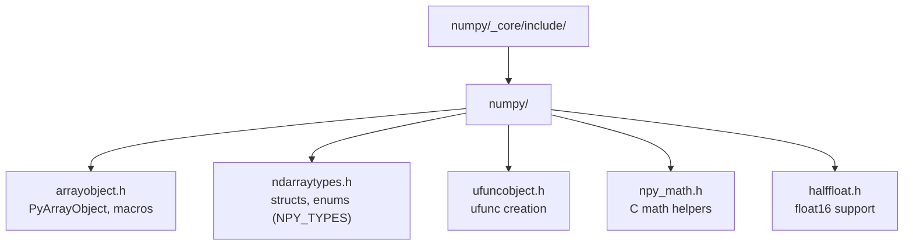
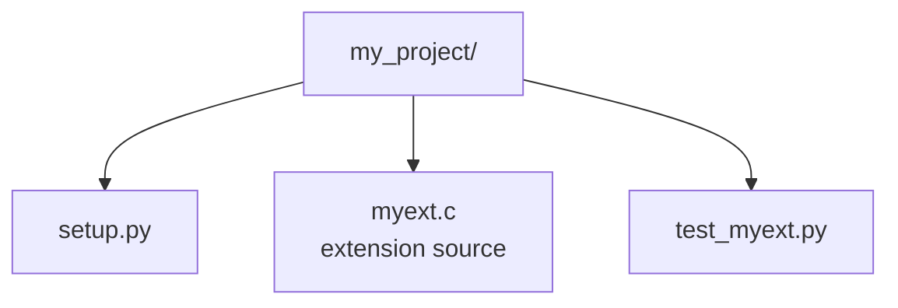

# NumPy C API — Pure C Guide

The **NumPy C API** is the official C interface that powers NumPy itself and lets you write compiled extension modules that create, inspect and manipulate `numpy.ndarray` objects at native speed. Every array is a `PyArrayObject*` (a Python object), so this API is really *NumPy + the CPython C API* working together. Use it when you need to expose fast C/C++ routines to Python while passing data in and out as NumPy arrays with zero or minimal copying.

---

## Table of Contents

1. [Setup and Installation](#1-setup-and-installation)
2. [Build Configuration](#2-build-configuration)
3. [Initializing the C API](#3-initializing-the-c-api)
4. [Scalars, Vectors and Matrices](#4-scalars-vectors-and-matrices)
5. [Data Types (dtypes)](#5-data-types-dtypes)
6. [Accessing Array Data and Metadata](#6-accessing-array-data-and-metadata)
7. [Indexing and Element Access](#7-indexing-and-element-access)
8. [Shape Manipulation](#8-shape-manipulation)
9. [Array Operations and Math](#9-array-operations-and-math)
10. [Reduction Operations](#10-reduction-operations)
11. [Iterators — NpyIter](#11-iterators--npyiter)
12. [Reference Counting and Error Handling](#12-reference-counting-and-error-handling)
13. [Writing an Extension Module](#13-writing-an-extension-module)
14. [Interfacing with Existing C Buffers](#14-interfacing-with-existing-c-buffers)
15. [Full End-to-End Example](#15-full-end-to-end-example)

---

## 1. Setup and Installation

The C API headers ship inside the NumPy Python package. You need a Python development environment plus NumPy.

```bash
# Python headers + NumPy
pip install numpy

# Locate the include directory (add this to your compiler's -I path)
python -c "import numpy; print(numpy.get_include())"
# -> /path/to/site-packages/numpy/_core/include   (or numpy/core/include on older versions)

# Python's own headers (Debian/Ubuntu)
sudo apt-get install python3-dev
```

The two headers you will use:

```c
#include <Python.h>          // CPython C API — always first
#include <numpy/arrayobject.h>   // NumPy C API
```

Directory layout of the NumPy include tree:



---

## 2. Build Configuration

### Option A — setuptools (recommended)

```python
# setup.py
from setuptools import setup, Extension
import numpy

module = Extension(
    "myext",
    sources=["myext.c"],
    include_dirs=[numpy.get_include()],
    define_macros=[("NPY_NO_DEPRECATED_API", "NPY_1_7_API_VERSION")],
)

setup(name="myext", version="1.0", ext_modules=[module])
```

```bash
python setup.py build_ext --inplace
# produces myext.<platform>.so  ->  import myext
```

### Option B — direct compiler invocation

```bash
gcc -O2 -shared -fPIC \
    $(python3-config --includes) \
    -I$(python -c "import numpy; print(numpy.get_include())") \
    -DNPY_NO_DEPRECATED_API=NPY_1_7_API_VERSION \
    myext.c -o myext.so
```

### Project layout



> **Always** define `NPY_NO_DEPRECATED_API=NPY_1_7_API_VERSION` so you compile against the current, stable API and get warnings for deprecated calls.

---

## 3. Initializing the C API

The NumPy C API is exposed through a function-pointer table that **must** be imported once per module by calling `import_array()` inside your module-init function. Skipping this causes a segfault on the first NumPy call.

```c
#include <Python.h>
#include <numpy/arrayobject.h>

static PyMethodDef Methods[] = {
    {NULL, NULL, 0, NULL}   // sentinel
};

static struct PyModuleDef moduledef = {
    PyModuleDef_HEAD_INIT,
    "myext",        // module name
    "Example",      // docstring
    -1,
    Methods
};

PyMODINIT_FUNC PyInit_myext(void) {
    PyObject *m = PyModule_Create(&moduledef);
    if (m == NULL) return NULL;

    import_array();   // <-- REQUIRED. Returns NULL on failure.

    return m;
}
```

If you split your extension across **multiple `.c` files**, only one translation unit defines the API table. The others must declare they use someone else's:

```c
// In every .c file EXCEPT the one with import_array():
#define NO_IMPORT_ARRAY
#define PY_ARRAY_UNIQUE_SYMBOL  myext_ARRAY_API
#include <numpy/arrayobject.h>

// In the ONE file that calls import_array():
#define PY_ARRAY_UNIQUE_SYMBOL  myext_ARRAY_API
#include <numpy/arrayobject.h>
```

---

## 4. Scalars, Vectors and Matrices

Arrays are created with the `PyArray_*` factory functions. Dimensions are passed as an array of `npy_intp`.

### 4.1 Scalar (0-D array)

```c
// 0-D array holding a single double
npy_intp dims0[1] = {0};
PyObject *s = PyArray_SimpleNew(0, NULL, NPY_DOUBLE);
*(double *)PyArray_DATA((PyArrayObject *)s) = 3.14;

// Or wrap a C scalar as a NumPy scalar object
double value = 42.0;
PyObject *sc = PyArray_Scalar(&value, PyArray_DescrFromType(NPY_DOUBLE), NULL);
```

### 4.2 Vector (1-D array)

```c
// Uninitialised 1-D array of 5 doubles
npy_intp dims[1] = {5};
PyObject *v = PyArray_SimpleNew(1, dims, NPY_DOUBLE);

// Fill it
double *vd = (double *)PyArray_DATA((PyArrayObject *)v);
for (npy_intp i = 0; i < 5; ++i) vd[i] = (double)(i + 1);  // [1, 2, 3, 4, 5]

// Zeros and ones
PyObject *zeros_v = PyArray_ZEROS(1, dims, NPY_DOUBLE, 0 /*fortran*/);
PyObject *ones_v  = PyArray_EMPTY(1, dims, NPY_DOUBLE, 0);
PyArray_FILLWBYTE((PyArrayObject *)ones_v, 0);  // memset-style fill

// arange equivalent
PyObject *range_v = PyArray_Arange(0.0, 10.0, 2.0, NPY_DOUBLE); // [0,2,4,6,8]
```

### 4.3 Matrix (2-D array)

```c
// 3×4 zero matrix
npy_intp mdims[2] = {3, 4};
PyObject *m = PyArray_ZEROS(2, mdims, NPY_DOUBLE, 0);

// Fill using strides-aware access
PyArrayObject *ma = (PyArrayObject *)m;
for (npy_intp i = 0; i < 3; ++i)
    for (npy_intp j = 0; j < 4; ++j)
        *(double *)PyArray_GETPTR2(ma, i, j) = (double)(i * 4 + j);

// Identity matrix
PyObject *I = PyArray_Eye(3, 3, 0 /*k diagonal*/, NPY_DOUBLE);
```

### 4.4 Higher-Dimensional Arrays (N-D)

```c
npy_intp dims4[4] = {16, 3, 224, 224};   // batch × channels × H × W
PyObject *t4 = PyArray_ZEROS(4, dims4, NPY_FLOAT32, 0);

PyArrayObject *t = (PyArrayObject *)t4;
printf("ndim:  %d\n",  PyArray_NDIM(t));   // 4
printf("size:  %lld\n", (long long)PyArray_SIZE(t)); // 16*3*224*224
```

---

## 5. Data Types (dtypes)

Each NumPy dtype has a `NPY_TYPES` enum constant and a corresponding C type.

| NumPy dtype | `NPY_TYPES` enum | C type |
|---|---|---|
| `float64` | `NPY_DOUBLE` | `double` |
| `float32` | `NPY_FLOAT` | `float` |
| `float16` | `NPY_HALF` | `npy_half` |
| `int32` | `NPY_INT32` | `npy_int32` |
| `int64` | `NPY_INT64` | `npy_int64` |
| `uint8` | `NPY_UINT8` | `npy_uint8` |
| `bool` | `NPY_BOOL` | `npy_bool` |
| `complex128` | `NPY_CDOUBLE` | `npy_cdouble` |

```c
// Get a dtype descriptor object
PyArray_Descr *descr = PyArray_DescrFromType(NPY_DOUBLE);
printf("itemsize: %d bytes\n", descr->elsize);   // 8

// Inspect an existing array's type
PyArrayObject *a = /* ... */;
int type_num = PyArray_TYPE(a);
if (type_num == NPY_DOUBLE) puts("array is float64");

// Cast an array to a new dtype (returns a NEW reference)
PyObject *as_int = PyArray_Cast(a, NPY_INT32);

// Type checks
if (PyArray_ISFLOAT(a))    puts("floating point");
if (PyArray_ISINTEGER(a))  puts("integer");
if (PyArray_ISCOMPLEX(a))  puts("complex");
```

---

## 6. Accessing Array Data and Metadata

```c
PyArrayObject *a = /* some 2-D array */;

// Core metadata accessor macros
int        ndim   = PyArray_NDIM(a);     // number of dimensions
npy_intp  *shape  = PyArray_DIMS(a);     // pointer to dim sizes
npy_intp  *strides= PyArray_STRIDES(a);  // byte strides per dimension
npy_intp   total  = PyArray_SIZE(a);     // total element count
int        typenum= PyArray_TYPE(a);     // dtype enum
void      *data   = PyArray_DATA(a);     // raw contiguous-ish buffer
int        itemsz = PyArray_ITEMSIZE(a); // bytes per element

printf("shape = (");
for (int i = 0; i < ndim; ++i)
    printf("%lld%s", (long long)shape[i], i + 1 < ndim ? ", " : "");
printf(")\n");

// Flags
if (PyArray_IS_C_CONTIGUOUS(a)) puts("C-contiguous");
if (PyArray_ISWRITEABLE(a))     puts("writeable");
if (PyArray_ISALIGNED(a))       puts("aligned");
```

### Guaranteeing a usable layout

Input arrays may be non-contiguous, byte-swapped, or the wrong dtype. `PyArray_FROM_OTF` normalises them:

```c
// Force: float64, C-contiguous, aligned. Returns a new (possibly copied) ref.
PyObject *clean = PyArray_FROM_OTF(
    input_obj, NPY_DOUBLE, NPY_ARRAY_IN_ARRAY);
if (clean == NULL) return NULL;   // exception already set
PyArrayObject *arr = (PyArrayObject *)clean;
// ... use arr ...
Py_DECREF(clean);
```

---

## 7. Indexing and Element Access

NumPy arrays may be strided, so always go through the `PyArray_GETPTR*` macros rather than assuming a flat layout.

```c
PyArrayObject *m = /* 3×4 double array */;

// Typed pointer to element (i, j)
double  val  = *(double *)PyArray_GETPTR2(m, 1, 2);   // m[1, 2]
*(double *)PyArray_GETPTR2(m, 0, 0) = 99.0;           // m[0, 0] = 99

// 1-D / 3-D / N-D variants
double v1 = *(double *)PyArray_GETPTR1(vec, 4);            // vec[4]
double v3 = *(double *)PyArray_GETPTR3(t3, 2, 0, 5);      // t3[2, 0, 5]

npy_intp idx[4] = {1, 0, 30, 30};
float vn = *(float *)PyArray_GetPtr(t4, idx);             // N-D general

// Fast path when the array is known C-contiguous: treat as flat C buffer
if (PyArray_IS_C_CONTIGUOUS(m)) {
    double *flat = (double *)PyArray_DATA(m);
    npy_intp n   = PyArray_SIZE(m);
    for (npy_intp k = 0; k < n; ++k) flat[k] *= 2.0;
}
```

---

## 8. Shape Manipulation

```c
PyArrayObject *t = /* 1-D array of 24 elements */;

// Reshape to (4, 6)
npy_intp newdims[2] = {4, 6};
PyArray_Dims shape = { newdims, 2 };
PyObject *reshaped = PyArray_Newshape(t, &shape, NPY_CORDER);

// Flatten / ravel (ravel avoids a copy when possible)
PyObject *flat  = PyArray_Flatten(t, NPY_CORDER);
PyObject *ravel = PyArray_Ravel(t, NPY_CORDER);

// Transpose (no data copy — returns a view with swapped strides)
PyObject *tr = PyArray_Transpose((PyArrayObject *)reshaped, NULL);

// Add / remove length-1 axes
PyObject *expanded = PyArray_ExpandDims((PyArrayObject *)t, 0);  // (1, 24)
PyObject *squeezed = PyArray_Squeeze((PyArrayObject *)expanded);

// Concatenate a tuple of arrays along an axis
PyObject *tup = PyTuple_Pack(2, arrayA, arrayB);
PyObject *cat = PyArray_Concatenate(tup, 0 /*axis*/);
Py_DECREF(tup);

// Stack along a new axis
PyObject *stacked = PyArray_Stack(tup_of_arrays, 0, NULL);
```

---

## 9. Array Operations and Math

Element-wise math is exposed both as dedicated functions and via the generic operator dispatcher `PyNumber_*` (which calls NumPy's ufuncs under the hood).

```c
PyObject *a = /* ndarray */, *b = /* ndarray */;

// Element-wise arithmetic via Python's number protocol
PyObject *sum  = PyNumber_Add(a, b);        // a + b
PyObject *diff = PyNumber_Subtract(a, b);   // a - b
PyObject *prod = PyNumber_Multiply(a, b);   // a * b  (element-wise)
PyObject *quot = PyNumber_TrueDivide(a, b); // a / b

// Matrix multiply (a @ b)
PyObject *mm = PyNumber_MatrixMultiply(a, b);

// Direct ufunc-backed math helpers
PyObject *sq = PyArray_Square((PyArrayObject *)a);
PyObject *sr = PyArray_Sqrt((PyArrayObject *)a);

// Generic ufunc call: numpy.add(a, b) by name
PyObject *np  = PyImport_ImportModule("numpy");
PyObject *fn  = PyObject_GetAttrString(np, "exp");
PyObject *res = PyObject_CallFunctionObjArgs(fn, a, NULL);
Py_DECREF(fn); Py_DECREF(np);

// Comparisons -> boolean arrays
PyObject *mask = PyObject_RichCompare(a, b, Py_GT);   // a > b

// Clip to a range
PyObject *clipped = PyArray_Clip((PyArrayObject *)a, lo_obj, hi_obj, NULL);
```

> **Remember:** every function above returns a **new reference** that you must `Py_DECREF` when finished, or you leak memory.

---

## 10. Reduction Operations

```c
PyArrayObject *m = /* 2-D array */;

// Whole-array reductions (axis = NPY_MAXDIMS means "flatten")
PyObject *total = PyArray_Sum(m,  NPY_MAXDIMS, NPY_DOUBLE, NULL);
PyObject *mean  = PyArray_Mean(m, NPY_MAXDIMS, NPY_DOUBLE, NULL);
PyObject *prod  = PyArray_Prod(m, NPY_MAXDIMS, NPY_DOUBLE, NULL);
PyObject *std_  = PyArray_Std(m,  NPY_MAXDIMS, NPY_DOUBLE, NULL, 0);

// Along an axis
PyObject *colSum = PyArray_Sum(m, 0, NPY_DOUBLE, NULL);   // collapse rows
PyObject *rowSum = PyArray_Sum(m, 1, NPY_DOUBLE, NULL);   // collapse cols

// Min / max and their argument indices
PyObject *maxV   = PyArray_Max(m, NPY_MAXDIMS, NULL);
PyObject *minV   = PyArray_Min(m, NPY_MAXDIMS, NULL);
PyObject *argmax = PyArray_ArgMax(m, NPY_MAXDIMS, NULL);
PyObject *argmin = PyArray_ArgMin(m, 0, NULL);

// Cumulative
PyObject *cumsum  = PyArray_CumSum(m, NPY_MAXDIMS, NPY_DOUBLE, NULL);
PyObject *cumprod = PyArray_CumProd(m, NPY_MAXDIMS, NPY_DOUBLE, NULL);

// Sort (in place) / argsort (returns indices)
PyArray_Sort(m, 1, NPY_QUICKSORT);
PyObject *order = PyArray_ArgSort(m, 1, NPY_QUICKSORT);
```

---

## 11. Iterators — NpyIter

`NpyIter` is the modern, high-performance way to walk over one or more arrays while correctly handling broadcasting, arbitrary strides, and buffering.

### 11.1 Single-array iteration

```c
PyArrayObject *a = /* any layout, any dtype coerced to double below */;

NpyIter *iter = NpyIter_New(
    a,
    NPY_ITER_READWRITE | NPY_ITER_EXTERNAL_LOOP | NPY_ITER_REFS_OK,
    NPY_KEEPORDER, NPY_NO_CASTING, NULL);
if (iter == NULL) return NULL;

NpyIter_IterNextFunc *iternext = NpyIter_GetIterNext(iter, NULL);
char    **dataptr = NpyIter_GetDataPtrArray(iter);
npy_intp *strideptr = NpyIter_GetInnerStrideArray(iter);
npy_intp *sizeptr   = NpyIter_GetInnerLoopSizePtr(iter);

do {
    char    *data   = *dataptr;
    npy_intp stride = *strideptr;
    npy_intp count  = *sizeptr;
    while (count--) {
        *(double *)data *= 2.0;     // operate on each element
        data += stride;
    }
} while (iternext(iter));

NpyIter_Deallocate(iter);
```

### 11.2 Multi-array iteration with broadcasting

```c
PyArrayObject *op[3] = { a, b, NULL };   // NULL output is allocated for us
npy_uint32 flags = 0;
npy_uint32 op_flags[3] = {
    NPY_ITER_READONLY,
    NPY_ITER_READONLY,
    NPY_ITER_WRITEONLY | NPY_ITER_ALLOCATE
};

NpyIter *it = NpyIter_MultiNew(
    3, op, flags, NPY_KEEPORDER, NPY_SAME_KIND_CASTING, op_flags, NULL);

NpyIter_IterNextFunc *next = NpyIter_GetIterNext(it, NULL);
char **ptrs = NpyIter_GetDataPtrArray(it);

do {
    double x = *(double *)ptrs[0];
    double y = *(double *)ptrs[1];
    *(double *)ptrs[2] = x + y;     // out = a + b (broadcast)
} while (next(it));

PyArrayObject *result = NpyIter_GetOperandArray(it)[2];
Py_INCREF(result);              // keep it past deallocate
NpyIter_Deallocate(it);
```

---

## 12. Reference Counting and Error Handling

The single biggest source of bugs in C-API code is mishandling references. Rules of thumb:

- Factory functions (`PyArray_SimpleNew`, `PyArray_FROM_OTF`, `PyNumber_Add`, …) return a **new reference** you own and must `Py_DECREF`.
- Borrowed references (e.g. items fetched from a list with `PyList_GetItem`) must **not** be decref'd.
- On error, set an exception and return `NULL` (or `-1`); decref anything you already created.

```c
static PyObject *safe_op(PyObject *self, PyObject *args) {
    PyObject *input;
    if (!PyArg_ParseTuple(args, "O", &input))
        return NULL;   // TypeError already set

    PyObject *arr = PyArray_FROM_OTF(input, NPY_DOUBLE, NPY_ARRAY_IN_ARRAY);
    if (arr == NULL)
        return NULL;   // conversion failed; exception set

    if (PyArray_NDIM((PyArrayObject *)arr) != 2) {
        Py_DECREF(arr);                    // clean up before erroring
        PyErr_SetString(PyExc_ValueError, "expected a 2-D array");
        return NULL;
    }

    PyObject *result = PyArray_Sum((PyArrayObject *)arr, NPY_MAXDIMS,
                                   NPY_DOUBLE, NULL);
    Py_DECREF(arr);                        // done with the input
    if (result == NULL)
        return NULL;

    return result;                          // hand ownership to the caller
}
```

### Releasing the GIL for heavy C loops

```c
Py_BEGIN_ALLOW_THREADS
// ... long-running pure-C computation that touches NO Python objects ...
Py_END_ALLOW_THREADS
```

---

## 13. Writing an Extension Module

A complete module exposing one function, `myext.scale(arr, factor)`, that multiplies a float64 array by a scalar **in place**.

```c
// myext.c
#define NPY_NO_DEPRECATED_API NPY_1_7_API_VERSION
#include <Python.h>
#include <numpy/arrayobject.h>

static PyObject *scale(PyObject *self, PyObject *args) {
    PyObject *input;
    double factor;

    // "O" = object, "d" = C double
    if (!PyArg_ParseTuple(args, "Od", &input, &factor))
        return NULL;

    // Accept anything array-like; require writeable float64
    PyObject *arr = PyArray_FROM_OTF(
        input, NPY_DOUBLE, NPY_ARRAY_INOUT_ARRAY2);
    if (arr == NULL) return NULL;

    PyArrayObject *a = (PyArrayObject *)arr;
    npy_intp  n  = PyArray_SIZE(a);
    double   *d  = (double *)PyArray_DATA(a);

    Py_BEGIN_ALLOW_THREADS
    for (npy_intp i = 0; i < n; ++i) d[i] *= factor;
    Py_END_ALLOW_THREADS

    PyArray_ResolveWritebackIfCopy(a);   // flush back if a copy was made
    Py_DECREF(arr);
    Py_RETURN_NONE;
}

static PyMethodDef Methods[] = {
    {"scale", scale, METH_VARARGS, "Scale a float64 array in place."},
    {NULL, NULL, 0, NULL}
};

static struct PyModuleDef moduledef = {
    PyModuleDef_HEAD_INIT, "myext", "Demo C extension", -1, Methods
};

PyMODINIT_FUNC PyInit_myext(void) {
    PyObject *m = PyModule_Create(&moduledef);
    if (m == NULL) return NULL;
    import_array();          // initialise the NumPy C API
    return m;
}
```

```python
# test_myext.py
import numpy as np
import myext

a = np.array([1.0, 2.0, 3.0])
myext.scale(a, 10.0)
print(a)        # [10. 20. 30.]
```

---

## 14. Interfacing with Existing C Buffers

Wrap memory you already own as a NumPy array **without copying** using `PyArray_SimpleNewFromData`. You are responsible for keeping that memory alive as long as the array exists.

```c
// Expose a C array to Python as a NumPy view (zero-copy)
double *buffer = malloc(sizeof(double) * 12);
for (int i = 0; i < 12; ++i) buffer[i] = i;

npy_intp dims[2] = {3, 4};
PyObject *arr = PyArray_SimpleNewFromData(2, dims, NPY_DOUBLE, buffer);

// Tell NumPy to free() the buffer when the array is garbage-collected:
PyArray_ENABLEFLAGS((PyArrayObject *)arr, NPY_ARRAY_OWNDATA);

// --- OR keep ownership in C and tie lifetime via a base object ---
PyObject *capsule = PyCapsule_New(buffer, NULL, free_capsule_cb);
PyArray_SetBaseObject((PyArrayObject *)arr, capsule);  // steals the capsule ref
```

Going the other way — accessing a Python-supplied array's raw bytes — use the buffer protocol or `PyArray_DATA` as shown in earlier sections.

---

## 15. Full End-to-End Example

A complete extension module implementing a fast `matvec` (matrix–vector product) and `rowwise_softmax`, demonstrating input validation, strided access, the GIL release, and proper reference handling.

```c
// fastmath.c
#define NPY_NO_DEPRECATED_API NPY_1_7_API_VERSION
#include <Python.h>
#include <numpy/arrayobject.h>
#include <math.h>

// ── matvec: y = M @ x  for M (m×n) and x (n,) ────────────────────────────────
static PyObject *matvec(PyObject *self, PyObject *args) {
    PyObject *M_obj, *x_obj;
    if (!PyArg_ParseTuple(args, "OO", &M_obj, &x_obj))
        return NULL;

    PyObject *M = PyArray_FROM_OTF(M_obj, NPY_DOUBLE, NPY_ARRAY_IN_ARRAY);
    PyObject *x = PyArray_FROM_OTF(x_obj, NPY_DOUBLE, NPY_ARRAY_IN_ARRAY);
    if (M == NULL || x == NULL) { Py_XDECREF(M); Py_XDECREF(x); return NULL; }

    PyArrayObject *Ma = (PyArrayObject *)M;
    PyArrayObject *xa = (PyArrayObject *)x;

    if (PyArray_NDIM(Ma) != 2 || PyArray_NDIM(xa) != 1) {
        PyErr_SetString(PyExc_ValueError, "need 2-D M and 1-D x");
        goto fail;
    }
    npy_intp rows = PyArray_DIM(Ma, 0);
    npy_intp cols = PyArray_DIM(Ma, 1);
    if (PyArray_DIM(xa, 0) != cols) {
        PyErr_SetString(PyExc_ValueError, "shape mismatch: M.cols != x.len");
        goto fail;
    }

    // Allocate the output vector (rows,)
    npy_intp ydims[1] = { rows };
    PyObject *y = PyArray_ZEROS(1, ydims, NPY_DOUBLE, 0);
    if (y == NULL) goto fail;

    double *yd = (double *)PyArray_DATA((PyArrayObject *)y);
    const double *xd = (const double *)PyArray_DATA(xa);

    Py_BEGIN_ALLOW_THREADS
    for (npy_intp i = 0; i < rows; ++i) {
        double acc = 0.0;
        for (npy_intp j = 0; j < cols; ++j)
            acc += *(double *)PyArray_GETPTR2(Ma, i, j) * xd[j];
        yd[i] = acc;
    }
    Py_END_ALLOW_THREADS

    Py_DECREF(M);
    Py_DECREF(x);
    return y;

fail:
    Py_XDECREF(M);
    Py_XDECREF(x);
    return NULL;
}

// ── rowwise_softmax: numerically stable softmax of each row of a 2-D array ───
static PyObject *rowwise_softmax(PyObject *self, PyObject *args) {
    PyObject *input;
    if (!PyArg_ParseTuple(args, "O", &input))
        return NULL;

    PyObject *arr = PyArray_FROM_OTF(input, NPY_DOUBLE, NPY_ARRAY_IN_ARRAY);
    if (arr == NULL) return NULL;
    PyArrayObject *a = (PyArrayObject *)arr;

    if (PyArray_NDIM(a) != 2) {
        Py_DECREF(arr);
        PyErr_SetString(PyExc_ValueError, "expected a 2-D array");
        return NULL;
    }
    npy_intp rows = PyArray_DIM(a, 0);
    npy_intp cols = PyArray_DIM(a, 1);

    PyObject *out = PyArray_ZEROS(2, PyArray_DIMS(a), NPY_DOUBLE, 0);
    if (out == NULL) { Py_DECREF(arr); return NULL; }
    PyArrayObject *o = (PyArrayObject *)out;

    Py_BEGIN_ALLOW_THREADS
    for (npy_intp i = 0; i < rows; ++i) {
        // max for numerical stability
        double m = -INFINITY;
        for (npy_intp j = 0; j < cols; ++j) {
            double v = *(double *)PyArray_GETPTR2(a, i, j);
            if (v > m) m = v;
        }
        // exp and sum
        double sum = 0.0;
        for (npy_intp j = 0; j < cols; ++j) {
            double e = exp(*(double *)PyArray_GETPTR2(a, i, j) - m);
            *(double *)PyArray_GETPTR2(o, i, j) = e;
            sum += e;
        }
        // normalise
        for (npy_intp j = 0; j < cols; ++j)
            *(double *)PyArray_GETPTR2(o, i, j) /= sum;
    }
    Py_END_ALLOW_THREADS

    Py_DECREF(arr);
    return out;
}

static PyMethodDef Methods[] = {
    {"matvec",          matvec,          METH_VARARGS, "y = M @ x"},
    {"rowwise_softmax", rowwise_softmax, METH_VARARGS, "softmax over rows"},
    {NULL, NULL, 0, NULL}
};

static struct PyModuleDef moduledef = {
    PyModuleDef_HEAD_INIT, "fastmath",
    "Hand-written NumPy C-API kernels", -1, Methods
};

PyMODINIT_FUNC PyInit_fastmath(void) {
    PyObject *m = PyModule_Create(&moduledef);
    if (m == NULL) return NULL;
    import_array();
    return m;
}
```

Build and test:

```bash
gcc -O3 -shared -fPIC \
    $(python3-config --includes) \
    -I$(python -c "import numpy; print(numpy.get_include())") \
    -DNPY_NO_DEPRECATED_API=NPY_1_7_API_VERSION \
    fastmath.c -o fastmath.so
```

```python
# test_fastmath.py
import numpy as np
import fastmath

M = np.random.randn(4, 5)
x = np.random.randn(5)
assert np.allclose(fastmath.matvec(M, x), M @ x)

logits = np.random.randn(3, 6)
sm = fastmath.rowwise_softmax(logits)
assert np.allclose(sm.sum(axis=1), 1.0)          # each row sums to 1
assert np.allclose(sm, np.exp(logits - logits.max(1, keepdims=True))
                       / np.exp(logits - logits.max(1, keepdims=True)).sum(1, keepdims=True))
print("All checks passed.")
```

---

## Quick NumPy (Python) → C API Cheat Sheet

| Python (NumPy) | C API |
|---|---|
| `import numpy as np` | `#include <numpy/arrayobject.h>` + `import_array()` |
| `np.empty((3, 4))` | `PyArray_SimpleNew(2, dims, NPY_DOUBLE)` |
| `np.zeros((3, 4))` | `PyArray_ZEROS(2, dims, NPY_DOUBLE, 0)` |
| `np.arange(0, 10, 2)` | `PyArray_Arange(0, 10, 2, NPY_DOUBLE)` |
| `np.eye(3)` | `PyArray_Eye(3, 3, 0, NPY_DOUBLE)` |
| `a.ndim` | `PyArray_NDIM(a)` |
| `a.shape` | `PyArray_DIMS(a)` |
| `a.size` | `PyArray_SIZE(a)` |
| `a.dtype` | `PyArray_TYPE(a)` / `PyArray_DESCR(a)` |
| `a[i, j]` | `*(T *)PyArray_GETPTR2(a, i, j)` |
| `a.reshape(r, c)` | `PyArray_Newshape(a, &dims, NPY_CORDER)` |
| `a.T` | `PyArray_Transpose(a, NULL)` |
| `a + b` | `PyNumber_Add(a, b)` |
| `a @ b` | `PyNumber_MatrixMultiply(a, b)` |
| `a.sum(axis=0)` | `PyArray_Sum(a, 0, NPY_DOUBLE, NULL)` |
| `a.astype(np.int32)` | `PyArray_Cast(a, NPY_INT32)` |
| `np.ascontiguousarray(a)` | `PyArray_FROM_OTF(o, t, NPY_ARRAY_IN_ARRAY)` |

---

### References

- NumPy C API reference: <https://numpy.org/doc/stable/reference/c-api/index.html>
- Array API (`PyArrayObject`, macros): <https://numpy.org/doc/stable/reference/c-api/array.html>
- Iterator (`NpyIter`) guide: <https://numpy.org/doc/stable/reference/c-api/iterator.html>
- Writing extension modules: <https://numpy.org/doc/stable/user/c-info.how-to-extend.html>
- CPython Extending/Embedding guide: <https://docs.python.org/3/extending/index.html>
