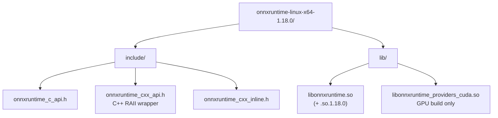
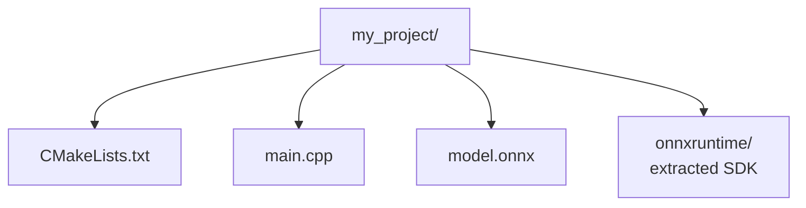
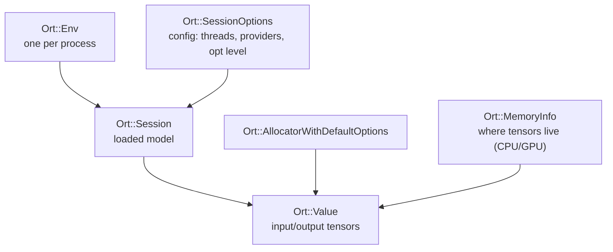
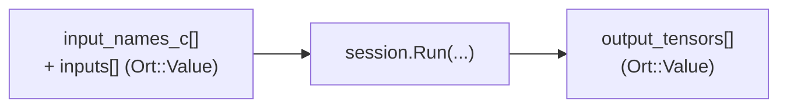
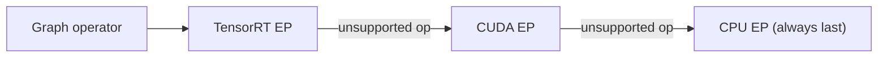

# ONNX Runtime — C++ Guide

[ONNX Runtime](https://onnxruntime.ai/) (ORT) is a cross-platform, high-performance inference (and training) engine for models in the **ONNX** (Open Neural Network Exchange) format. Train a model in PyTorch, TensorFlow, scikit-learn, or anything else, export it to a single `.onnx` file, and run it from C++ with SIMD-optimized CPU kernels (AVX-512/VNNI, ARM NEON) or hardware accelerators (CUDA, TensorRT, DirectML, CoreML, OpenVINO) through a uniform API.

This guide uses the **C++ API** (`onnxruntime_cxx_api.h`), a header-only RAII wrapper over the stable C API.

---

## Table of Contents

1. [Setup and Installation](#1-setup-and-installation)
2. [CMake Build Configuration](#2-cmake-build-configuration)
3. [Core Objects and Lifecycle](#3-core-objects-and-lifecycle)
4. [Loading a Model and Inspecting I/O](#4-loading-a-model-and-inspecting-io)
5. [Creating Tensors (Ort::Value)](#5-creating-tensors-ortvalue)
6. [Running Inference](#6-running-inference)
7. [Reading Outputs](#7-reading-outputs)
8. [Data Types](#8-data-types)
9. [Session Options and Optimization](#9-session-options-and-optimization)
10. [Execution Providers (CPU, CUDA, TensorRT, …)](#10-execution-providers-cpu-cuda-tensorrt-)
11. [Dynamic Shapes and Batching](#11-dynamic-shapes-and-batching)
12. [Memory, IOBinding and Zero-Copy](#12-memory-iobinding-and-zero-copy)
13. [Error Handling](#13-error-handling)
14. [Preprocessing and Postprocessing](#14-preprocessing-and-postprocessing)
15. [Full End-to-End Example](#15-full-end-to-end-example)

---

## 1. Setup and Installation

### Download pre-built binaries

```bash
# Linux x64 (CPU)
wget https://github.com/microsoft/onnxruntime/releases/download/v1.18.0/onnxruntime-linux-x64-1.18.0.tgz
tar -xzf onnxruntime-linux-x64-1.18.0.tgz

# Linux x64 (GPU / CUDA)
wget https://github.com/microsoft/onnxruntime/releases/download/v1.18.0/onnxruntime-linux-x64-gpu-1.18.0.tgz
tar -xzf onnxruntime-linux-x64-gpu-1.18.0.tgz
```

Extracted layout:



### Set the runtime library path

```bash
export LD_LIBRARY_PATH=/path/to/onnxruntime-linux-x64-1.18.0/lib:$LD_LIBRARY_PATH
```

### Package managers

```bash
# vcpkg
vcpkg install onnxruntime          # CPU
vcpkg install onnxruntime[cuda]    # GPU

# Conda
conda install -c conda-forge onnxruntime-cpp
```

### Producing an .onnx file (from Python)

```python
import torch

model = MyModel().eval()
dummy = torch.randn(1, 3, 224, 224)
torch.onnx.export(
    model, dummy, "model.onnx",
    input_names=["input"], output_names=["logits"],
    dynamic_axes={"input": {0: "batch"}, "logits": {0: "batch"}},
    opset_version=17,
)
```

---

## 2. CMake Build Configuration

### Project layout



### CMakeLists.txt

```cmake
cmake_minimum_required(VERSION 3.18)
project(OrtApp CXX)

set(CMAKE_CXX_STANDARD 17)
set(CMAKE_CXX_STANDARD_REQUIRED ON)

# Point these at your extracted SDK
set(ORT_ROOT "${CMAKE_SOURCE_DIR}/onnxruntime")
set(ORT_INCLUDE "${ORT_ROOT}/include")
set(ORT_LIB     "${ORT_ROOT}/lib")

add_executable(app main.cpp)
target_include_directories(app PRIVATE "${ORT_INCLUDE}")
target_link_directories(app PRIVATE "${ORT_LIB}")
target_link_libraries(app PRIVATE onnxruntime)

# Copy the shared library next to the binary at build time (optional)
add_custom_command(TARGET app POST_BUILD
    COMMAND ${CMAKE_COMMAND} -E copy_if_different
        "${ORT_LIB}/libonnxruntime.so" $<TARGET_FILE_DIR:app>)
```

### Build

```bash
mkdir build && cd build
cmake .. -DCMAKE_BUILD_TYPE=Release
cmake --build . --config Release -j$(nproc)
./app
```

---

## 3. Core Objects and Lifecycle

The header you always need:

```cpp
#include <onnxruntime_cxx_api.h>
```

The main objects and how they relate:



```cpp
// 1. Environment — create exactly ONE, keep it alive for the whole program.
Ort::Env env(ORT_LOGGING_LEVEL_WARNING, "app");

// 2. Session options — tune threading, optimization, providers.
Ort::SessionOptions opts;
opts.SetIntraOpNumThreads(4);
opts.SetGraphOptimizationLevel(GraphOptimizationLevel::ORT_ENABLE_ALL);

// 3. Session — loads and prepares the model.
Ort::Session session(env, "model.onnx", opts);   // Linux/macOS: const char*
// On Windows the path is wchar_t*: L"model.onnx"
```

> `Ort::Env` must outlive every `Ort::Session`. A common pattern is a single global/`static` env.

---

## 4. Loading a Model and Inspecting I/O

```cpp
Ort::Session session(env, "model.onnx", opts);
Ort::AllocatorWithDefaultOptions allocator;

// --- Inputs ---
size_t num_inputs = session.GetInputCount();
std::vector<std::string> input_names;
std::vector<const char*> input_names_c;

for (size_t i = 0; i < num_inputs; ++i) {
    Ort::AllocatedStringPtr name = session.GetInputNameAllocated(i, allocator);
    input_names.emplace_back(name.get());

    auto type_info  = session.GetInputTypeInfo(i);
    auto tensor_info = type_info.GetTensorTypeAndShapeInfo();
    ONNXTensorElementDataType dtype = tensor_info.GetElementType();
    std::vector<int64_t> shape = tensor_info.GetShape();  // -1 = dynamic dim

    std::cout << "Input " << i << ": " << input_names[i] << "  shape [";
    for (auto d : shape) std::cout << d << " ";
    std::cout << "] dtype=" << dtype << "\n";
}

// Build the const char* array AFTER the strings are stable (vector won't realloc)
for (auto& s : input_names) input_names_c.push_back(s.c_str());

// --- Outputs (same pattern) ---
size_t num_outputs = session.GetOutputCount();
std::vector<std::string> output_names;
std::vector<const char*> output_names_c;
for (size_t i = 0; i < num_outputs; ++i) {
    auto name = session.GetOutputNameAllocated(i, allocator);
    output_names.emplace_back(name.get());
}
for (auto& s : output_names) output_names_c.push_back(s.c_str());
```

> `GetInputNameAllocated` returns an owning `Ort::AllocatedStringPtr`. Copy it into a `std::string` you keep, because the C-string arrays passed to `Run()` must stay valid for the whole call.

---

## 5. Creating Tensors (Ort::Value)

A tensor wraps a flat, contiguous buffer plus a shape. The most efficient path, `CreateTensor(MemoryInfo, ...)`, **does not copy** — it views your `std::vector`'s memory, so that buffer must outlive the `Ort::Value`.

```cpp
// Describe where the data lives (CPU, arena allocator)
Ort::MemoryInfo mem_info = Ort::MemoryInfo::CreateCpu(
    OrtArenaAllocator, OrtMemTypeDefault);

// --- Float input, shape [1, 3, 224, 224] ---
std::vector<int64_t> shape = {1, 3, 224, 224};
size_t element_count = 1 * 3 * 224 * 224;
std::vector<float> data(element_count, 0.0f);   // fill with real values

Ort::Value input_tensor = Ort::Value::CreateTensor<float>(
    mem_info,
    data.data(), data.size(),     // buffer (NOT copied — keep `data` alive)
    shape.data(), shape.size());  // dims

// --- Owning variant: ORT allocates and owns the buffer ---
Ort::Value owned = Ort::Value::CreateTensor<float>(
    allocator, shape.data(), shape.size());
float* owned_buf = owned.GetTensorMutableData<float>();
std::fill(owned_buf, owned_buf + element_count, 1.0f);

// --- Integer / other dtypes use the same template ---
std::vector<int64_t> ids = {101, 2054, 2003, 102};
std::vector<int64_t> ids_shape = {1, 4};
Ort::Value id_tensor = Ort::Value::CreateTensor<int64_t>(
    mem_info, ids.data(), ids.size(), ids_shape.data(), ids_shape.size());

// Verify
std::cout << "is tensor: " << input_tensor.IsTensor() << "\n";
auto info = input_tensor.GetTensorTypeAndShapeInfo();
std::cout << "element count: " << info.GetElementCount() << "\n";
```

---

## 6. Running Inference

```cpp
// Input/output name arrays (const char*) and the input Ort::Value vector
std::vector<Ort::Value> inputs;
inputs.push_back(std::move(input_tensor));

// Synchronous run — returns a vector<Ort::Value> of outputs
auto output_tensors = session.Run(
    Ort::RunOptions{nullptr},
    input_names_c.data(),  inputs.data(),       inputs.size(),
    output_names_c.data(), output_names_c.size());

std::cout << "Got " << output_tensors.size() << " output(s)\n";
```

The shapes:



> `Run` is thread-safe across concurrent calls on the **same** `Ort::Session`, so one loaded model can serve many request threads.

---

## 7. Reading Outputs

```cpp
Ort::Value& out = output_tensors[0];

// Shape and element count
auto out_info = out.GetTensorTypeAndShapeInfo();
std::vector<int64_t> out_shape = out_info.GetShape();
size_t out_count = out_info.GetElementCount();

// Raw, read-only pointer to the contiguous output buffer
const float* logits = out.GetTensorData<float>();
// (use GetTensorMutableData<float>() if you need to modify in place)

// Copy into a std::vector if you want to own it
std::vector<float> result(logits, logits + out_count);

// Example: argmax over a [1, num_classes] classification output
int64_t num_classes = out_shape.back();
int best = 0;
for (int64_t i = 1; i < num_classes; ++i)
    if (logits[i] > logits[best]) best = i;

std::cout << "Predicted class: " << best
          << "  score: " << logits[best] << "\n";
```

---

## 8. Data Types

ONNX element types map to C++ types via the `ONNXTensorElementDataType` enum.

| ONNX enum | C++ type | Notes |
|---|---|---|
| `ONNX_TENSOR_ELEMENT_DATA_TYPE_FLOAT` | `float` | most common |
| `ONNX_TENSOR_ELEMENT_DATA_TYPE_DOUBLE` | `double` | |
| `ONNX_TENSOR_ELEMENT_DATA_TYPE_FLOAT16` | `Ort::Float16_t` | half precision |
| `ONNX_TENSOR_ELEMENT_DATA_TYPE_BFLOAT16` | `Ort::BFloat16_t` | |
| `ONNX_TENSOR_ELEMENT_DATA_TYPE_INT64` | `int64_t` | token IDs, indices |
| `ONNX_TENSOR_ELEMENT_DATA_TYPE_INT32` | `int32_t` | |
| `ONNX_TENSOR_ELEMENT_DATA_TYPE_INT8` | `int8_t` | quantized |
| `ONNX_TENSOR_ELEMENT_DATA_TYPE_UINT8` | `uint8_t` | quantized / images |
| `ONNX_TENSOR_ELEMENT_DATA_TYPE_BOOL` | `bool` | |
| `ONNX_TENSOR_ELEMENT_DATA_TYPE_STRING` | strings | use `FillStringTensor` |

```cpp
auto dtype = out.GetTensorTypeAndShapeInfo().GetElementType();
switch (dtype) {
    case ONNX_TENSOR_ELEMENT_DATA_TYPE_FLOAT:
        process(out.GetTensorData<float>());   break;
    case ONNX_TENSOR_ELEMENT_DATA_TYPE_INT64:
        process(out.GetTensorData<int64_t>()); break;
    default:
        throw std::runtime_error("unexpected output dtype");
}
```

String tensors need a dedicated API:

```cpp
std::vector<int64_t> s_shape = {2};
Ort::Value str_tensor = Ort::Value::CreateTensor(
    allocator, s_shape.data(), s_shape.size(),
    ONNX_TENSOR_ELEMENT_DATA_TYPE_STRING);
const char* strs[] = {"hello", "world"};
str_tensor.FillStringTensor(strs, 2);
```

---

## 9. Session Options and Optimization

```cpp
Ort::SessionOptions opts;

// Threading
opts.SetIntraOpNumThreads(4);   // parallelism WITHIN an operator
opts.SetInterOpNumThreads(2);   // parallelism ACROSS operators (parallel exec)
opts.SetExecutionMode(ORT_SEQUENTIAL);   // or ORT_PARALLEL

// Graph optimization level
//   ORT_DISABLE_ALL | ORT_ENABLE_BASIC | ORT_ENABLE_EXTENDED | ORT_ENABLE_ALL
opts.SetGraphOptimizationLevel(GraphOptimizationLevel::ORT_ENABLE_ALL);

// Persist the optimized graph so future loads skip re-optimization
opts.SetOptimizedModelFilePath("model.optimized.onnx");

// Memory arena & pattern
opts.EnableCpuMemArena();
opts.EnableMemPattern();

// Deterministic compute (disable nondeterministic kernels)
opts.AddConfigEntry("session.use_deterministic_compute", "1");

// Profiling — emits a chrome://tracing JSON
opts.EnableProfiling("ort_profile_");
```

---

## 10. Execution Providers (CPU, CUDA, TensorRT, …)

Execution Providers (EPs) are pluggable backends. They are tried **in registration order**; ops an EP can't handle fall back to the next (CPU is always the final fallback).

```cpp
Ort::SessionOptions opts;

// --- CUDA ---
OrtCUDAProviderOptions cuda_opts{};
cuda_opts.device_id = 0;
cuda_opts.gpu_mem_limit = static_cast<size_t>(4) * 1024 * 1024 * 1024; // 4 GB
opts.AppendExecutionProvider_CUDA(cuda_opts);

// --- TensorRT (register BEFORE CUDA so it takes priority) ---
OrtTensorRTProviderOptions trt_opts{};
trt_opts.device_id = 0;
trt_opts.trt_fp16_enable = 1;
opts.AppendExecutionProvider_TensorRT(trt_opts);

// --- Other providers via the generic API ---
// opts.AppendExecutionProvider("OpenVINO", {{"device_type", "CPU"}});
// opts.AppendExecutionProvider("CoreML",   {});       // Apple
// opts.AppendExecutionProvider("DML",      {});       // DirectML (Windows)

// CPU is implicit and always present as the final fallback.

Ort::Session session(env, "model.onnx", opts);

// List the providers actually available in this build:
for (const auto& p : Ort::GetAvailableProviders())
    std::cout << "Available EP: " << p << "\n";
```



---

## 11. Dynamic Shapes and Batching

Models exported with `dynamic_axes` report `-1` for free dimensions. You fix the concrete size at tensor-creation time.

```cpp
// Model input shape reported as [-1, 3, 224, 224]  (-1 = dynamic batch)
auto shape = session.GetInputTypeInfo(0)
                    .GetTensorTypeAndShapeInfo().GetShape();   // {-1,3,224,224}

// Choose a concrete batch size at runtime
int64_t batch = 8;
std::vector<int64_t> concrete = {batch, 3, 224, 224};

size_t n = batch * 3 * 224 * 224;
std::vector<float> data(n);
// ... fill data with `batch` stacked, preprocessed images ...

Ort::Value input = Ort::Value::CreateTensor<float>(
    mem_info, data.data(), data.size(), concrete.data(), concrete.size());

// The output's batch dimension follows automatically.
```

> **Tip:** if the batch size is fixed in production, re-export (or use `onnxruntime.tools.make_dynamic_shape_fixed`) to a static shape — static shapes let ORT pre-plan memory and run faster.

---

## 12. Memory, IOBinding and Zero-Copy

For GPU inference or tight loops, `Ort::IoBinding` lets you bind input/output buffers once (potentially on-device) and avoid per-call allocations and host↔device copies.

```cpp
Ort::IoBinding binding(session);

// Bind a pre-built CPU (or GPU) input tensor
binding.BindInput(input_names_c[0], input_tensor);

// Bind output to a device — ORT allocates the result there
Ort::MemoryInfo cuda_mem("Cuda", OrtArenaAllocator, 0, OrtMemTypeDefault);
binding.BindOutput(output_names_c[0], cuda_mem);

// Run using the binding (no name/value arrays needed)
session.Run(Ort::RunOptions{nullptr}, binding);

// Retrieve outputs
std::vector<Ort::Value> outs = binding.GetOutputValues();

// Reuse across iterations; clear if shapes change
binding.ClearBoundInputs();
binding.ClearBoundOutputs();
```

Pre-allocated, reusable output buffer (avoids reallocating every call):

```cpp
std::vector<float> out_buf(1 * 1000);
std::vector<int64_t> out_shape = {1, 1000};
Ort::Value out_val = Ort::Value::CreateTensor<float>(
    mem_info, out_buf.data(), out_buf.size(),
    out_shape.data(), out_shape.size());
binding.BindOutput(output_names_c[0], out_val);
```

---

## 13. Error Handling

The C++ API throws `Ort::Exception` (derived from `std::exception`) on failure. Wrap calls in try/catch.

```cpp
try {
    Ort::Env env(ORT_LOGGING_LEVEL_WARNING, "app");
    Ort::SessionOptions opts;
    Ort::Session session(env, "model.onnx", opts);

    auto outputs = session.Run(/* ... */);
}
catch (const Ort::Exception& e) {
    std::cerr << "ORT error [" << e.GetOrtErrorCode() << "]: "
              << e.what() << "\n";
    return 1;
}
catch (const std::exception& e) {
    std::cerr << "Error: " << e.what() << "\n";
    return 1;
}
```

Common failure causes: wrong input **name**, mismatched **shape** or **dtype**, a missing shared library on `LD_LIBRARY_PATH`, or requesting an EP not compiled into your build.

---

## 14. Preprocessing and Postprocessing

ORT runs the model graph only — image decoding, normalization, tokenization, and softmax are your responsibility (unless baked into the model).

```cpp
// --- Image preprocessing: HWC uint8 -> CHW float, normalized ---
// Assume `pixels` is HxWx3 row-major uint8 (e.g. from stb_image).
std::vector<float> to_chw_normalized(
    const unsigned char* pixels, int H, int W,
    const std::array<float,3>& mean, const std::array<float,3>& stddev)
{
    std::vector<float> out(3 * H * W);
    for (int c = 0; c < 3; ++c)
        for (int y = 0; y < H; ++y)
            for (int x = 0; x < W; ++x) {
                float v = pixels[(y * W + x) * 3 + c] / 255.0f;
                out[c * H * W + y * W + x] = (v - mean[c]) / stddev[c];
            }
    return out;   // ready to wrap in an Ort::Value of shape [1,3,H,W]
}

// --- Softmax over a logits vector ---
std::vector<float> softmax(const float* logits, int64_t n) {
    float m = *std::max_element(logits, logits + n);   // stability
    std::vector<float> p(n);
    float sum = 0.f;
    for (int64_t i = 0; i < n; ++i) { p[i] = std::exp(logits[i] - m); sum += p[i]; }
    for (auto& v : p) v /= sum;
    return p;
}
```

---

## 15. Full End-to-End Example

A complete image-classification program: it loads a model, inspects its I/O, builds an input tensor, runs inference (CUDA if available, else CPU), applies softmax, and prints the top-5 classes.

```cpp
// classify.cpp
#include <onnxruntime_cxx_api.h>
#include <algorithm>
#include <array>
#include <cmath>
#include <iostream>
#include <numeric>
#include <string>
#include <vector>

static std::vector<float> softmax(const float* x, int64_t n) {
    float m = *std::max_element(x, x + n);
    std::vector<float> p(n);
    float s = 0.f;
    for (int64_t i = 0; i < n; ++i) { p[i] = std::exp(x[i] - m); s += p[i]; }
    for (auto& v : p) v /= s;
    return p;
}

int main(int argc, char** argv) {
    const char* model_path = argc > 1 ? argv[1] : "model.onnx";

    try {
        // ── Environment & options ────────────────────────────────────────────
        Ort::Env env(ORT_LOGGING_LEVEL_WARNING, "classify");
        Ort::SessionOptions opts;
        opts.SetIntraOpNumThreads(4);
        opts.SetGraphOptimizationLevel(
            GraphOptimizationLevel::ORT_ENABLE_ALL);

        // Try CUDA, silently fall back to CPU if not available in this build
        try {
            OrtCUDAProviderOptions cuda{};
            cuda.device_id = 0;
            opts.AppendExecutionProvider_CUDA(cuda);
            std::cout << "Using CUDA execution provider\n";
        } catch (const Ort::Exception&) {
            std::cout << "CUDA unavailable — using CPU\n";
        }

        // ── Load model ───────────────────────────────────────────────────────
        Ort::Session session(env, model_path, opts);
        Ort::AllocatorWithDefaultOptions allocator;

        // ── Gather I/O names ─────────────────────────────────────────────────
        std::vector<std::string> in_names, out_names;
        for (size_t i = 0; i < session.GetInputCount(); ++i)
            in_names.emplace_back(
                session.GetInputNameAllocated(i, allocator).get());
        for (size_t i = 0; i < session.GetOutputCount(); ++i)
            out_names.emplace_back(
                session.GetOutputNameAllocated(i, allocator).get());

        std::vector<const char*> in_c, out_c;
        for (auto& s : in_names)  in_c.push_back(s.c_str());
        for (auto& s : out_names) out_c.push_back(s.c_str());

        // Resolve input shape, replacing dynamic (-1) dims with concrete sizes
        auto in_shape = session.GetInputTypeInfo(0)
                              .GetTensorTypeAndShapeInfo().GetShape();
        for (auto& d : in_shape) if (d < 0) d = 1;   // batch=1, etc.

        int64_t count = std::accumulate(
            in_shape.begin(), in_shape.end(),
            int64_t{1}, std::multiplies<int64_t>());

        // ── Build a dummy input (replace with real preprocessed image) ───────
        std::vector<float> input_data(count, 0.5f);

        Ort::MemoryInfo mem = Ort::MemoryInfo::CreateCpu(
            OrtArenaAllocator, OrtMemTypeDefault);
        Ort::Value input = Ort::Value::CreateTensor<float>(
            mem, input_data.data(), input_data.size(),
            in_shape.data(), in_shape.size());

        // ── Inference ────────────────────────────────────────────────────────
        auto outputs = session.Run(
            Ort::RunOptions{nullptr},
            in_c.data(), &input, 1,
            out_c.data(), out_c.size());

        // ── Postprocess: softmax + top-5 ─────────────────────────────────────
        auto info = outputs[0].GetTensorTypeAndShapeInfo();
        int64_t n = info.GetElementCount();
        const float* logits = outputs[0].GetTensorData<float>();

        std::vector<float> probs = softmax(logits, n);

        std::vector<int64_t> idx(n);
        std::iota(idx.begin(), idx.end(), 0);
        std::partial_sort(idx.begin(), idx.begin() + 5, idx.end(),
            [&](int64_t a, int64_t b) { return probs[a] > probs[b]; });

        std::cout << "\nTop-5 predictions:\n";
        for (int k = 0; k < 5; ++k)
            std::cout << "  class " << idx[k]
                      << "  prob " << probs[idx[k]] << "\n";
    }
    catch (const Ort::Exception& e) {
        std::cerr << "ORT error [" << e.GetOrtErrorCode() << "]: "
                  << e.what() << "\n";
        return 1;
    }
    return 0;
}
```

Build and run:

```bash
g++ -std=c++17 -O2 \
    -I/path/to/onnxruntime/include \
    classify.cpp -o classify \
    -L/path/to/onnxruntime/lib -lonnxruntime

LD_LIBRARY_PATH=/path/to/onnxruntime/lib ./classify model.onnx
```

Expected output:

```
Using CUDA execution provider
Top-5 predictions:
  class 285  prob 0.41273
  class 281  prob 0.18902
  class 282  prob 0.07514
  class 287  prob 0.05210
  class 283  prob 0.03988
```

---

## Quick API Cheat Sheet

| Task | C++ API |
|---|---|
| Create environment | `Ort::Env env(level, "tag");` |
| Configure session | `Ort::SessionOptions opts;` |
| Load model | `Ort::Session session(env, path, opts);` |
| Default allocator | `Ort::AllocatorWithDefaultOptions alloc;` |
| Input/output count | `session.GetInputCount()` / `GetOutputCount()` |
| Input name | `session.GetInputNameAllocated(i, alloc)` |
| Input shape/dtype | `session.GetInputTypeInfo(i).GetTensorTypeAndShapeInfo()` |
| CPU memory info | `Ort::MemoryInfo::CreateCpu(OrtArenaAllocator, OrtMemTypeDefault)` |
| Create tensor (view) | `Ort::Value::CreateTensor<float>(mem, data, len, dims, ndim)` |
| Create tensor (owned) | `Ort::Value::CreateTensor<float>(alloc, dims, ndim)` |
| Run | `session.Run(run_opts, in_names, in_vals, n, out_names, m)` |
| Read output ptr | `value.GetTensorData<float>()` |
| Output shape | `value.GetTensorTypeAndShapeInfo().GetShape()` |
| Add CUDA EP | `opts.AppendExecutionProvider_CUDA(cuda_opts)` |
| List EPs | `Ort::GetAvailableProviders()` |
| Zero-copy binding | `Ort::IoBinding binding(session);` |

---

### References

- ONNX Runtime site: <https://onnxruntime.ai/>
- C/C++ API docs: <https://onnxruntime.ai/docs/api/c/>
- C++ API header reference: <https://onnxruntime.ai/docs/api/c/struct_ort_1_1_session.html>
- Execution Providers: <https://onnxruntime.ai/docs/execution-providers/>
- Exporting to ONNX (PyTorch): <https://pytorch.org/docs/stable/onnx.html>
- ONNX format spec: <https://github.com/onnx/onnx>
