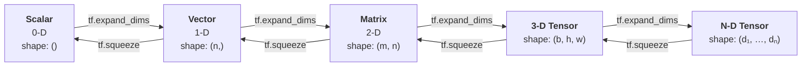
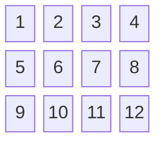
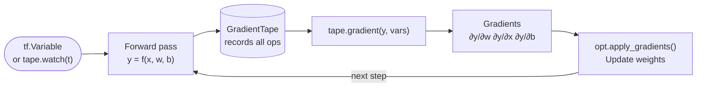
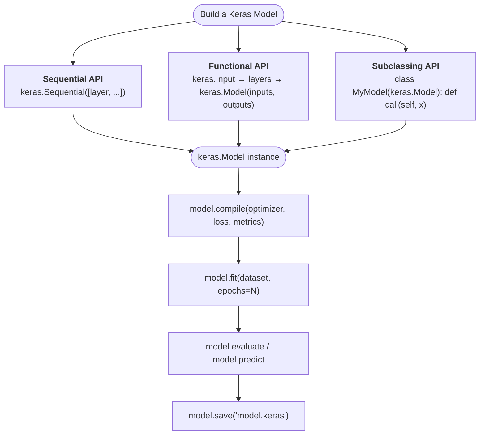
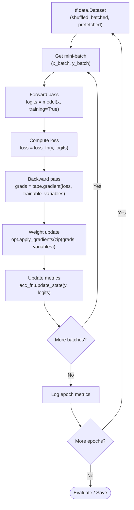
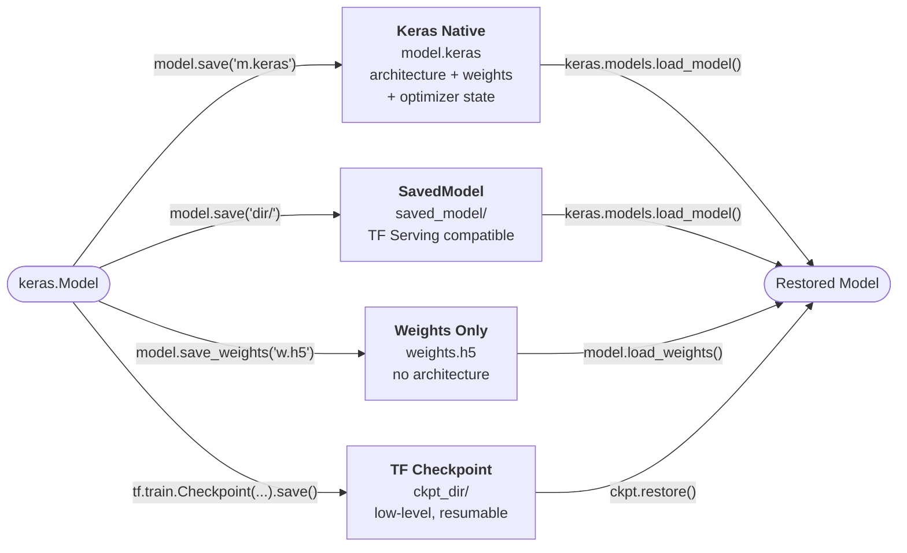
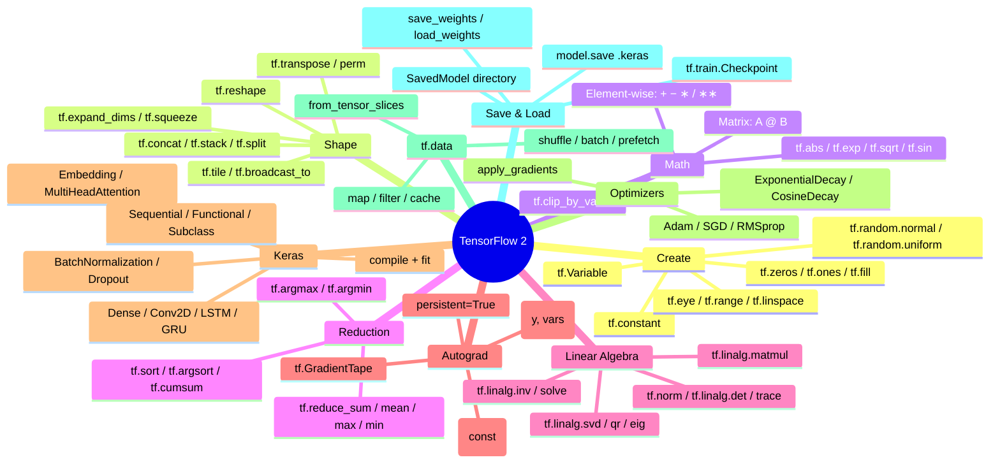

# TensorFlow 2 — Python Guide

TensorFlow 2 ships with Keras as its primary high-level API. Eager execution is on by default, so tensors behave like NumPy arrays while still supporting GPU acceleration and automatic differentiation through `tf.GradientTape`.

---

## Table of Contents

1. [Setup and Installation](#1-setup-and-installation)
2. [Scalars, Vectors and Matrices](#2-scalars-vectors-and-matrices)
3. [Data Types and Devices](#3-data-types-and-devices)
4. [Tensor Operations](#4-tensor-operations)
5. [Indexing and Slicing](#5-indexing-and-slicing)
6. [Shape Manipulation](#6-shape-manipulation)
7. [Linear Algebra](#7-linear-algebra)
8. [Reduction Operations](#8-reduction-operations)
9. [Automatic Differentiation — GradientTape](#9-automatic-differentiation--gradienttape)
10. [Building Neural Networks with Keras](#10-building-neural-networks-with-keras)
11. [Training a Model](#11-training-a-model)
12. [Saving and Loading Models](#12-saving-and-loading-models)
13. [GPU Support](#13-gpu-support)
14. [Data Pipelines with tf.data](#14-data-pipelines-with-tfdata)
15. [Full End-to-End Example](#15-full-end-to-end-example)

---

## 1. Setup and Installation

### Install via pip

```bash
# CPU-only (recommended for learning)
pip install tensorflow

# GPU support (requires compatible CUDA / cuDNN)
pip install tensorflow[and-cuda]

# Verify installation
python -c "import tensorflow as tf; print(tf.__version__); print(tf.config.list_physical_devices())"
```

### Standard imports

```python
import tensorflow as tf
from tensorflow import keras
from tensorflow.keras import layers, optimizers, losses, metrics
import numpy as np
```

### Check version and GPU

```python
print("TensorFlow:", tf.__version__)
print("Keras:     ", keras.__version__)
print("GPUs:      ", tf.config.list_physical_devices('GPU'))
print("Eager:     ", tf.executing_eagerly())   # True by default
```

---

## 2. Scalars, Vectors and Matrices



### 2.1 Scalar (0-D tensor)

```python
# From a Python literal
s1 = tf.constant(3.14)
s2 = tf.constant(42)
s3 = tf.constant(True)

# Read the value back as a Python number
v1 = s1.numpy()          # 3.14  (float32)
v2 = int(s2.numpy())     # 42

print("Scalar:", v1)
print("Shape: ", s1.shape)   # ()
print("Rank:  ", s1.ndim)    # 0
print("Dtype: ", s1.dtype)   # tf.float32
```

### 2.2 Vector (1-D tensor)

```python
# From a Python list
v = tf.constant([1.0, 2.0, 3.0, 4.0, 5.0])

# From a NumPy array
import numpy as np
arr = np.array([10.0, 20.0, 30.0], dtype=np.float32)
v2  = tf.constant(arr)

print(v)              # tf.Tensor([1. 2. 3. 4. 5.], shape=(5,), dtype=float32)
print(v.shape)        # (5,)
print(v.shape[0])     # 5

# Factory functions
zeros_v = tf.zeros([6])                      # [0, 0, 0, 0, 0, 0]
ones_v  = tf.ones([6])                       # [1, 1, 1, 1, 1, 1]
range_v = tf.range(0, 10, delta=2)           # [0, 2, 4, 6, 8]
lin_v   = tf.linspace(0.0, 1.0, 5)          # [0, 0.25, 0.5, 0.75, 1]
rand_v  = tf.random.normal([8])              # standard normal
```

### 2.3 Matrix (2-D tensor)

```python
# From a nested list
m = tf.constant([
    [1.0, 2.0, 3.0],
    [4.0, 5.0, 6.0],
    [7.0, 8.0, 9.0]
])

print(m)
print("Shape:", m.shape)           # (3, 3)
print("Rows:", m.shape[0], "Cols:", m.shape[1])

# Factory functions for matrices
Z = tf.zeros([4, 5])               # 4×5 all-zeros
I = tf.eye(3)                      # 3×3 identity
R = tf.random.normal([3, 3])       # 3×3 standard normal
U = tf.random.uniform([3, 3])      # 3×3 uniform [0, 1)
F = tf.fill([2, 4], 7.0)           # 2×4 filled with 7
```

### 2.4 Higher-Dimensional Tensors (N-D)

```python
# 3-D: batch × height × width  (e.g. greyscale images)
t3 = tf.random.normal([8, 28, 28])

# 4-D: batch × height × width × channels  (TF uses NHWC by default)
t4 = tf.random.normal([16, 224, 224, 3])

print(t3.ndim)            # 3
print(tf.size(t4).numpy())  # 16*224*224*3 = 2,408,448
```

---

## 3. Data Types and Devices

### Scalar types

| `tf.dtype` | NumPy equiv | Bits |
|---|---|---|
| `tf.float32` | `np.float32` | 32 |
| `tf.float64` | `np.float64` | 64 |
| `tf.float16` | `np.float16` | 16 |
| `tf.int32` | `np.int32` | 32 |
| `tf.int64` | `np.int64` | 64 |
| `tf.int8` | `np.int8` | 8 |
| `tf.uint8` | `np.uint8` | 8 |
| `tf.bool` | `np.bool_` | 8 |
| `tf.string` | — | variable |

```python
# Specify dtype at creation
fi = tf.ones([3, 3], dtype=tf.float64)
ii = tf.zeros([4], dtype=tf.int64)
bi = tf.ones([2, 2], dtype=tf.bool)

# Cast an existing tensor
a   = tf.random.normal([3, 3])          # float32
a64 = tf.cast(a, tf.float64)            # cast to float64
ai  = tf.cast(a, tf.int32)             # cast to int32

# Inspect
print(a.dtype)                           # tf.float32
print(a.dtype.is_floating)              # True
```

### Devices

```python
# List available devices
print(tf.config.list_physical_devices())

# Create a tensor on a specific device
with tf.device('/CPU:0'):
    t_cpu = tf.random.normal([3, 3])

with tf.device('/GPU:0'):
    t_gpu = tf.random.normal([3, 3])    # raises if no GPU

# Copy between devices
t_on_gpu = tf.identity(t_cpu)           # TF manages placement automatically

# Check where a tensor lives
print(t_cpu.device)   # /job:localhost/replica:0/task:0/device:CPU:0
```

---

## 4. Tensor Operations

### 4.1 Element-wise arithmetic

```python
a = tf.constant([1.0, 2.0, 3.0, 4.0])
b = tf.constant([10.0, 20.0, 30.0, 40.0])

# Binary ops — return new tensors
add  = a + b                   # tf.add(a, b)      → [11, 22, 33, 44]
sub  = b - a                   # tf.subtract(b, a) → [9, 18, 27, 36]
mul  = a * b                   # tf.multiply(a, b) → [10, 40, 90, 160]
div_ = b / a                   # tf.divide(b, a)   → [10, 10, 10, 10]
pw   = a ** 2                  # tf.pow(a, 2)      → [1, 4, 9, 16]

# Scalar ops
scaled = a * 3.0               # [3, 6, 9, 12]
offset = a + 100.0             # [101, 102, 103, 104]

# TF tensors are immutable — use tf.Variable for mutable state
v = tf.Variable([1.0, 2.0, 3.0])
v.assign_add([1.0, 1.0, 1.0])  # v → [2, 3, 4]
v.assign(tf.zeros([3]))         # v → [0, 0, 0]
```

### 4.2 Comparison operations

```python
x = tf.constant([1.0, 5.0, 3.0, 7.0, 2.0])

gt   = x > 3.0                  # tf.greater(x, 3.0)
eq   = tf.equal(x, 5.0)
mask = (x >= 2.0) & (x <= 5.0) # element-wise AND on bool tensors

# Use a boolean mask to gather elements
selected = tf.boolean_mask(x, mask)
print(selected.numpy())         # [5. 3. 2.]

# where: element-wise conditional
result = tf.where(x > 3.0, x, tf.zeros_like(x))
print(result.numpy())           # [0. 5. 0. 7. 0.]
```

### 4.3 Mathematical functions

```python
t = tf.constant([-2.0, -1.0, 0.0, 1.0, 2.0])

abs_t  = tf.abs(t)              # [2, 1, 0, 1, 2]
relu_t = tf.nn.relu(t)          # [0, 0, 0, 1, 2]
exp_t  = tf.exp(t)
log_t  = tf.math.log(tf.abs(t) + 1e-6)
sqrt_t = tf.sqrt(tf.abs(t))
sin_t  = tf.sin(t)

# Activations
sig_t  = tf.sigmoid(t)
tanh_t = tf.tanh(t)

# Clamp values to a range
clamped = tf.clip_by_value(t, -1.0, 1.0)  # [-1, -1, 0, 1, 1]
```

---

## 5. Indexing and Slicing

The 3 × 4 matrix `m` used in the examples below:



```python
m = tf.reshape(tf.cast(tf.range(1, 13), tf.float32), [3, 4])

# Single element
elem = m[1, 2].numpy()         # 7.0
elem = m[1][2].numpy()         # 7.0

# Whole row / column
row1  = m[1]                   # [5, 6, 7, 8]
col2  = m[:, 2]                # [3, 7, 11]

# Standard Python slices work
rows01 = m[0:2]                # rows 0-1
cols13 = m[:, 1:3]             # cols 1-2
step   = m[:, ::2]             # every 2nd column

# Negative indexing
last_row = m[-1]               # [9, 10, 11, 12]
last_col = m[:, -1]            # [4, 8, 12]

# Boolean mask
flat = tf.reshape(m, [-1])
big  = tf.boolean_mask(flat, flat > 6.0)   # [7, 8, 9, 10, 11, 12]

# Fancy indexing
rows = tf.gather(m, [0, 2])                # rows 0 and 2
elem = tf.gather_nd(m, [[0, 1], [2, 3]])   # m[0,1] and m[2,3]

# Scatter updates (produces a new tensor; use tf.Variable for in-place)
updated = tf.tensor_scatter_nd_update(m, [[0, 0]], [99.0])
```

---

## 6. Shape Manipulation

```python
t = tf.cast(tf.range(24), tf.float32)   # shape (24,)

# Reshape (total elements must match)
a = tf.reshape(t, [2, 3, 4])    # (2, 3, 4)
b = tf.reshape(t, [6, 4])       # (6, 4)
c = tf.reshape(t, [-1, 6])      # (-1 inferred) → (4, 6)

# Flatten
flat  = tf.reshape(a, [-1])                  # (24,)
flat2 = tf.reshape(a, [a.shape[0], -1])      # (2, 12)

# Add/remove dimensions
m  = tf.random.normal([3, 4])
u0 = tf.expand_dims(m, 0)     # (1, 3, 4)
u1 = tf.expand_dims(m, 1)     # (3, 1, 4)
u2 = tf.expand_dims(m, -1)    # (3, 4, 1)
sq = tf.squeeze(u0, 0)        # (3, 4)
sq2 = tf.squeeze(u0)          # removes all size-1 dims

# Transpose and permute
t2 = tf.transpose(m)                         # (4, 3)
p  = tf.transpose(a, perm=[2, 0, 1])         # (4, 2, 3)

# Broadcast — TF follows NumPy rules
row    = tf.ones([1, 4])
tiled  = tf.tile(row, [3, 1])                # (3, 4) — copies data
broad  = row + tf.zeros([3, 4])              # (3, 4) — broadcast add

# Concatenate and stack
x = tf.ones([2, 3])
y = tf.zeros([2, 3])
cat_r = tf.concat([x, y], axis=0)    # (4, 3)  along rows
cat_c = tf.concat([x, y], axis=1)    # (2, 6)  along cols
stk   = tf.stack([x, y], axis=0)     # (2, 2, 3)  new dimension

# Split
parts = tf.split(cat_r, num_or_size_splits=2, axis=0)  # two (2, 3) tensors
```

---

## 7. Linear Algebra

```python
A = tf.random.normal([3, 4])
B = tf.random.normal([4, 5])

# Matrix multiply
C  = tf.linalg.matmul(A, B)          # (3, 5)
C2 = A @ B                            # same, operator overload

# Batched matrix multiply
Ab = tf.random.normal([8, 3, 4])
Bb = tf.random.normal([8, 4, 5])
Cb = tf.linalg.matmul(Ab, Bb)        # (8, 3, 5)

# Dot product (1-D vectors)
u  = tf.constant([1.0, 2.0, 3.0])
v2 = tf.constant([4.0, 5.0, 6.0])
dot = tf.tensordot(u, v2, axes=1)     # scalar: 32

# Outer product
outer = tf.tensordot(u, v2, axes=0)  # (3, 3)

# Transpose
At  = tf.transpose(A)                 # (4, 3)

# Decompositions
s, u_tf, v = tf.linalg.svd(A)        # SVD — s: (3,), u: (3,3), v: (4,3)
e, vec     = tf.linalg.eig(A @ tf.transpose(A))    # eigenvalues / vectors
q, r       = tf.linalg.qr(A)         # QR decomposition

# Inverse and solve
sq_A = A @ tf.transpose(A)           # 3×3 positive definite
Ainv = tf.linalg.inv(sq_A)           # inverse
b_v  = tf.random.normal([3])
x_sol = tf.linalg.solve(sq_A, b_v[:, tf.newaxis])  # Ax = b

# Norms
frob     = tf.norm(A)                            # Frobenius
col_norm = tf.norm(A, axis=0)                    # per-column L2
det      = tf.linalg.det(sq_A)
trace_v  = tf.linalg.trace(sq_A)
```

---

## 8. Reduction Operations

```python
m = tf.constant([
    [1.0, 2.0, 3.0],
    [4.0, 5.0, 6.0]
])

# Global reductions
total  = tf.reduce_sum(m)       # 21
mean_v = tf.reduce_mean(m)      # 3.5
max_v  = tf.reduce_max(m)       # 6
min_v  = tf.reduce_min(m)       # 1
prod   = tf.reduce_prod(m)
std_v  = tf.math.reduce_std(m)
var_v  = tf.math.reduce_variance(m)

# Along an axis
col_sum  = tf.reduce_sum(m, axis=0)               # [5, 7, 9]
row_sum  = tf.reduce_sum(m, axis=1)               # [6, 15]
col_mean = tf.reduce_mean(m, axis=0)              # [2.5, 3.5, 4.5]
row_mean = tf.reduce_mean(m, axis=1, keepdims=True)  # [[2], [5]]

# Argmax and argmin
argmax_col = tf.argmax(m, axis=0)   # index of max in each column
argmax_row = tf.argmax(m, axis=1)   # index of max in each row

argmin_col = tf.argmin(m, axis=0)

# Sort
sorted_m  = tf.sort(m, axis=1)                    # sort each row ascending
sorted_d  = tf.sort(m, axis=1, direction='DESCENDING')
sort_idx  = tf.argsort(m, axis=1)                 # indices that would sort

# Cumulative operations
flat    = tf.reshape(m, [-1])
cumsum  = tf.cumsum(flat)            # [1, 3, 6, 10, 15, 21]
cumprod = tf.math.cumprod(flat)

# Unique values
unique_vals, idx, counts = tf.unique_with_counts(
    tf.constant([1, 2, 2, 3, 3, 3])
)
print(unique_vals.numpy())  # [1, 2, 3]
print(counts.numpy())       # [1, 2, 3]
```

---

## 9. Automatic Differentiation — GradientTape



```python
# Tensors that need gradients — use tf.Variable or watch inside a tape
x = tf.Variable(2.0)
w = tf.Variable(3.0)
b = tf.Variable(1.0)

# Forward: y = w*x + b
with tf.GradientTape() as tape:
    y = w * x + b           # 3*2+1 = 7

# Compute gradients
grads = tape.gradient(y, [w, x, b])
print("dy/dw:", grads[0].numpy())   # 2  (= x)
print("dy/dx:", grads[1].numpy())   # 3  (= w)
print("dy/db:", grads[2].numpy())   # 1

# Gradient of a vector function
a = tf.Variable([1.0, 2.0, 3.0])
with tf.GradientTape() as tape:
    out = tf.reduce_sum(a * a)      # scalar

grad_a = tape.gradient(out, a)
print(grad_a.numpy())               # [2, 4, 6]  = 2*a

# Second-order gradients (nested tapes)
x2 = tf.Variable(3.0)
with tf.GradientTape() as outer:
    with tf.GradientTape() as inner:
        y2 = x2 ** 3
    dy_dx = inner.gradient(y2, x2)   # 3x^2
d2y_dx2 = outer.gradient(dy_dx, x2)  # 6x
print(d2y_dx2.numpy())               # 18

# Watch a non-Variable tensor
t_const = tf.constant(4.0)
with tf.GradientTape() as tape:
    tape.watch(t_const)
    f = t_const ** 2

df = tape.gradient(f, t_const)
print(df.numpy())                    # 8  (= 2*t)

# Persistent tape — compute multiple gradients
x3 = tf.Variable(2.0)
with tf.GradientTape(persistent=True) as tape:
    y3 = x3 ** 2
    z  = x3 ** 3

dy = tape.gradient(y3, x3)   # 4
dz = tape.gradient(z,  x3)   # 12
del tape                      # release resources
```

---

## 10. Building Neural Networks with Keras



### 10.1 Sequential API

```python
from tensorflow import keras
from tensorflow.keras import layers

model = keras.Sequential([
    layers.Dense(128, activation='relu', input_shape=(16,)),
    layers.Dropout(0.3),
    layers.Dense(64, activation='relu'),
    layers.Dense(10, activation='softmax')
])

model.summary()
```

### 10.2 Functional API

```python
inputs = keras.Input(shape=(16,), name='features')
x      = layers.Dense(128, activation='relu')(inputs)
x      = layers.Dropout(0.3)(x)
x      = layers.Dense(64, activation='relu')(x)
outputs = layers.Dense(10, activation='softmax')(x)

model = keras.Model(inputs=inputs, outputs=outputs, name='mlp')
model.summary()
```

### 10.3 Subclassing API

```python
class MLP(keras.Model):
    def __init__(self, hidden, num_classes):
        super().__init__()
        self.fc1  = layers.Dense(hidden, activation='relu')
        self.drop = layers.Dropout(0.3)
        self.fc2  = layers.Dense(hidden, activation='relu')
        self.fc3  = layers.Dense(num_classes, activation='softmax')

    def call(self, x, training=False):
        x = self.fc1(x)
        x = self.drop(x, training=training)
        x = self.fc2(x)
        return self.fc3(x)

model = MLP(hidden=64, num_classes=10)
```

### 10.4 Built-in Keras layers

| Category | Layers |
|---|---|
| **Core** | `Dense`, `Activation`, `Flatten`, `Reshape`, `Lambda` |
| **Convolution** | `Conv1D`, `Conv2D`, `Conv3D`, `Conv2DTranspose`, `DepthwiseConv2D` |
| **Normalisation** | `BatchNormalization`, `LayerNormalization`, `GroupNormalization` |
| **Recurrent** | `LSTM`, `GRU`, `SimpleRNN`, `Bidirectional`, `TimeDistributed` |
| **Attention** | `MultiHeadAttention`, `Attention` |
| **Pooling** | `MaxPooling2D`, `AveragePooling2D`, `GlobalAveragePooling2D` |
| **Regularisation** | `Dropout`, `SpatialDropout2D`, `ActivityRegularization` |
| **Embedding** | `Embedding` |
| **Merging** | `Add`, `Multiply`, `Concatenate`, `Average` |

### 10.5 Inspecting parameters

```python
model.build(input_shape=(None, 16))

# Total parameter count
print("Total params:", model.count_params())

# Iterate named variables
for var in model.trainable_variables:
    print(var.name, var.shape)
```

---

## 11. Training a Model



### 11.1 compile + fit (high-level)

```python
model.compile(
    optimizer=keras.optimizers.Adam(learning_rate=1e-3),
    loss='sparse_categorical_crossentropy',
    metrics=['accuracy']
)

X_train = np.random.randn(800, 16).astype(np.float32)
y_train = (X_train.sum(axis=1) > 0).astype(np.int32) % 3

history = model.fit(
    X_train, y_train,
    epochs=50,
    batch_size=64,
    validation_split=0.2,
    verbose=1
)
```

### 11.2 Custom training loop

```python
model   = MLP(hidden=64, num_classes=3)
opt     = keras.optimizers.Adam(1e-3)
loss_fn = keras.losses.SparseCategoricalCrossentropy()
acc_fn  = keras.metrics.SparseCategoricalAccuracy()

X = tf.constant(np.random.randn(800, 16).astype(np.float32))
y = tf.constant((X.numpy().sum(axis=1) > 0).astype(np.int32) % 3)

BATCH  = 64
EPOCHS = 50
n      = X.shape[0]

for epoch in range(1, EPOCHS + 1):
    acc_fn.reset_state()
    epoch_loss = 0.0
    steps      = 0

    for start in range(0, n, BATCH):
        x_b = X[start:start + BATCH]
        y_b = y[start:start + BATCH]

        with tf.GradientTape() as tape:
            logits = model(x_b, training=True)
            loss   = loss_fn(y_b, logits)

        grads = tape.gradient(loss, model.trainable_variables)
        opt.apply_gradients(zip(grads, model.trainable_variables))

        acc_fn.update_state(y_b, logits)
        epoch_loss += loss.numpy()
        steps      += 1

    if epoch % 10 == 0:
        print(f"Epoch {epoch:3d}  loss={epoch_loss/steps:.4f}"
              f"  acc={acc_fn.result().numpy():.4f}")
```

### Available optimisers

```python
# SGD with momentum
opt1 = keras.optimizers.SGD(learning_rate=0.01, momentum=0.9)

# Adam
opt2 = keras.optimizers.Adam(learning_rate=1e-3, weight_decay=1e-4)

# RMSprop
opt3 = keras.optimizers.RMSprop(learning_rate=1e-3, rho=0.9)

# Learning-rate decay
sched = keras.optimizers.schedules.ExponentialDecay(
    initial_learning_rate=1e-3,
    decay_steps=1000,
    decay_rate=0.96
)
opt  = keras.optimizers.Adam(learning_rate=sched)
```

---

## 12. Saving and Loading Models



```python
# Save the entire model (architecture + weights + optimiser state)
model.save("model.keras")               # recommended Keras native format

# Load it back
loaded = keras.models.load_model("model.keras")

# SavedModel format (TensorFlow serving compatible)
model.save("saved_model_dir")           # directory
loaded = keras.models.load_model("saved_model_dir")

# Weights only (HDF5 or TF checkpoint)
model.save_weights("weights.h5")
model.load_weights("weights.h5")

# TF checkpoint (low-level)
ckpt    = tf.train.Checkpoint(model=model, optimizer=opt)
manager = tf.train.CheckpointManager(ckpt, "ckpt_dir", max_to_keep=3)
manager.save()

ckpt.restore(manager.latest_checkpoint)

# Export just the weights as a numpy dict
weights_dict = {v.name: v.numpy() for v in model.trainable_variables}
np.save("weights.npy", weights_dict)
```

---

## 13. GPU Support

```python
# List all GPUs
gpus = tf.config.list_physical_devices('GPU')
print("GPUs:", gpus)

# Enable memory growth (avoids allocating all GPU RAM at once)
for gpu in gpus:
    tf.config.experimental.set_memory_growth(gpu, True)

# Limit GPU memory to 2 GB
tf.config.set_logical_device_configuration(
    gpus[0],
    [tf.config.LogicalDeviceConfiguration(memory_limit=2048)]
)

# Place ops on a specific device
with tf.device('/GPU:0'):
    t_gpu = tf.random.normal([1000, 1000])
    result = t_gpu @ t_gpu

# Multi-GPU: MirroredStrategy
strategy = tf.distribute.MirroredStrategy()
with strategy.scope():
    model = MLP(hidden=64, num_classes=3)
    model.compile(optimizer='adam',
                  loss='sparse_categorical_crossentropy')
```

**Rule:** TF automatically places ops on GPU when one is available and the op is supported. Use `tf.device` only to override placement explicitly.

---

## 14. Data Pipelines with tf.data

```mermaid
flowchart LR
    NP["NumPy arrays\nor generator"]
    NP -->|"from_tensor_slices()\nor from_generator()"| DS["tf.data.Dataset"]
    DS -->|".map(fn, parallel_calls)"| TF["Transform\n(normalize, augment)"]
    TF -->|".cache()"| CA["Cache\n(hold in RAM)"]
    CA -->|".shuffle(buffer)"| SH["Shuffle\n(randomize order)"]
    SH -->|".batch(N)"| BA["Batch\n(group N samples)"]
    BA -->|".prefetch(AUTOTUNE)"| PF["Prefetch\n(overlap IO + compute)"]
    PF --> MDL["Model Training\nfor x, y in dataset:"]
```



```python
# From NumPy arrays
dataset = tf.data.Dataset.from_tensor_slices((X_train, y_train))

# Shuffle, batch, prefetch — standard pipeline
dataset = (dataset
    .shuffle(buffer_size=1000)
    .batch(64)
    .prefetch(tf.data.AUTOTUNE))

# Iterate
for x_batch, y_batch in dataset:
    logits = model(x_batch, training=True)
    break

# From a generator
def gen():
    for i in range(100):
        yield np.random.randn(16).astype(np.float32), np.int32(i % 3)

ds_gen = tf.data.Dataset.from_generator(
    gen,
    output_signature=(
        tf.TensorSpec(shape=(16,), dtype=tf.float32),
        tf.TensorSpec(shape=(),    dtype=tf.int32)
    )
)

# Apply transformations
ds_mapped = dataset.map(
    lambda x, y: (x / tf.norm(x), y),
    num_parallel_calls=tf.data.AUTOTUNE
)

# Cache in memory
ds_cached = dataset.cache()

# Repeat for multiple epochs
ds_rep = dataset.repeat(3)
```

---

## 15. Full End-to-End Example

A complete classifier that creates data, builds a model, trains it, evaluates it, and saves it.

```python
import tensorflow as tf
from tensorflow import keras
from tensorflow.keras import layers
import numpy as np

# ── Reproducibility ────────────────────────────────────────────────────────────

tf.random.set_seed(42)
np.random.seed(42)

# ── Dataset ───────────────────────────────────────────────────────────────────

def make_dataset(n, features=16, classes=3):
    X = np.random.randn(n, features).astype(np.float32)
    y = (X.sum(axis=1) > 0).astype(np.int32) % classes
    return X, y

X_train, y_train = make_dataset(800)
X_val,   y_val   = make_dataset(200)

train_ds = (tf.data.Dataset
    .from_tensor_slices((X_train, y_train))
    .shuffle(800)
    .batch(64)
    .prefetch(tf.data.AUTOTUNE))

val_ds = (tf.data.Dataset
    .from_tensor_slices((X_val, y_val))
    .batch(64)
    .prefetch(tf.data.AUTOTUNE))

# ── Model ─────────────────────────────────────────────────────────────────────

class Classifier(keras.Model):
    def __init__(self, hidden, num_classes):
        super().__init__()
        self.fc1  = layers.Dense(hidden, activation='relu')
        self.bn1  = layers.BatchNormalization()
        self.drop = layers.Dropout(0.3)
        self.fc2  = layers.Dense(hidden // 2, activation='relu')
        self.bn2  = layers.BatchNormalization()
        self.out  = layers.Dense(num_classes)

    def call(self, x, training=False):
        x = self.bn1(self.fc1(x), training=training)
        x = self.drop(x, training=training)
        x = self.bn2(self.fc2(x), training=training)
        return self.out(x)

model = Classifier(hidden=128, num_classes=3)

# ── Compile and train ──────────────────────────────────────────────────────────

model.compile(
    optimizer=keras.optimizers.Adam(1e-3),
    loss=keras.losses.SparseCategoricalCrossentropy(from_logits=True),
    metrics=[keras.metrics.SparseCategoricalAccuracy(name='acc')]
)

history = model.fit(
    train_ds,
    epochs=50,
    validation_data=val_ds,
    verbose=0,
    callbacks=[
        keras.callbacks.EarlyStopping(patience=10, restore_best_weights=True),
    ]
)

# ── Evaluate ─────────────────────────────────────────────────────────────────

val_loss, val_acc = model.evaluate(val_ds, verbose=0)
print(f"Val loss: {val_loss:.4f}  Val acc: {val_acc*100:.1f}%")

# ── Save and reload ───────────────────────────────────────────────────────────

model.save("classifier.keras")

reloaded = keras.models.load_model("classifier.keras")
reloaded_loss, reloaded_acc = reloaded.evaluate(val_ds, verbose=0)
print(f"Reloaded acc: {reloaded_acc*100:.1f}%")
```

Expected output:

```
Val loss: 0.8241  Val acc: 68.5%
Reloaded acc: 68.5%
```

---

## Quick Reference


